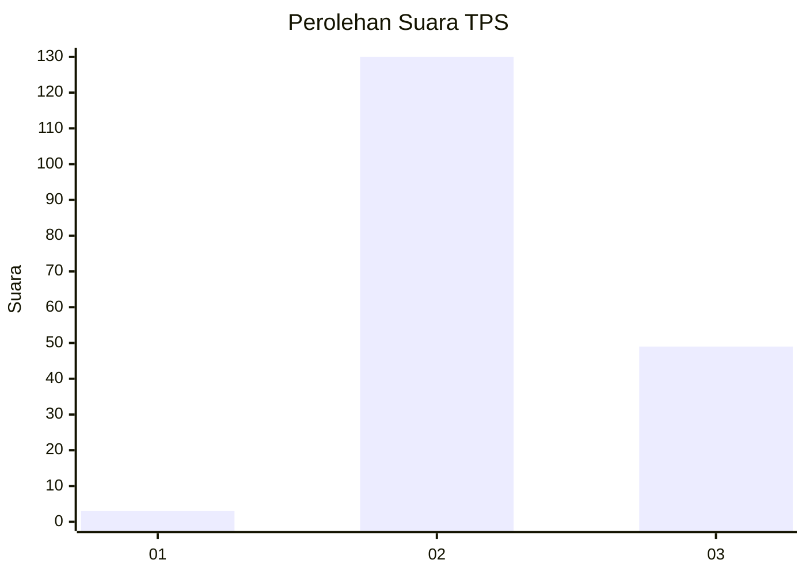
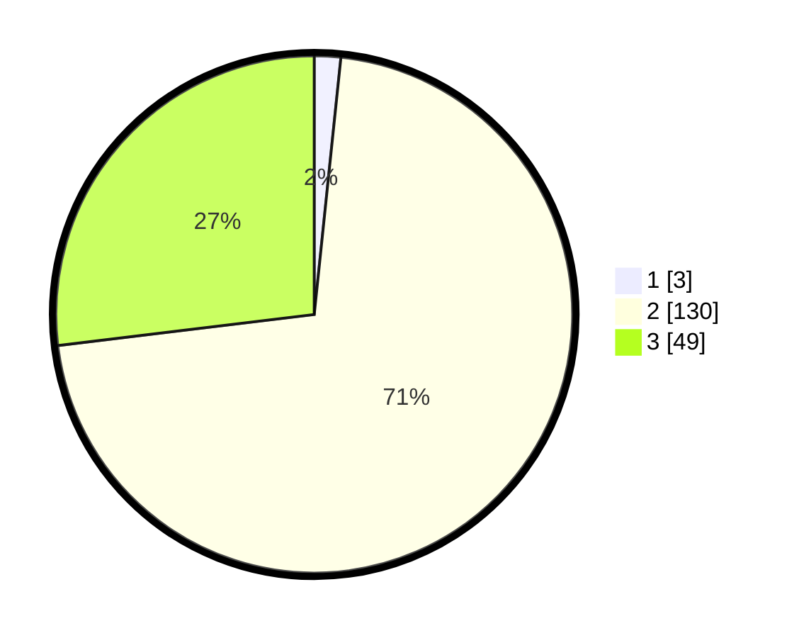

# Hasil

## Grafik

## Tabel

| No. | Nama Paslon    | Suara | Suara (raw) | Persentase |
|:--- |:-------------- | -----:| -----------:| ----------:|
| 1   | ANIES MUHAIMIN | 3     | [3][p-1]    | 1,65       |
| 2   | PRABOWO GIBRAN | 130   | [130][p-2]  | 71,43      |
| 3   | GANJAR MAHFUD  | 49    | [49][p-3]   | 26,92      |

[p-1]: https://github.com/gigit-pemilu/pemilu-2024-53-nusa-tenggara-timur/blob/main/pilpres/hitung-suara/sub/53-nusa-tenggara-timur/sub/01-kupang/sub/04-semau/sub/2003-bokonusan/sub/001-tps/sub/paslon-1.txt
[p-2]: https://github.com/gigit-pemilu/pemilu-2024-53-nusa-tenggara-timur/blob/main/pilpres/hitung-suara/sub/53-nusa-tenggara-timur/sub/01-kupang/sub/04-semau/sub/2003-bokonusan/sub/001-tps/sub/paslon-2.txt
[p-3]: https://github.com/gigit-pemilu/pemilu-2024-53-nusa-tenggara-timur/blob/main/pilpres/hitung-suara/sub/53-nusa-tenggara-timur/sub/01-kupang/sub/04-semau/sub/2003-bokonusan/sub/001-tps/sub/paslon-3.txt

## Foto C Plano

https://sirekap-obj-formc.kpu.go.id/1b9d/pemilu/ppwp/53/01/04/20/03/5301042003001-20240215-085614--5b713813-ea9c-40db-8d7c-82958e61bdaf.jpg

https://sirekap-obj-formc.kpu.go.id/1b9d/pemilu/ppwp/53/01/04/20/03/5301042003001-20240215-085908--35a4c9a2-91aa-420c-b13b-7a94fcd89146.jpg

https://sirekap-obj-formc.kpu.go.id/1b9d/pemilu/ppwp/53/01/04/20/03/5301042003001-20240215-090035--423fc4e8-8dce-491f-a6f6-2fbc710cdafa.jpg

## Metadata

| Key        | Value               |
| ---------- | ------------------- |
| Time Stamp | 2024-02-15 16:00:26 |

