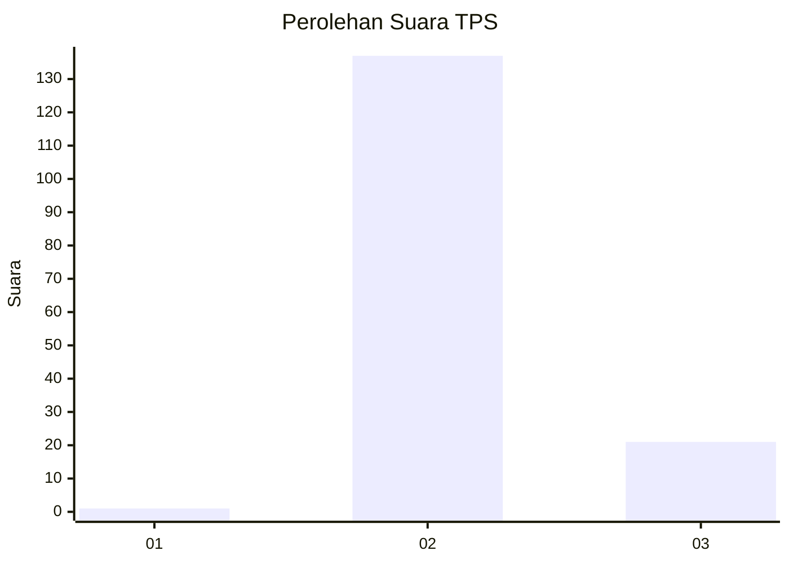
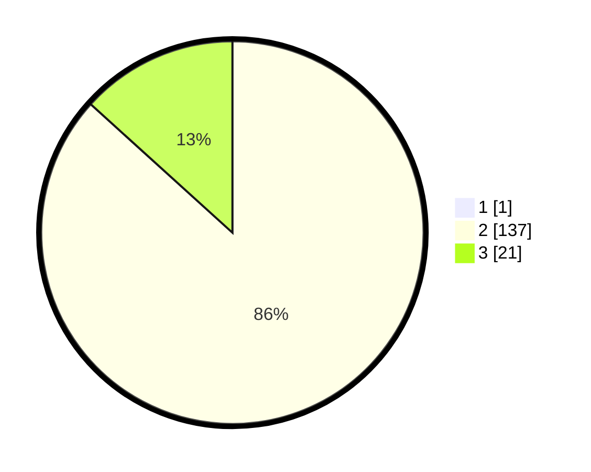

# Hasil

## Grafik

## Tabel

| No. | Nama Paslon    | Suara | Suara (raw) | Persentase |
|:--- |:-------------- | -----:| -----------:| ----------:|
| 1   | ANIES MUHAIMIN | 1     | [1][p-1]    | 0,63       |
| 2   | PRABOWO GIBRAN | 137   | [137][p-2]  | 86,16      |
| 3   | GANJAR MAHFUD  | 21    | [21][p-3]   | 13,21      |

[p-1]: https://github.com/gigit-pemilu/pemilu-2024-53-nusa-tenggara-timur/blob/main/pilpres/hitung-suara/sub/53-nusa-tenggara-timur/sub/01-kupang/sub/04-semau/sub/2003-bokonusan/sub/002-tps/sub/paslon-1.txt
[p-2]: https://github.com/gigit-pemilu/pemilu-2024-53-nusa-tenggara-timur/blob/main/pilpres/hitung-suara/sub/53-nusa-tenggara-timur/sub/01-kupang/sub/04-semau/sub/2003-bokonusan/sub/002-tps/sub/paslon-2.txt
[p-3]: https://github.com/gigit-pemilu/pemilu-2024-53-nusa-tenggara-timur/blob/main/pilpres/hitung-suara/sub/53-nusa-tenggara-timur/sub/01-kupang/sub/04-semau/sub/2003-bokonusan/sub/002-tps/sub/paslon-3.txt

## Foto C Plano

https://sirekap-obj-formc.kpu.go.id/59b7/pemilu/ppwp/53/01/04/20/03/5301042003002-20240215-170014--b10cc6ca-811e-4eac-9452-fe40d16fe430.jpg

https://sirekap-obj-formc.kpu.go.id/59b7/pemilu/ppwp/53/01/04/20/03/5301042003002-20240215-170941--9b564c6d-70ff-442e-a772-a3ef7838c6fe.jpg

https://sirekap-obj-formc.kpu.go.id/59b7/pemilu/ppwp/53/01/04/20/03/5301042003002-20240215-171112--ac27fc54-2929-4254-9b31-90ba5e7ac2ec.jpg

## Metadata

| Key        | Value               |
| ---------- | ------------------- |
| Time Stamp | 2024-02-16 21:01:00 |

