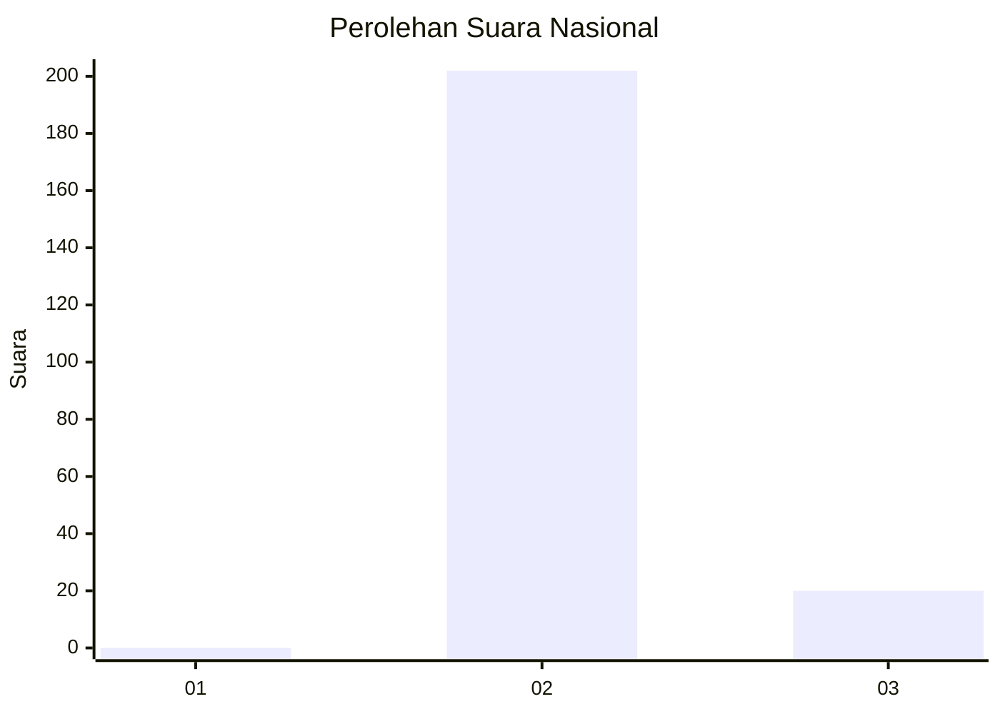
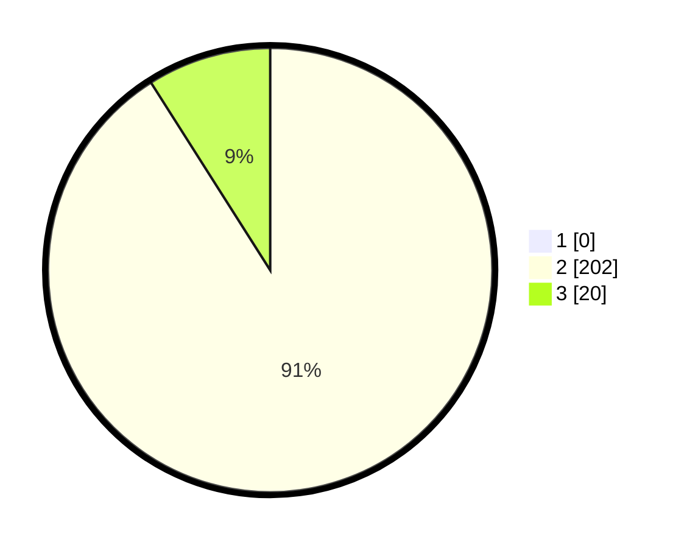

# Hasil

## Grafik

## Tabel

| No. | Nama Paslon    | Suara | Suara (raw) | Persentase |
|:--- |:-------------- | -----:| -----------:| ----------:|
| 1   | ANIES MUHAIMIN | 0     | [0][p-1]    | 0,00       |
| 2   | PRABOWO GIBRAN | 202   | [202][p-2]  | 90,99      |
| 3   | GANJAR MAHFUD  | 20    | [20][p-3]   | 9,01       |

[p-1]: https://github.com/gigit-pemilu/pemilu-2024/blob/main/pilpres/hitung-suara/sub/53-nusa-tenggara-timur/sub/01-kupang/sub/04-semau/sub/2003-bokonusan/sub/004-tps/sub/paslon-1.txt
[p-2]: https://github.com/gigit-pemilu/pemilu-2024/blob/main/pilpres/hitung-suara/sub/53-nusa-tenggara-timur/sub/01-kupang/sub/04-semau/sub/2003-bokonusan/sub/004-tps/sub/paslon-2.txt
[p-3]: https://github.com/gigit-pemilu/pemilu-2024/blob/main/pilpres/hitung-suara/sub/53-nusa-tenggara-timur/sub/01-kupang/sub/04-semau/sub/2003-bokonusan/sub/004-tps/sub/paslon-3.txt

## Foto C Plano

https://sirekap-obj-formc.kpu.go.id/e3a8/pemilu/ppwp/53/01/04/20/03/5301042003004-20240215-104211--5e1e4cac-a1a5-4b24-a664-53697a764b11.jpg

https://sirekap-obj-formc.kpu.go.id/e3a8/pemilu/ppwp/53/01/04/20/03/5301042003004-20240215-104406--430aa98d-3eb1-4f74-aece-a0e7f7b9200e.jpg

https://sirekap-obj-formc.kpu.go.id/e3a8/pemilu/ppwp/53/01/04/20/03/5301042003004-20240215-104545--453daabb-eb54-467b-b839-21e472f40164.jpg

## Metadata

| Key        | Value               |
| ---------- | ------------------- |
| Time Stamp | 2024-02-15 19:00:26 |

