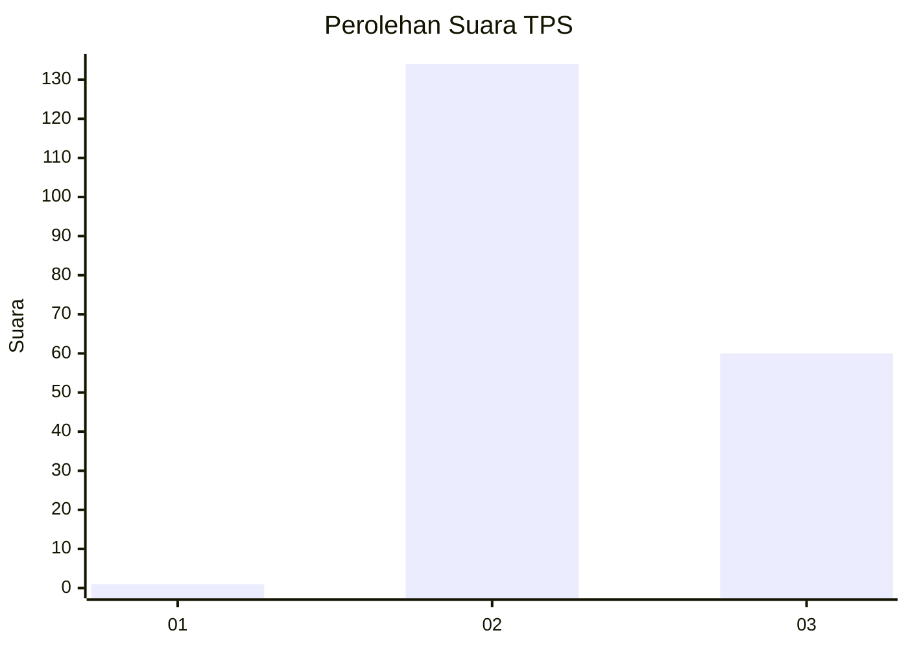
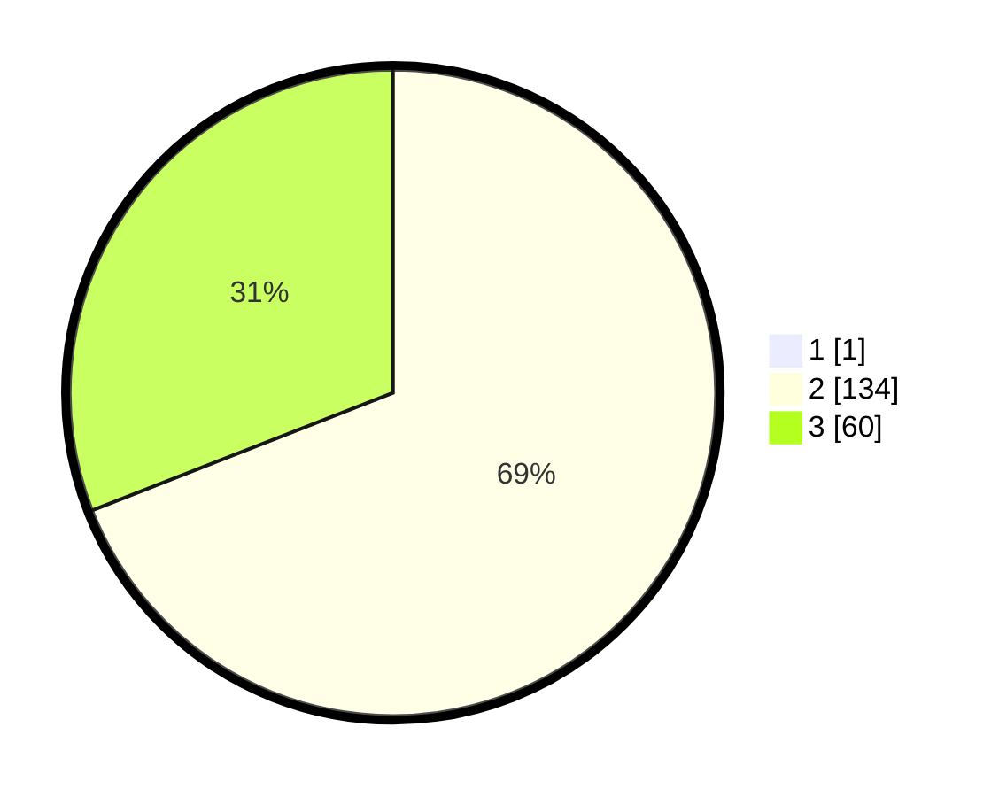

# Hasil

## Grafik

## Tabel

| No. | Nama Paslon    | Suara | Suara (raw) | Persentase |
|:--- |:-------------- | -----:| -----------:| ----------:|
| 1   | ANIES MUHAIMIN | 1     | [1][p-1]    | 0,51       |
| 2   | PRABOWO GIBRAN | 134   | [134][p-2]  | 68,72      |
| 3   | GANJAR MAHFUD  | 60    | [60][p-3]   | 30,77      |

[p-1]: https://github.com/gigit-pemilu/pemilu-2024-53-nusa-tenggara-timur/blob/main/pilpres/hitung-suara/sub/53-nusa-tenggara-timur/sub/01-kupang/sub/04-semau/sub/2004-otan/sub/002-tps/sub/paslon-1.txt
[p-2]: https://github.com/gigit-pemilu/pemilu-2024-53-nusa-tenggara-timur/blob/main/pilpres/hitung-suara/sub/53-nusa-tenggara-timur/sub/01-kupang/sub/04-semau/sub/2004-otan/sub/002-tps/sub/paslon-2.txt
[p-3]: https://github.com/gigit-pemilu/pemilu-2024-53-nusa-tenggara-timur/blob/main/pilpres/hitung-suara/sub/53-nusa-tenggara-timur/sub/01-kupang/sub/04-semau/sub/2004-otan/sub/002-tps/sub/paslon-3.txt

## Foto C Plano

https://sirekap-obj-formc.kpu.go.id/9f0f/pemilu/ppwp/53/01/04/20/04/5301042004002-20240215-143501--4e192847-aaf2-4c83-bb2e-1c2a1c749255.jpg

https://sirekap-obj-formc.kpu.go.id/9f0f/pemilu/ppwp/53/01/04/20/04/5301042004002-20240215-164610--7ddcb21f-b998-4ad6-82c6-cb1738f1bb4f.jpg

https://sirekap-obj-formc.kpu.go.id/9f0f/pemilu/ppwp/53/01/04/20/04/5301042004002-20240215-143738--170ffe00-7b32-4f3f-aee6-78826001c1ea.jpg

## Metadata

| Key        | Value               |
| ---------- | ------------------- |
| Time Stamp | 2024-02-16 21:01:00 |

## DATA PEMILIH TETAP

Jumlah pemilih dalam DPT: **231**.
 * L: **123**.
 * P: **108**.

## DATA PENGGUNA HAK PILIH

Jumlah pengguna hak pilih dalam DPT: **195**.
 * L: **101**.
 * P: **94**.

Jumlah pengguna hak pilih dalam DPTb: **0**.
 * L: **0**.
 * P: **0**.

Jumlah pengguna hak pilih dalam DPK: **0**.
 * L: **0**.
 * P: **0**.

Jumlah pengguna hak pilih: **195**.
 * L: **101**.
 * P: **94**.

## JUMLAH SUARA SAH DAN TIDAK SAH

JUMLAH SELURUH SUARA SAH: **195**.

JUMLAH SUARA TIDAK SAH: **0**.

JUMLAH SELURUH SUARA SAH DAN SUARA TIDAK SAH: **195**.

