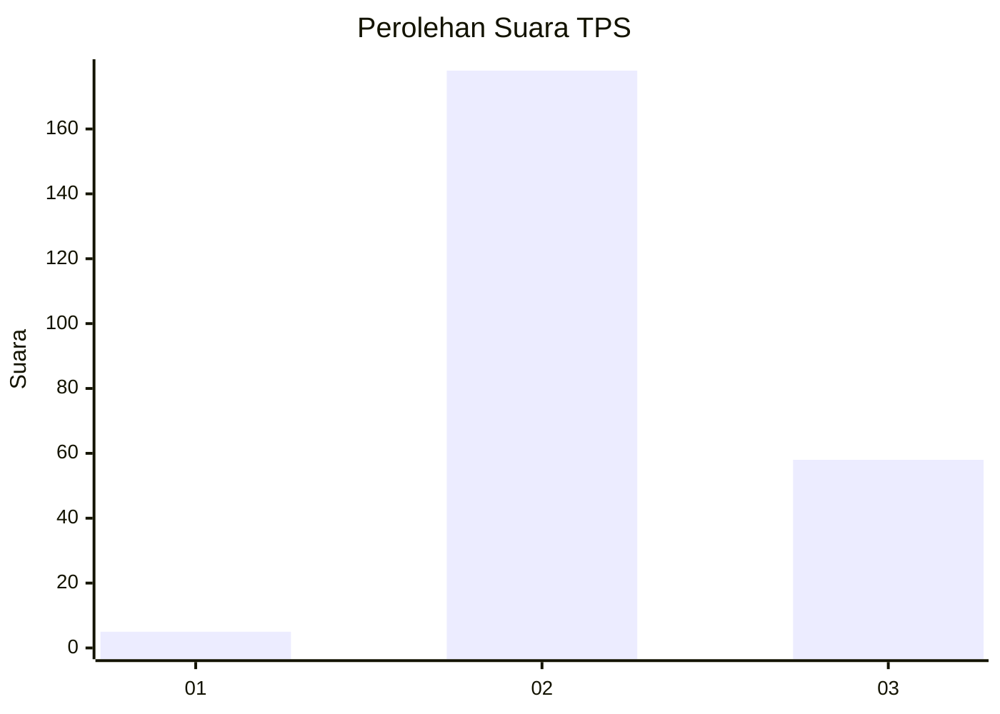
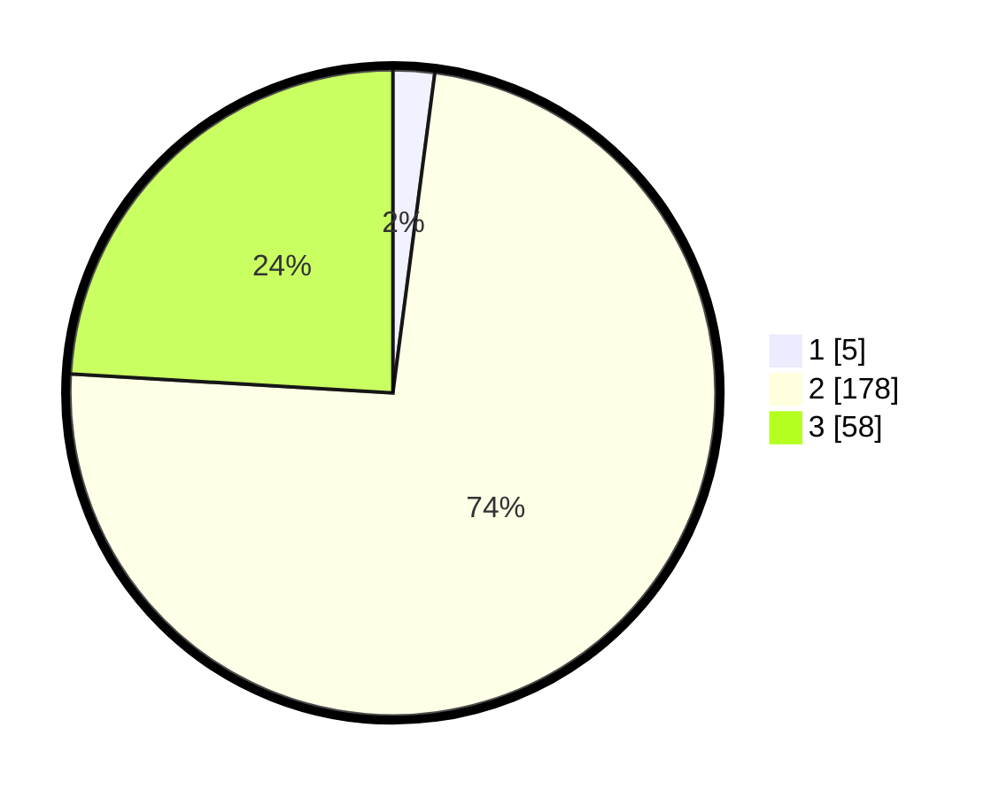

# Hasil

## Grafik

## Tabel

| No. | Nama Paslon    | Suara | Suara (raw) | Persentase |
|:--- |:-------------- | -----:| -----------:| ----------:|
| 1   | ANIES MUHAIMIN | 5     | [5][p-1]    | 2,07       |
| 2   | PRABOWO GIBRAN | 178   | [178][p-2]  | 73,86      |
| 3   | GANJAR MAHFUD  | 58    | [58][p-3]   | 24,07      |

[p-1]: https://github.com/gigit-pemilu/pemilu-2024-53-nusa-tenggara-timur/blob/main/pilpres/hitung-suara/sub/53-nusa-tenggara-timur/sub/01-kupang/sub/06-kupang-timur/sub/1001-babau/sub/005-tps/sub/paslon-1.txt
[p-2]: https://github.com/gigit-pemilu/pemilu-2024-53-nusa-tenggara-timur/blob/main/pilpres/hitung-suara/sub/53-nusa-tenggara-timur/sub/01-kupang/sub/06-kupang-timur/sub/1001-babau/sub/005-tps/sub/paslon-2.txt
[p-3]: https://github.com/gigit-pemilu/pemilu-2024-53-nusa-tenggara-timur/blob/main/pilpres/hitung-suara/sub/53-nusa-tenggara-timur/sub/01-kupang/sub/06-kupang-timur/sub/1001-babau/sub/005-tps/sub/paslon-3.txt

## Foto C Plano

https://sirekap-obj-formc.kpu.go.id/0f95/pemilu/ppwp/53/01/06/10/01/5301061001005-20240217-145745--679be5fe-a21f-40cf-956b-b2fffb8fcb0c.jpg

https://sirekap-obj-formc.kpu.go.id/0f95/pemilu/ppwp/53/01/06/10/01/5301061001005-20240215-035158--ec085af7-68f3-48b7-bae7-47039932c1b2.jpg

https://sirekap-obj-formc.kpu.go.id/0f95/pemilu/ppwp/53/01/06/10/01/5301061001005-20240215-035339--a887275b-e77c-4108-b9c2-690c3a39e0d5.jpg

## Metadata

| Key        | Value               |
| ---------- | ------------------- |
| Time Stamp | 2024-02-17 16:00:02 |

