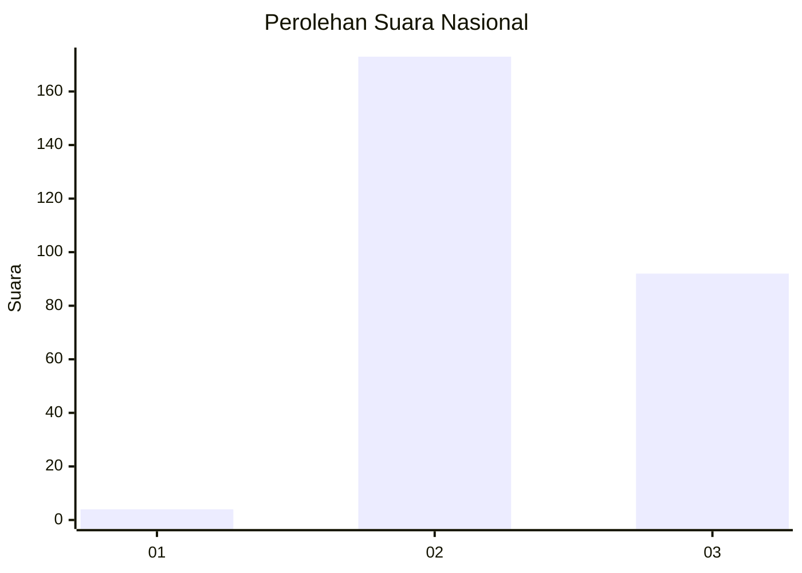
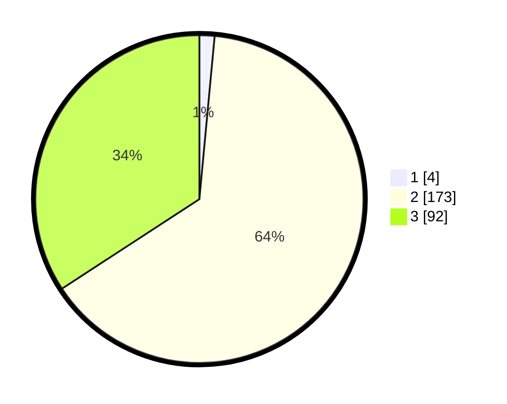

# Hasil

## Grafik

## Tabel

| No. | Nama Paslon    | Suara | Suara (raw) | Persentase |
|:--- |:-------------- | -----:| -----------:| ----------:|
| 1   | ANIES MUHAIMIN | 4     | [4][p-1]    | 1,49       |
| 2   | PRABOWO GIBRAN | 173   | [173][p-2]  | 64,31      |
| 3   | GANJAR MAHFUD  | 92    | [92][p-3]   | 34,20      |

[p-1]: https://github.com/gigit-pemilu/pemilu-2024/blob/main/pilpres/hitung-suara/sub/53-nusa-tenggara-timur/sub/01-kupang/sub/06-kupang-timur/sub/1004-oesao/sub/002-tps/sub/paslon-1.txt
[p-2]: https://github.com/gigit-pemilu/pemilu-2024/blob/main/pilpres/hitung-suara/sub/53-nusa-tenggara-timur/sub/01-kupang/sub/06-kupang-timur/sub/1004-oesao/sub/002-tps/sub/paslon-2.txt
[p-3]: https://github.com/gigit-pemilu/pemilu-2024/blob/main/pilpres/hitung-suara/sub/53-nusa-tenggara-timur/sub/01-kupang/sub/06-kupang-timur/sub/1004-oesao/sub/002-tps/sub/paslon-3.txt

## Foto C Plano

https://sirekap-obj-formc.kpu.go.id/33eb/pemilu/ppwp/53/01/06/10/04/5301061004002-20240215-090250--c26960a4-0253-4aab-ba9f-2e3e433bdf39.jpg

https://sirekap-obj-formc.kpu.go.id/33eb/pemilu/ppwp/53/01/06/10/04/5301061004002-20240215-090835--a53d38bd-54f8-4ac6-85ea-6517694b6286.jpg

https://sirekap-obj-formc.kpu.go.id/33eb/pemilu/ppwp/53/01/06/10/04/5301061004002-20240215-091041--6ab06e74-8ef4-4ca4-b7f0-e02164a02309.jpg

## Metadata

| Key        | Value               |
| ---------- | ------------------- |
| Time Stamp | 2024-02-26 03:00:00 |

