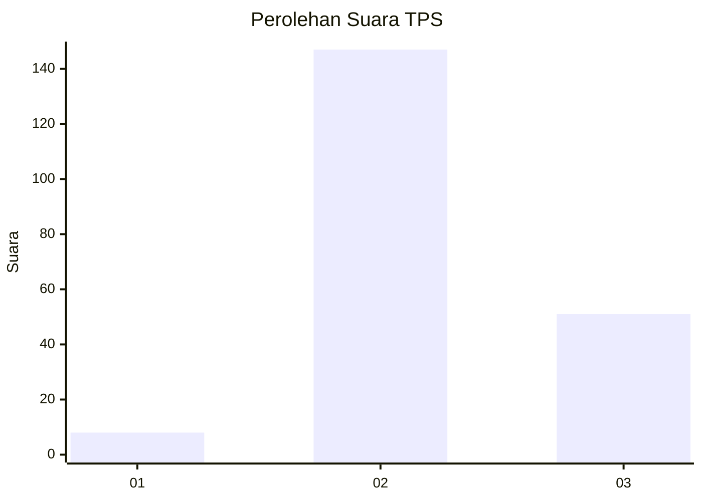
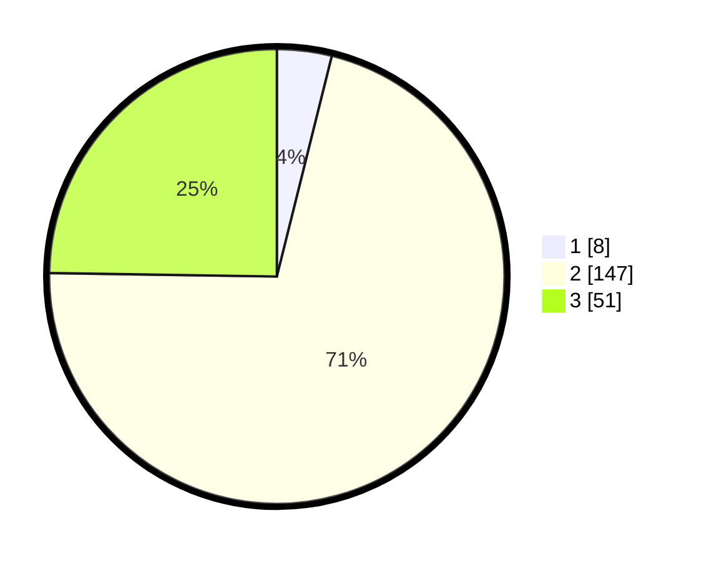

# Hasil

## Grafik

## Tabel

| No. | Nama Paslon    | Suara | Suara (raw) | Persentase |
|:--- |:-------------- | -----:| -----------:| ----------:|
| 1   | ANIES MUHAIMIN | 8     | [8][p-1]    | 3,88       |
| 2   | PRABOWO GIBRAN | 147   | [147][p-2]  | 71,36      |
| 3   | GANJAR MAHFUD  | 51    | [51][p-3]   | 24,76      |

[p-1]: https://github.com/gigit-pemilu/pemilu-2024-53-nusa-tenggara-timur/blob/main/pilpres/hitung-suara/sub/53-nusa-tenggara-timur/sub/01-kupang/sub/08-kupang-tengah/sub/1007-tarus/sub/001-tps/sub/paslon-1.txt
[p-2]: https://github.com/gigit-pemilu/pemilu-2024-53-nusa-tenggara-timur/blob/main/pilpres/hitung-suara/sub/53-nusa-tenggara-timur/sub/01-kupang/sub/08-kupang-tengah/sub/1007-tarus/sub/001-tps/sub/paslon-2.txt
[p-3]: https://github.com/gigit-pemilu/pemilu-2024-53-nusa-tenggara-timur/blob/main/pilpres/hitung-suara/sub/53-nusa-tenggara-timur/sub/01-kupang/sub/08-kupang-tengah/sub/1007-tarus/sub/001-tps/sub/paslon-3.txt

## Foto C Plano

https://sirekap-obj-formc.kpu.go.id/50db/pemilu/ppwp/53/01/08/10/07/5301081007001-20240215-094342--3dbc95ae-9854-488a-a0f4-7c3e085ddb74.jpg

https://sirekap-obj-formc.kpu.go.id/50db/pemilu/ppwp/53/01/08/10/07/5301081007001-20240215-094517--7ed9bb49-5ee0-40e1-92ed-8bca2e3c520d.jpg

https://sirekap-obj-formc.kpu.go.id/50db/pemilu/ppwp/53/01/08/10/07/5301081007001-20240215-094628--0c57f6ba-d75a-4c30-845b-33d7f35ab8b3.jpg

## Metadata

| Key        | Value               |
| ---------- | ------------------- |
| Time Stamp | 2024-02-24 22:31:28 |

