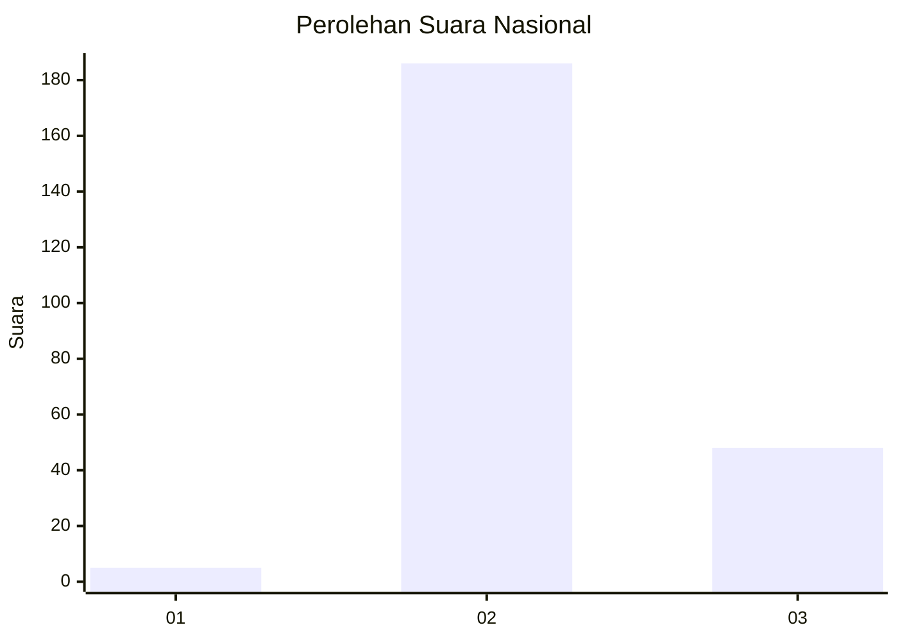

# Hasil

## Grafik

## Tabel

| No. | Nama Paslon    | Suara | Suara (raw) | Persentase |
|:--- |:-------------- | -----:| -----------:| ----------:|
| 1   | ANIES MUHAIMIN | 5     | [5][p-1]    | 2,09       |
| 2   | PRABOWO GIBRAN | 186   | [186][p-2]  | 77,82      |
| 3   | GANJAR MAHFUD  | 48    | [48][p-3]   | 20,08      |

[p-1]: https://github.com/gigit-pemilu/pemilu-2024/blob/main/pilpres/hitung-suara/sub/53-nusa-tenggara-timur/sub/01-kupang/sub/08-kupang-tengah/sub/1007-tarus/sub/003-tps/sub/paslon-1.txt
[p-2]: https://github.com/gigit-pemilu/pemilu-2024/blob/main/pilpres/hitung-suara/sub/53-nusa-tenggara-timur/sub/01-kupang/sub/08-kupang-tengah/sub/1007-tarus/sub/003-tps/sub/paslon-2.txt
[p-3]: https://github.com/gigit-pemilu/pemilu-2024/blob/main/pilpres/hitung-suara/sub/53-nusa-tenggara-timur/sub/01-kupang/sub/08-kupang-tengah/sub/1007-tarus/sub/003-tps/sub/paslon-3.txt

## Foto C Plano

https://sirekap-obj-formc.kpu.go.id/7c91/pemilu/ppwp/53/01/08/10/07/5301081007003-20240215-112321--e271ae3f-5588-45d6-8a24-898da8c2ff30.jpg

https://sirekap-obj-formc.kpu.go.id/7c91/pemilu/ppwp/53/01/08/10/07/5301081007003-20240215-112435--2a1b8287-4486-40bf-8e8e-6320d4709f8b.jpg

https://sirekap-obj-formc.kpu.go.id/7c91/pemilu/ppwp/53/01/08/10/07/5301081007003-20240215-112532--8d4ca2ee-9420-4788-b7ae-a4313df6d459.jpg

## Metadata

| Key        | Value               |
| ---------- | ------------------- |
| Time Stamp | 2024-02-15 15:00:29 |

