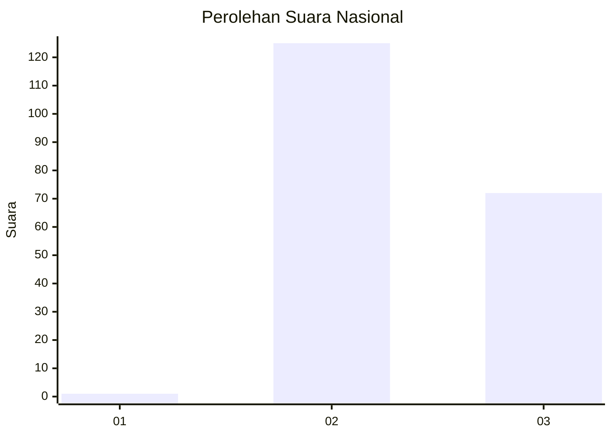
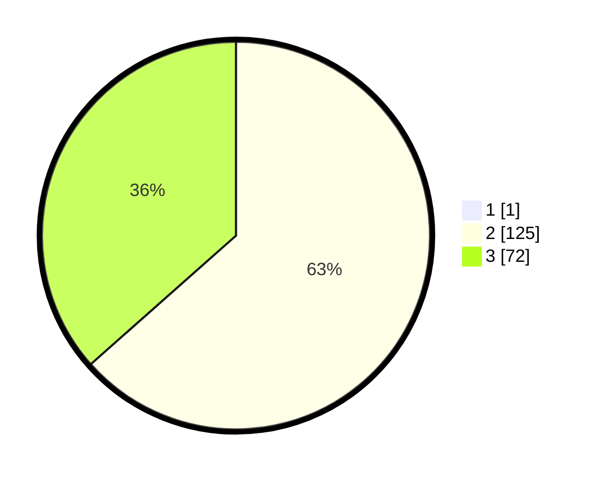

# Hasil

## Grafik

## Tabel

| No. | Nama Paslon    | Suara | Suara (raw) | Persentase |
|:--- |:-------------- | -----:| -----------:| ----------:|
| 1   | ANIES MUHAIMIN | 1     | [1][p-1]    | 0,51       |
| 2   | PRABOWO GIBRAN | 125   | [125][p-2]  | 63,13      |
| 3   | GANJAR MAHFUD  | 72    | [72][p-3]   | 36,36      |

[p-1]: https://github.com/gigit-pemilu/pemilu-2024/blob/main/pilpres/hitung-suara/sub/53-nusa-tenggara-timur/sub/01-kupang/sub/09-amarasi/sub/1002-nonbes/sub/003-tps/sub/paslon-1.txt
[p-2]: https://github.com/gigit-pemilu/pemilu-2024/blob/main/pilpres/hitung-suara/sub/53-nusa-tenggara-timur/sub/01-kupang/sub/09-amarasi/sub/1002-nonbes/sub/003-tps/sub/paslon-2.txt
[p-3]: https://github.com/gigit-pemilu/pemilu-2024/blob/main/pilpres/hitung-suara/sub/53-nusa-tenggara-timur/sub/01-kupang/sub/09-amarasi/sub/1002-nonbes/sub/003-tps/sub/paslon-3.txt

## Foto C Plano

https://sirekap-obj-formc.kpu.go.id/0f78/pemilu/ppwp/53/01/09/10/02/5301091002003-20240215-141742--c42ea9dd-7978-41fb-9411-3fa607f55537.jpg

https://sirekap-obj-formc.kpu.go.id/0f78/pemilu/ppwp/53/01/09/10/02/5301091002003-20240215-142143--279418bd-6e63-4705-b612-1da31d125a64.jpg

https://sirekap-obj-formc.kpu.go.id/0f78/pemilu/ppwp/53/01/09/10/02/5301091002003-20240215-181449--1ff6951a-7bb8-4568-af05-b1aea083da37.jpg

## Metadata

| Key        | Value               |
| ---------- | ------------------- |
| Time Stamp | 2024-02-15 22:30:27 |

