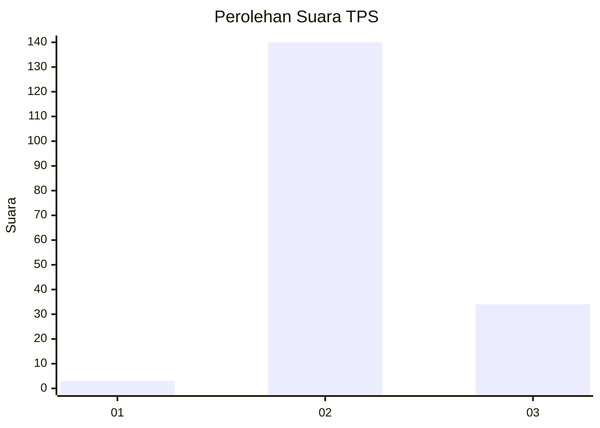
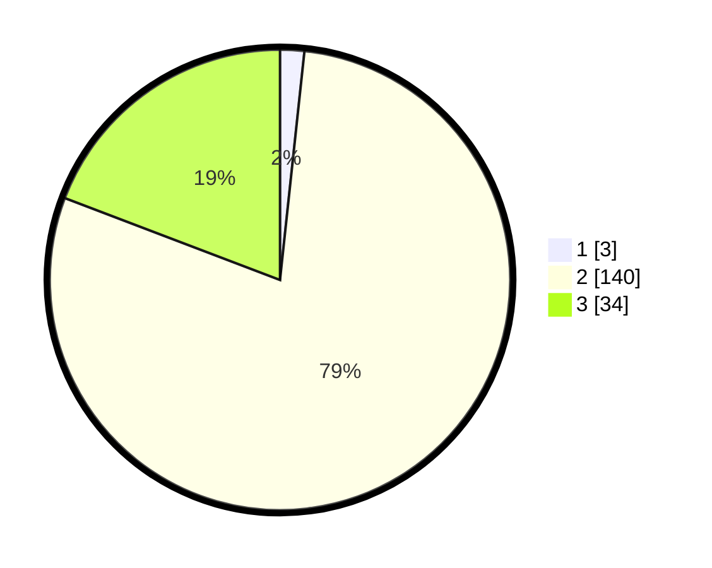

# Hasil

## Grafik

## Tabel

| No. | Nama Paslon    | Suara | Suara (raw) | Persentase |
|:--- |:-------------- | -----:| -----------:| ----------:|
| 1   | ANIES MUHAIMIN | 3     | [3][p-1]    | 1,69       |
| 2   | PRABOWO GIBRAN | 140   | [140][p-2]  | 79,10      |
| 3   | GANJAR MAHFUD  | 34    | [34][p-3]   | 19,21      |

[p-1]: https://github.com/gigit-pemilu/pemilu-2024-53-nusa-tenggara-timur/blob/main/pilpres/hitung-suara/sub/53-nusa-tenggara-timur/sub/01-kupang/sub/10-fatuleu/sub/1001-camplong-i/sub/002-tps/sub/paslon-1.txt
[p-2]: https://github.com/gigit-pemilu/pemilu-2024-53-nusa-tenggara-timur/blob/main/pilpres/hitung-suara/sub/53-nusa-tenggara-timur/sub/01-kupang/sub/10-fatuleu/sub/1001-camplong-i/sub/002-tps/sub/paslon-2.txt
[p-3]: https://github.com/gigit-pemilu/pemilu-2024-53-nusa-tenggara-timur/blob/main/pilpres/hitung-suara/sub/53-nusa-tenggara-timur/sub/01-kupang/sub/10-fatuleu/sub/1001-camplong-i/sub/002-tps/sub/paslon-3.txt

## Foto C Plano

https://sirekap-obj-formc.kpu.go.id/9dbc/pemilu/ppwp/53/01/10/10/01/5301101001002-20240215-081343--90784ad8-0670-43e3-ad3d-d440d291c4fc.jpg

https://sirekap-obj-formc.kpu.go.id/9dbc/pemilu/ppwp/53/01/10/10/01/5301101001002-20240215-081508--efdd9ca0-18f5-44aa-8ecf-0b2a60a31882.jpg

https://sirekap-obj-formc.kpu.go.id/9dbc/pemilu/ppwp/53/01/10/10/01/5301101001002-20240215-081724--c2a66c7a-ac0c-4456-a587-c729bca29b1b.jpg

## Metadata

| Key        | Value               |
| ---------- | ------------------- |
| Time Stamp | 2024-02-25 13:00:00 |

