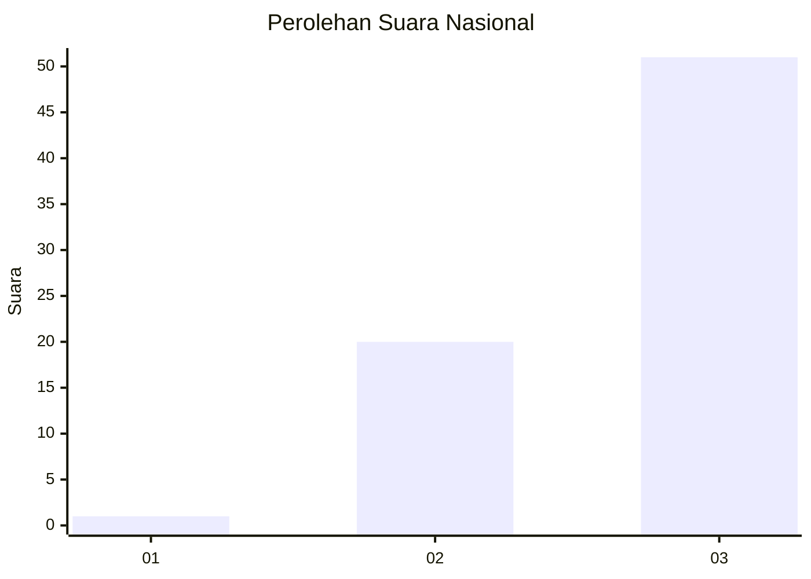
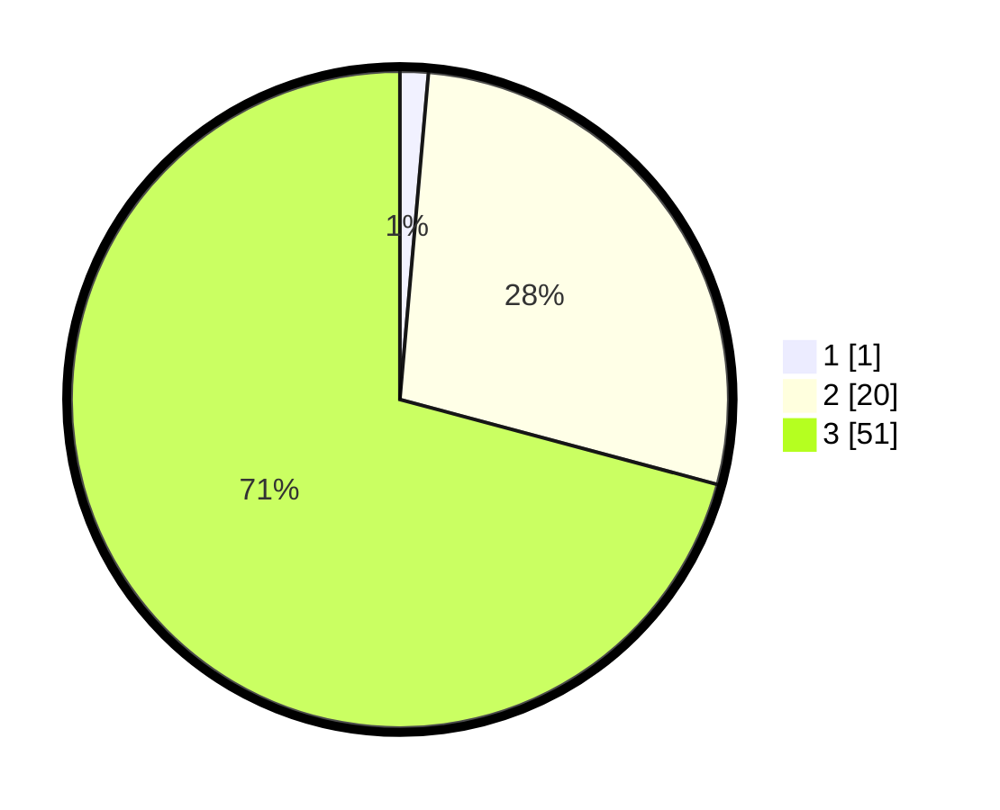

# Hasil

## Grafik

## Tabel

| No. | Nama Paslon    | Suara | Suara (raw) | Persentase |
|:--- |:-------------- | -----:| -----------:| ----------:|
| 1   | ANIES MUHAIMIN | 1     | [1][p-1]    | 1,39       |
| 2   | PRABOWO GIBRAN | 20    | [20][p-2]   | 27,78      |
| 3   | GANJAR MAHFUD  | 51    | [51][p-3]   | 70,83      |

[p-1]: https://github.com/gigit-pemilu/pemilu-2024/blob/main/pilpres/hitung-suara/sub/53-nusa-tenggara-timur/sub/01-kupang/sub/10-fatuleu/sub/2010-sillu/sub/012-tps/sub/paslon-1.txt
[p-2]: https://github.com/gigit-pemilu/pemilu-2024/blob/main/pilpres/hitung-suara/sub/53-nusa-tenggara-timur/sub/01-kupang/sub/10-fatuleu/sub/2010-sillu/sub/012-tps/sub/paslon-2.txt
[p-3]: https://github.com/gigit-pemilu/pemilu-2024/blob/main/pilpres/hitung-suara/sub/53-nusa-tenggara-timur/sub/01-kupang/sub/10-fatuleu/sub/2010-sillu/sub/012-tps/sub/paslon-3.txt

## Foto C Plano

https://sirekap-obj-formc.kpu.go.id/fe0c/pemilu/ppwp/53/01/10/20/10/5301102010012-20240215-021329--e04524a9-1266-404f-a613-26a6c95a2b9c.jpg

https://sirekap-obj-formc.kpu.go.id/fe0c/pemilu/ppwp/53/01/10/20/10/5301102010012-20240215-054422--9bbd843f-ce15-4de3-8760-43f654159b65.jpg

https://sirekap-obj-formc.kpu.go.id/fe0c/pemilu/ppwp/53/01/10/20/10/5301102010012-20240215-054629--2d7e160a-d120-4938-b60c-8ec38ac6c79b.jpg

## Metadata

| Key        | Value               |
| ---------- | ------------------- |
| Time Stamp | 2024-02-26 12:00:00 |

