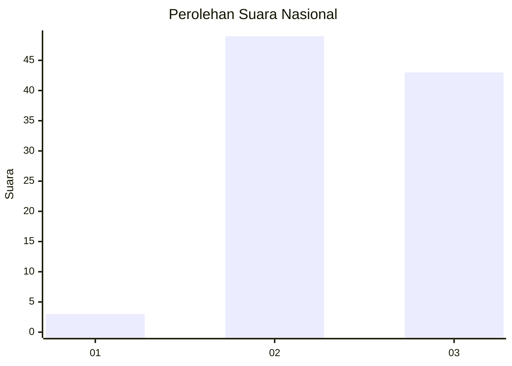
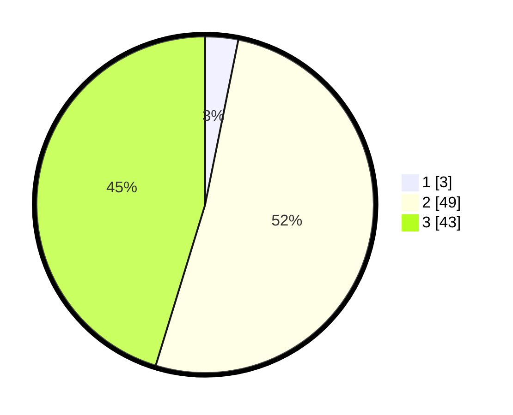

# Hasil

## Grafik

## Tabel

| No. | Nama Paslon    | Suara | Suara (raw) | Persentase |
|:--- |:-------------- | -----:| -----------:| ----------:|
| 1   | ANIES MUHAIMIN | 3     | [3][p-1]    | 3,16       |
| 2   | PRABOWO GIBRAN | 49    | [49][p-2]   | 51,58      |
| 3   | GANJAR MAHFUD  | 43    | [43][p-3]   | 45,26      |

[p-1]: https://github.com/gigit-pemilu/pemilu-2024/blob/main/pilpres/hitung-suara/sub/53-nusa-tenggara-timur/sub/01-kupang/sub/10-fatuleu/sub/2015-kiuoni/sub/004-tps/sub/paslon-1.txt
[p-2]: https://github.com/gigit-pemilu/pemilu-2024/blob/main/pilpres/hitung-suara/sub/53-nusa-tenggara-timur/sub/01-kupang/sub/10-fatuleu/sub/2015-kiuoni/sub/004-tps/sub/paslon-2.txt
[p-3]: https://github.com/gigit-pemilu/pemilu-2024/blob/main/pilpres/hitung-suara/sub/53-nusa-tenggara-timur/sub/01-kupang/sub/10-fatuleu/sub/2015-kiuoni/sub/004-tps/sub/paslon-3.txt

## Foto C Plano

https://sirekap-obj-formc.kpu.go.id/0e0f/pemilu/ppwp/53/01/10/20/15/5301102015004-20240215-082156--1e6d13f6-1da5-4191-a5bd-b5bfae7235c0.jpg

https://sirekap-obj-formc.kpu.go.id/0e0f/pemilu/ppwp/53/01/10/20/15/5301102015004-20240215-083404--33a7c345-4b68-415b-b491-052211d059a6.jpg

https://sirekap-obj-formc.kpu.go.id/0e0f/pemilu/ppwp/53/01/10/20/15/5301102015004-20240215-083651--a42ce97b-4be3-42e9-9849-42be099ffcc0.jpg

## Metadata

| Key        | Value               |
| ---------- | ------------------- |
| Time Stamp | 2024-02-25 09:00:00 |

