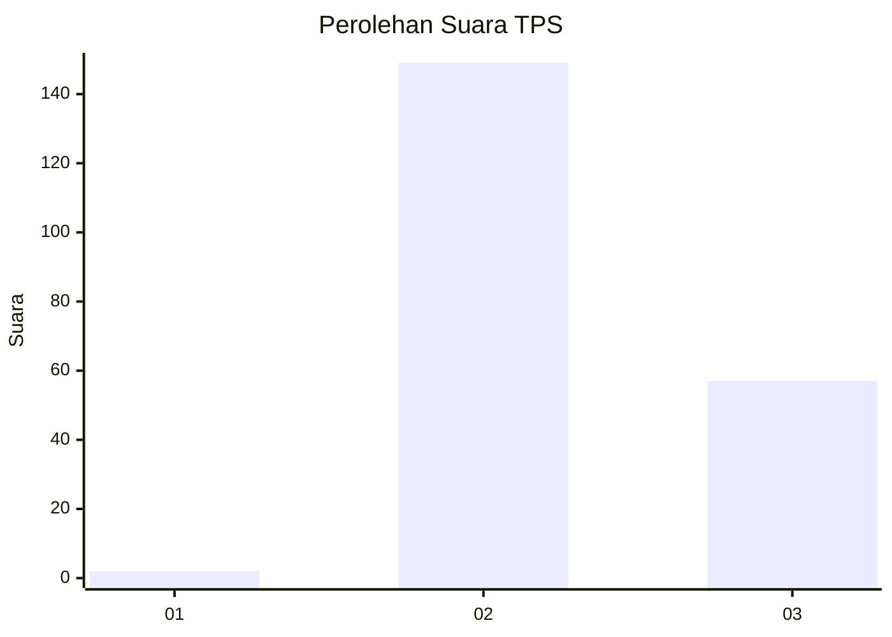
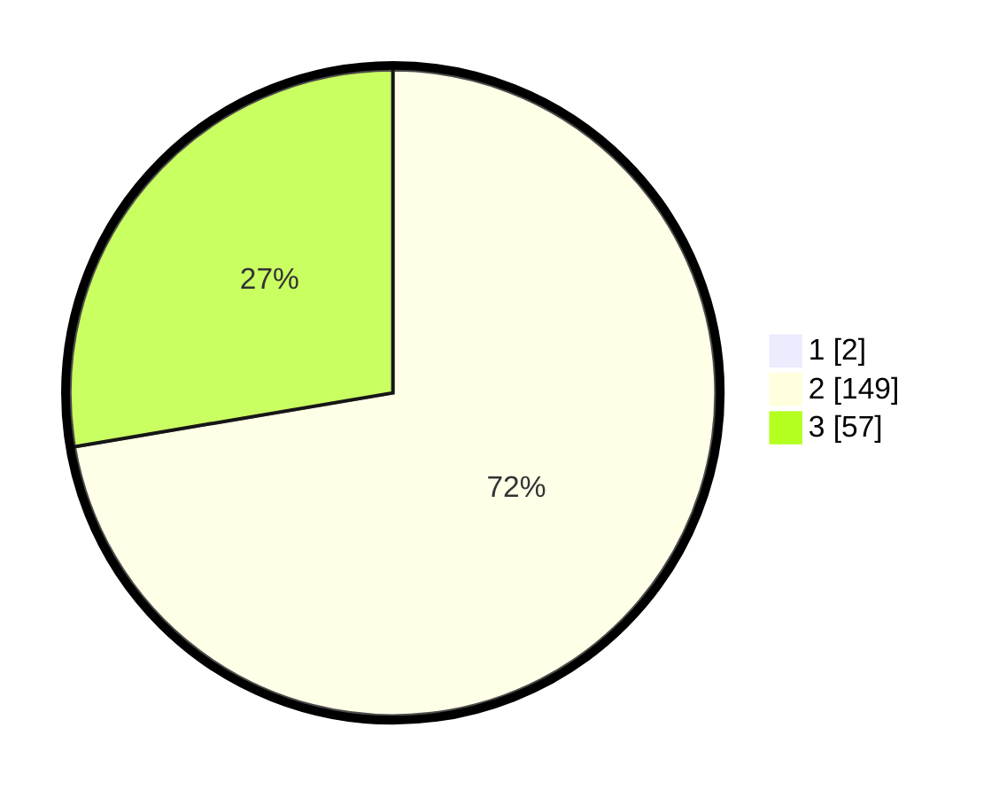

# Hasil

## Grafik

## Tabel

| No. | Nama Paslon    | Suara | Suara (raw) | Persentase |
|:--- |:-------------- | -----:| -----------:| ----------:|
| 1   | ANIES MUHAIMIN | 2     | [2][p-1]    | 0,96       |
| 2   | PRABOWO GIBRAN | 149   | [149][p-2]  | 71,63      |
| 3   | GANJAR MAHFUD  | 57    | [57][p-3]   | 27,40      |

[p-1]: https://github.com/gigit-pemilu/pemilu-2024-53-nusa-tenggara-timur/blob/main/pilpres/hitung-suara/sub/53-nusa-tenggara-timur/sub/01-kupang/sub/12-amfoang-selatan/sub/1003-lelogama/sub/002-tps/sub/paslon-1.txt
[p-2]: https://github.com/gigit-pemilu/pemilu-2024-53-nusa-tenggara-timur/blob/main/pilpres/hitung-suara/sub/53-nusa-tenggara-timur/sub/01-kupang/sub/12-amfoang-selatan/sub/1003-lelogama/sub/002-tps/sub/paslon-2.txt
[p-3]: https://github.com/gigit-pemilu/pemilu-2024-53-nusa-tenggara-timur/blob/main/pilpres/hitung-suara/sub/53-nusa-tenggara-timur/sub/01-kupang/sub/12-amfoang-selatan/sub/1003-lelogama/sub/002-tps/sub/paslon-3.txt

## Foto C Plano

https://sirekap-obj-formc.kpu.go.id/a78d/pemilu/ppwp/53/01/12/10/03/5301121003002-20240215-105007--45aa2dc9-ba8e-4b94-8e7c-4840874256f9.jpg

https://sirekap-obj-formc.kpu.go.id/a78d/pemilu/ppwp/53/01/12/10/03/5301121003002-20240215-105457--6afbb9e5-73cd-4d4b-bc10-0d744203231d.jpg

https://sirekap-obj-formc.kpu.go.id/a78d/pemilu/ppwp/53/01/12/10/03/5301121003002-20240215-105721--6c9b3103-ddfb-4d86-8a1a-b84de82f604f.jpg

## Metadata

| Key        | Value               |
| ---------- | ------------------- |
| Time Stamp | 2024-02-25 13:00:00 |

