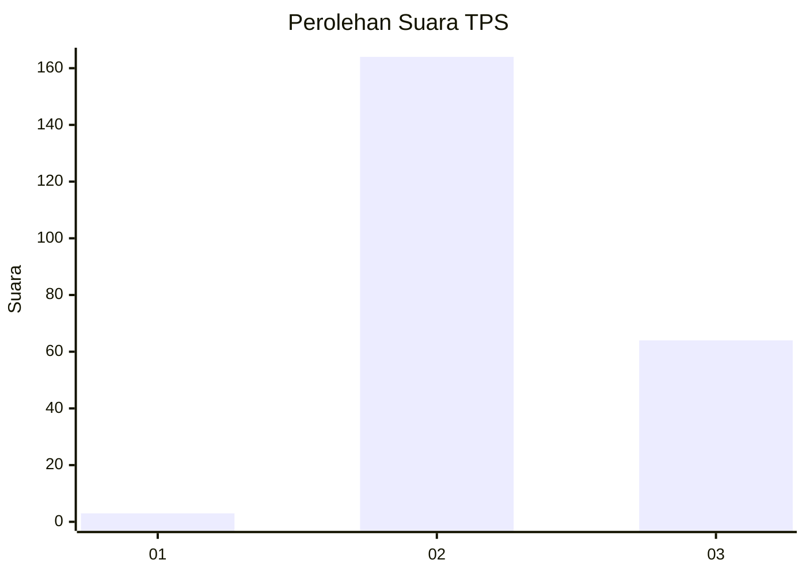
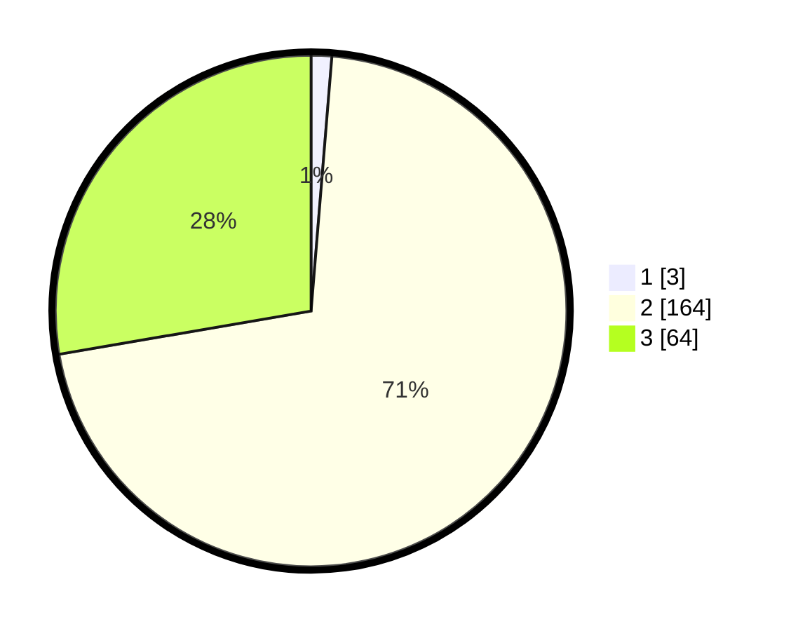

# Hasil

## Grafik

## Tabel

| No. | Nama Paslon    | Suara | Suara (raw) | Persentase |
|:--- |:-------------- | -----:| -----------:| ----------:|
| 1   | ANIES MUHAIMIN | 3     | [3][p-1]    | 1,30       |
| 2   | PRABOWO GIBRAN | 164   | [164][p-2]  | 71,00      |
| 3   | GANJAR MAHFUD  | 64    | [64][p-3]   | 27,71      |

[p-1]: https://github.com/gigit-pemilu/pemilu-2024-53-nusa-tenggara-timur/blob/main/pilpres/hitung-suara/sub/53-nusa-tenggara-timur/sub/01-kupang/sub/12-amfoang-selatan/sub/1003-lelogama/sub/005-tps/sub/paslon-1.txt
[p-2]: https://github.com/gigit-pemilu/pemilu-2024-53-nusa-tenggara-timur/blob/main/pilpres/hitung-suara/sub/53-nusa-tenggara-timur/sub/01-kupang/sub/12-amfoang-selatan/sub/1003-lelogama/sub/005-tps/sub/paslon-2.txt
[p-3]: https://github.com/gigit-pemilu/pemilu-2024-53-nusa-tenggara-timur/blob/main/pilpres/hitung-suara/sub/53-nusa-tenggara-timur/sub/01-kupang/sub/12-amfoang-selatan/sub/1003-lelogama/sub/005-tps/sub/paslon-3.txt

## Foto C Plano

https://sirekap-obj-formc.kpu.go.id/848d/pemilu/ppwp/53/01/12/10/03/5301121003005-20240215-102946--11308689-af9a-4d3d-866a-d8942124a06a.jpg

https://sirekap-obj-formc.kpu.go.id/848d/pemilu/ppwp/53/01/12/10/03/5301121003005-20240215-103201--cae26137-42eb-4340-b471-e800ea4b2d34.jpg

https://sirekap-obj-formc.kpu.go.id/848d/pemilu/ppwp/53/01/12/10/03/5301121003005-20240215-103520--80a47eb8-2a6a-462c-805a-de39f788af96.jpg

## Metadata

| Key        | Value               |
| ---------- | ------------------- |
| Time Stamp | 2024-02-19 06:16:00 |

