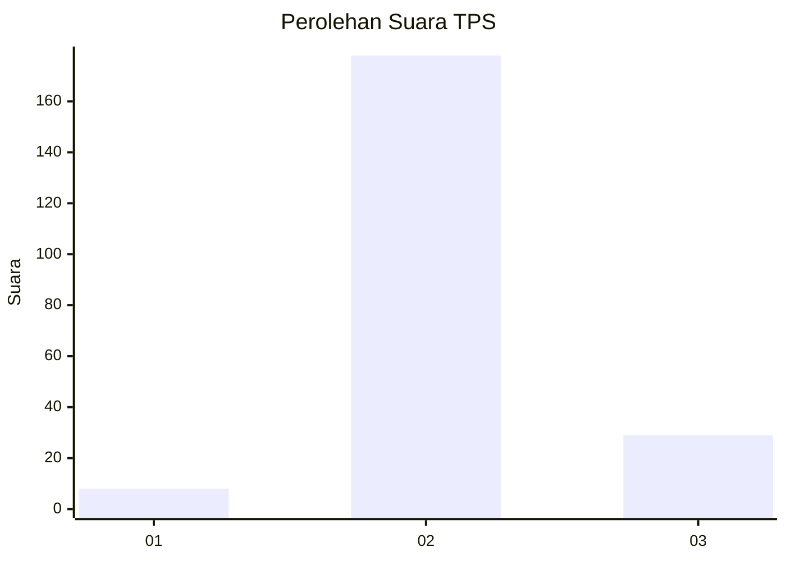
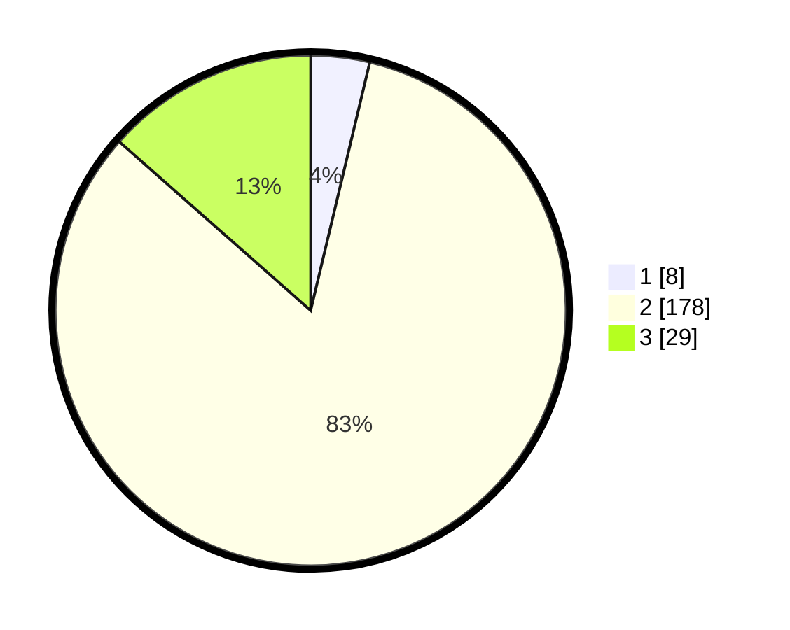

# Hasil

## Grafik

## Tabel

| No. | Nama Paslon    | Suara | Suara (raw) | Persentase |
|:--- |:-------------- | -----:| -----------:| ----------:|
| 1   | ANIES MUHAIMIN | 8     | [8][p-1]    | 3,72       |
| 2   | PRABOWO GIBRAN | 178   | [178][p-2]  | 82,79      |
| 3   | GANJAR MAHFUD  | 29    | [29][p-3]   | 13,49      |

[p-1]: https://github.com/gigit-pemilu/pemilu-2024-53-nusa-tenggara-timur/blob/main/pilpres/hitung-suara/sub/53-nusa-tenggara-timur/sub/01-kupang/sub/12-amfoang-selatan/sub/1003-lelogama/sub/006-tps/sub/paslon-1.txt
[p-2]: https://github.com/gigit-pemilu/pemilu-2024-53-nusa-tenggara-timur/blob/main/pilpres/hitung-suara/sub/53-nusa-tenggara-timur/sub/01-kupang/sub/12-amfoang-selatan/sub/1003-lelogama/sub/006-tps/sub/paslon-2.txt
[p-3]: https://github.com/gigit-pemilu/pemilu-2024-53-nusa-tenggara-timur/blob/main/pilpres/hitung-suara/sub/53-nusa-tenggara-timur/sub/01-kupang/sub/12-amfoang-selatan/sub/1003-lelogama/sub/006-tps/sub/paslon-3.txt

## Foto C Plano

https://sirekap-obj-formc.kpu.go.id/b6b1/pemilu/ppwp/53/01/12/10/03/5301121003006-20240215-110155--25d93e30-7d45-4128-b257-4fe952a81472.jpg

https://sirekap-obj-formc.kpu.go.id/b6b1/pemilu/ppwp/53/01/12/10/03/5301121003006-20240215-110435--37a8ba79-33eb-4e6b-9889-b58ddb36bfcb.jpg

https://sirekap-obj-formc.kpu.go.id/b6b1/pemilu/ppwp/53/01/12/10/03/5301121003006-20240215-110956--269ba61f-1c06-4078-8129-0c41b9f10388.jpg

## Metadata

| Key        | Value               |
| ---------- | ------------------- |
| Time Stamp | 2024-02-25 18:00:00 |

