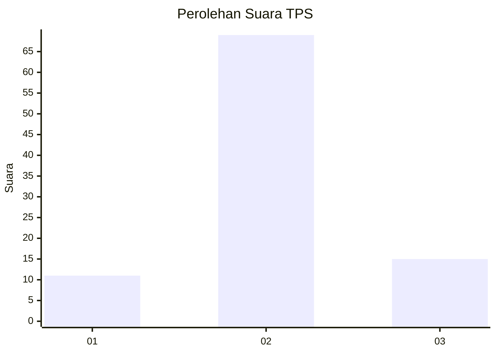

# Hasil

## Grafik

## Tabel

| No. | Nama Paslon    | Suara | Suara (raw) | Persentase |
|:--- |:-------------- | -----:| -----------:| ----------:|
| 1   | ANIES MUHAIMIN | 11    | [11][p-1]   | 11,58      |
| 2   | PRABOWO GIBRAN | 69    | [69][p-2]   | 72,63      |
| 3   | GANJAR MAHFUD  | 15    | [15][p-3]   | 15,79      |

[p-1]: https://github.com/gigit-pemilu/pemilu-2024-53-nusa-tenggara-timur/blob/main/pilpres/hitung-suara/sub/53-nusa-tenggara-timur/sub/01-kupang/sub/13-amfoang-utara/sub/1002-naikliu/sub/001-tps/sub/paslon-1.txt
[p-2]: https://github.com/gigit-pemilu/pemilu-2024-53-nusa-tenggara-timur/blob/main/pilpres/hitung-suara/sub/53-nusa-tenggara-timur/sub/01-kupang/sub/13-amfoang-utara/sub/1002-naikliu/sub/001-tps/sub/paslon-2.txt
[p-3]: https://github.com/gigit-pemilu/pemilu-2024-53-nusa-tenggara-timur/blob/main/pilpres/hitung-suara/sub/53-nusa-tenggara-timur/sub/01-kupang/sub/13-amfoang-utara/sub/1002-naikliu/sub/001-tps/sub/paslon-3.txt

## Foto C Plano

https://sirekap-obj-formc.kpu.go.id/3ad8/pemilu/ppwp/53/01/13/10/02/5301131002001-20240215-154120--e99696fc-0784-4ff4-a75f-a14ac69f7e2e.jpg

https://sirekap-obj-formc.kpu.go.id/3ad8/pemilu/ppwp/53/01/13/10/02/5301131002001-20240215-154344--fc7507aa-bd3e-4695-8fae-d47457d69ffb.jpg

https://sirekap-obj-formc.kpu.go.id/3ad8/pemilu/ppwp/53/01/13/10/02/5301131002001-20240215-154502--8e21519f-6c79-4460-b958-712229819ab8.jpg

## Metadata

| Key        | Value               |
| ---------- | ------------------- |
| Time Stamp | 2024-02-16 10:00:28 |

