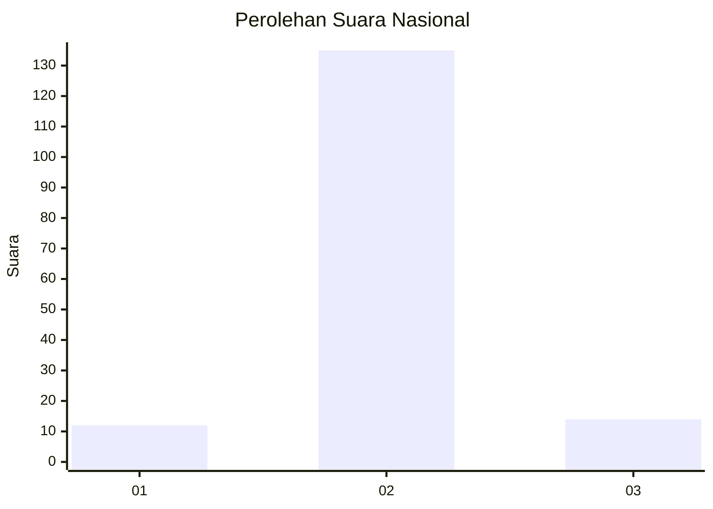
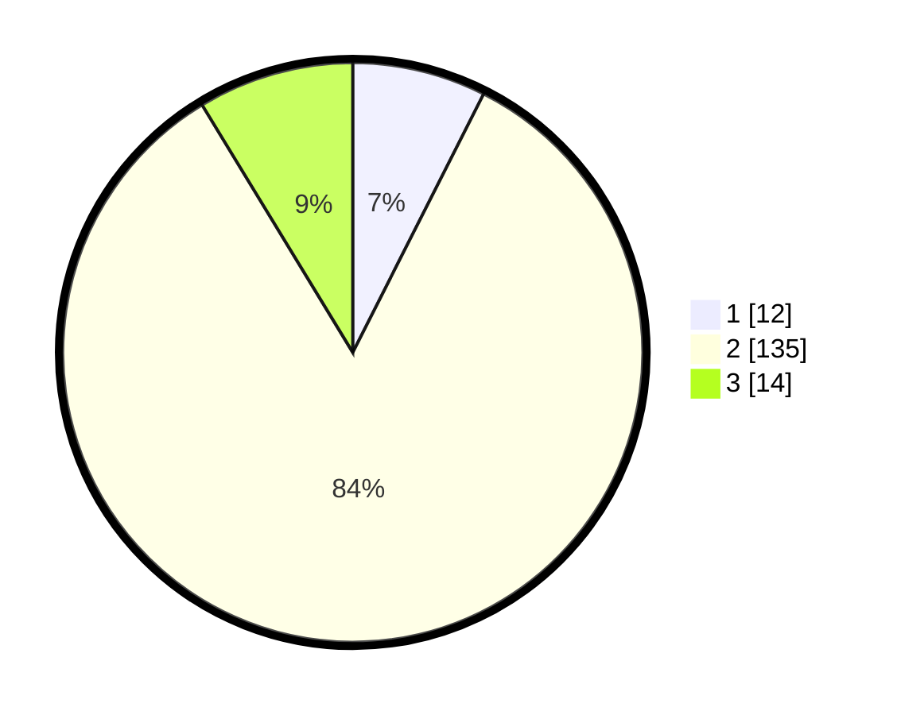

# Hasil

## Grafik

## Tabel

| No. | Nama Paslon    | Suara | Suara (raw) | Persentase |
|:--- |:-------------- | -----:| -----------:| ----------:|
| 1   | ANIES MUHAIMIN | 12    | [12][p-1]   | 7,45       |
| 2   | PRABOWO GIBRAN | 135   | [135][p-2]  | 83,85      |
| 3   | GANJAR MAHFUD  | 14    | [14][p-3]   | 8,70       |

[p-1]: https://github.com/gigit-pemilu/pemilu-2024/blob/main/pilpres/hitung-suara/sub/53-nusa-tenggara-timur/sub/01-kupang/sub/13-amfoang-utara/sub/1002-naikliu/sub/002-tps/sub/paslon-1.txt
[p-2]: https://github.com/gigit-pemilu/pemilu-2024/blob/main/pilpres/hitung-suara/sub/53-nusa-tenggara-timur/sub/01-kupang/sub/13-amfoang-utara/sub/1002-naikliu/sub/002-tps/sub/paslon-2.txt
[p-3]: https://github.com/gigit-pemilu/pemilu-2024/blob/main/pilpres/hitung-suara/sub/53-nusa-tenggara-timur/sub/01-kupang/sub/13-amfoang-utara/sub/1002-naikliu/sub/002-tps/sub/paslon-3.txt

## Foto C Plano

https://sirekap-obj-formc.kpu.go.id/a568/pemilu/ppwp/53/01/13/10/02/5301131002002-20240215-143942--4a056c52-55e0-4f55-923e-5b73fbbdc7ce.jpg

https://sirekap-obj-formc.kpu.go.id/a568/pemilu/ppwp/53/01/13/10/02/5301131002002-20240215-144349--e9ac4fa9-4c9b-44c3-9896-2287b4b373ab.jpg

https://sirekap-obj-formc.kpu.go.id/a568/pemilu/ppwp/53/01/13/10/02/5301131002002-20240215-144637--6cf164dd-f514-446d-babe-7adb3d9800f5.jpg

## Metadata

| Key        | Value               |
| ---------- | ------------------- |
| Time Stamp | 2024-02-16 10:00:28 |

