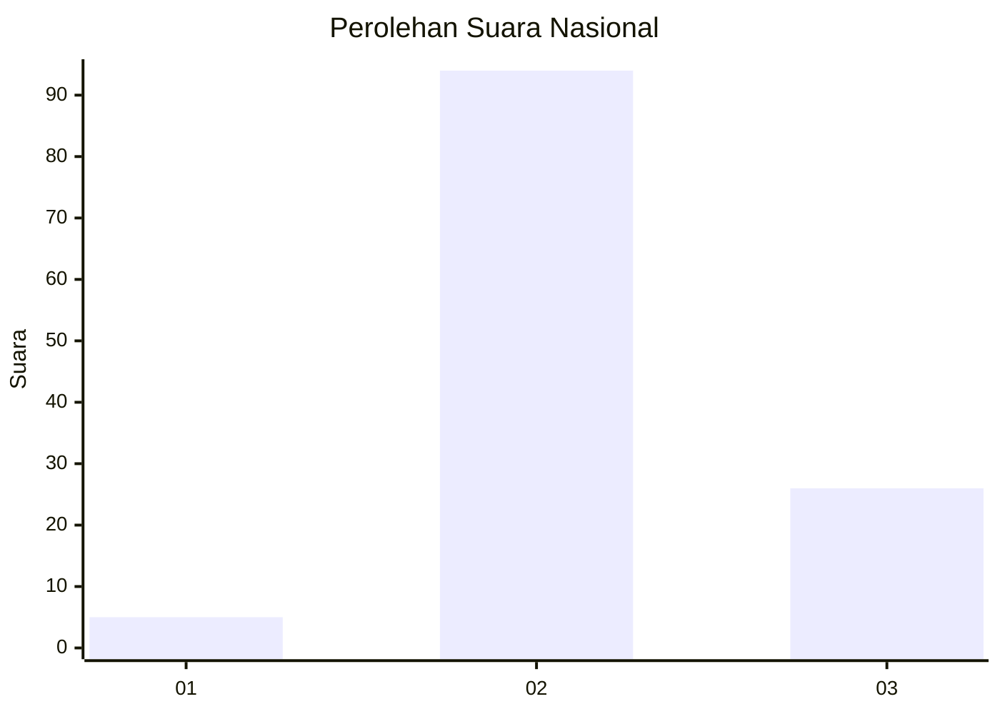

# Hasil

## Grafik

## Tabel

| No. | Nama Paslon    | Suara | Suara (raw) | Persentase |
|:--- |:-------------- | -----:| -----------:| ----------:|
| 1   | ANIES MUHAIMIN | 5     | [5][p-1]    | 4,00       |
| 2   | PRABOWO GIBRAN | 94    | [94][p-2]   | 75,20      |
| 3   | GANJAR MAHFUD  | 26    | [26][p-3]   | 20,80      |

[p-1]: https://github.com/gigit-pemilu/pemilu-2024/blob/main/pilpres/hitung-suara/sub/53-nusa-tenggara-timur/sub/01-kupang/sub/13-amfoang-utara/sub/1002-naikliu/sub/005-tps/sub/paslon-1.txt
[p-2]: https://github.com/gigit-pemilu/pemilu-2024/blob/main/pilpres/hitung-suara/sub/53-nusa-tenggara-timur/sub/01-kupang/sub/13-amfoang-utara/sub/1002-naikliu/sub/005-tps/sub/paslon-2.txt
[p-3]: https://github.com/gigit-pemilu/pemilu-2024/blob/main/pilpres/hitung-suara/sub/53-nusa-tenggara-timur/sub/01-kupang/sub/13-amfoang-utara/sub/1002-naikliu/sub/005-tps/sub/paslon-3.txt

## Foto C Plano

https://sirekap-obj-formc.kpu.go.id/102f/pemilu/ppwp/53/01/13/10/02/5301131002005-20240215-131938--14315095-ce5c-4210-9040-9f116c3fea18.jpg

https://sirekap-obj-formc.kpu.go.id/102f/pemilu/ppwp/53/01/13/10/02/5301131002005-20240215-133711--2cdba680-3140-4c4b-9f4b-85238e618f46.jpg

https://sirekap-obj-formc.kpu.go.id/102f/pemilu/ppwp/53/01/13/10/02/5301131002005-20240215-132255--34c16069-ce3c-42f4-8eed-f687273ba1a5.jpg

## Metadata

| Key        | Value               |
| ---------- | ------------------- |
| Time Stamp | 2024-02-16 10:00:28 |

