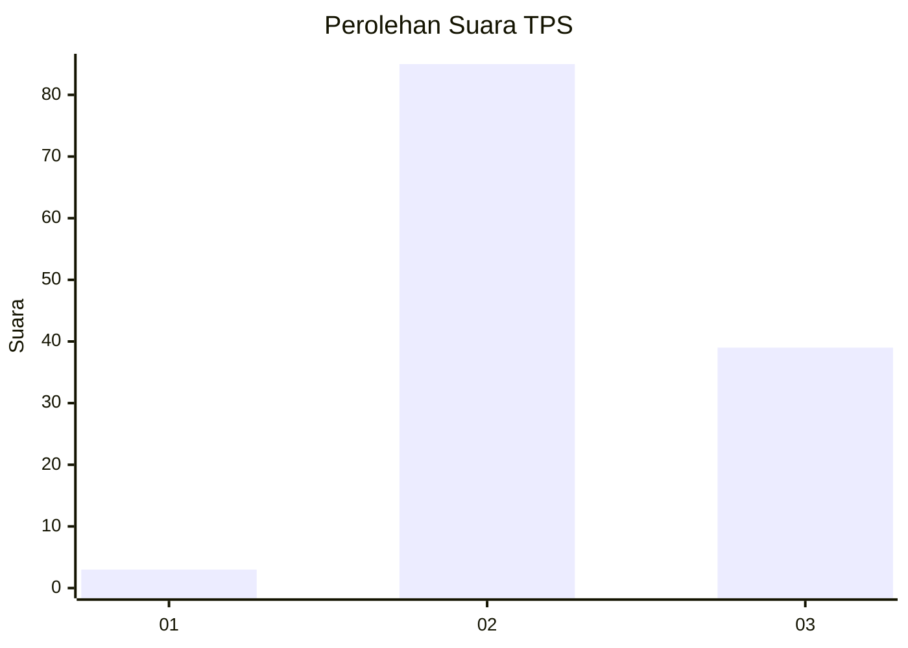
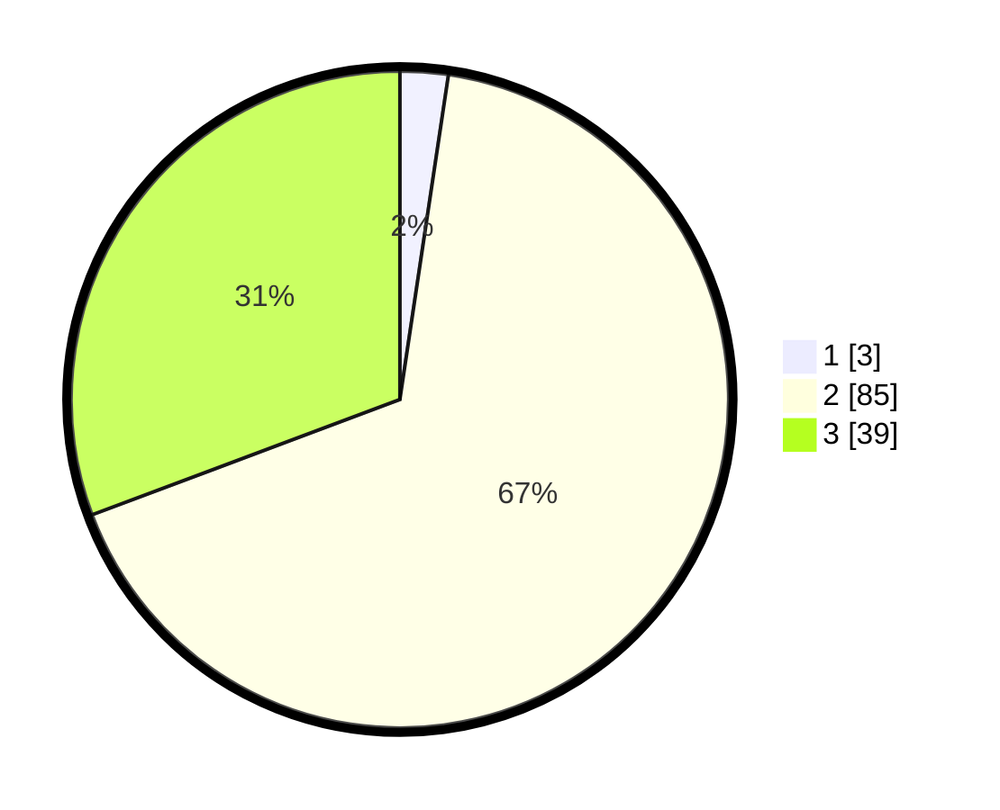

# Hasil

## Grafik

## Tabel

| No. | Nama Paslon    | Suara | Suara (raw) | Persentase |
|:--- |:-------------- | -----:| -----------:| ----------:|
| 1   | ANIES MUHAIMIN | 3     | [3][p-1]    | 2,36       |
| 2   | PRABOWO GIBRAN | 85    | [85][p-2]   | 66,93      |
| 3   | GANJAR MAHFUD  | 39    | [39][p-3]   | 30,71      |

[p-1]: https://github.com/gigit-pemilu/pemilu-2024-53-nusa-tenggara-timur/blob/main/pilpres/hitung-suara/sub/53-nusa-tenggara-timur/sub/01-kupang/sub/13-amfoang-utara/sub/2001-afoan/sub/002-tps/sub/paslon-1.txt
[p-2]: https://github.com/gigit-pemilu/pemilu-2024-53-nusa-tenggara-timur/blob/main/pilpres/hitung-suara/sub/53-nusa-tenggara-timur/sub/01-kupang/sub/13-amfoang-utara/sub/2001-afoan/sub/002-tps/sub/paslon-2.txt
[p-3]: https://github.com/gigit-pemilu/pemilu-2024-53-nusa-tenggara-timur/blob/main/pilpres/hitung-suara/sub/53-nusa-tenggara-timur/sub/01-kupang/sub/13-amfoang-utara/sub/2001-afoan/sub/002-tps/sub/paslon-3.txt

## Foto C Plano

https://sirekap-obj-formc.kpu.go.id/32c1/pemilu/ppwp/53/01/13/20/01/5301132001002-20240215-021621--907fdb68-cf93-40bb-b955-358c457f3c23.jpg

https://sirekap-obj-formc.kpu.go.id/32c1/pemilu/ppwp/53/01/13/20/01/5301132001002-20240215-021919--02093e92-0b53-4fa6-848d-69dab694b7c8.jpg

https://sirekap-obj-formc.kpu.go.id/32c1/pemilu/ppwp/53/01/13/20/01/5301132001002-20240215-022049--4d63a732-5467-4e2f-87e5-e4986fa6ff07.jpg

## Metadata

| Key        | Value               |
| ---------- | ------------------- |
| Time Stamp | 2024-02-15 15:00:29 |

