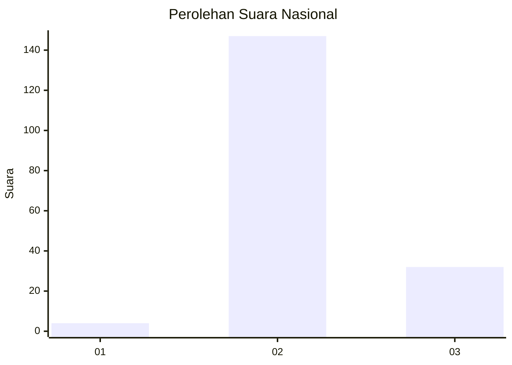

# Hasil

## Grafik

## Tabel

| No. | Nama Paslon    | Suara | Suara (raw) | Persentase |
|:--- |:-------------- | -----:| -----------:| ----------:|
| 1   | ANIES MUHAIMIN | 4     | [4][p-1]    | 2,19       |
| 2   | PRABOWO GIBRAN | 147   | [147][p-2]  | 80,33      |
| 3   | GANJAR MAHFUD  | 32    | [32][p-3]   | 17,49      |

[p-1]: https://github.com/gigit-pemilu/pemilu-2024/blob/main/pilpres/hitung-suara/sub/53-nusa-tenggara-timur/sub/01-kupang/sub/17-amarasi-barat/sub/1001-teunbaun/sub/003-tps/sub/paslon-1.txt
[p-2]: https://github.com/gigit-pemilu/pemilu-2024/blob/main/pilpres/hitung-suara/sub/53-nusa-tenggara-timur/sub/01-kupang/sub/17-amarasi-barat/sub/1001-teunbaun/sub/003-tps/sub/paslon-2.txt
[p-3]: https://github.com/gigit-pemilu/pemilu-2024/blob/main/pilpres/hitung-suara/sub/53-nusa-tenggara-timur/sub/01-kupang/sub/17-amarasi-barat/sub/1001-teunbaun/sub/003-tps/sub/paslon-3.txt

## Foto C Plano

https://sirekap-obj-formc.kpu.go.id/2505/pemilu/ppwp/53/01/17/10/01/5301171001003-20240214-233452--db21c317-5f48-4030-8fa2-ca9687dd7693.jpg

https://sirekap-obj-formc.kpu.go.id/2505/pemilu/ppwp/53/01/17/10/01/5301171001003-20240214-233826--d9e7c0db-8580-4bac-a2ed-c371410da492.jpg

https://sirekap-obj-formc.kpu.go.id/2505/pemilu/ppwp/53/01/17/10/01/5301171001003-20240214-234207--ebec104b-2835-40f5-b679-25ccb16a0999.jpg

## Metadata

| Key        | Value               |
| ---------- | ------------------- |
| Time Stamp | 2024-02-15 15:00:29 |

