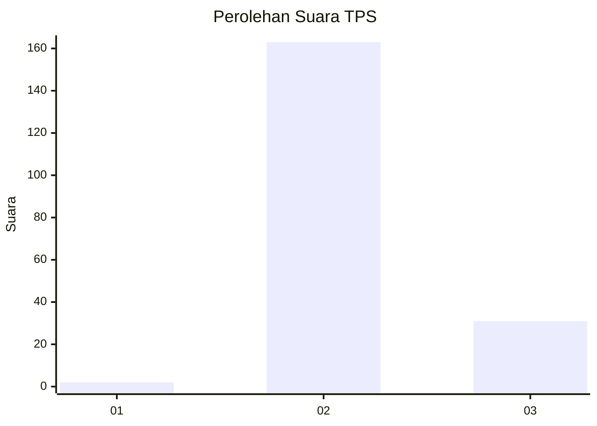
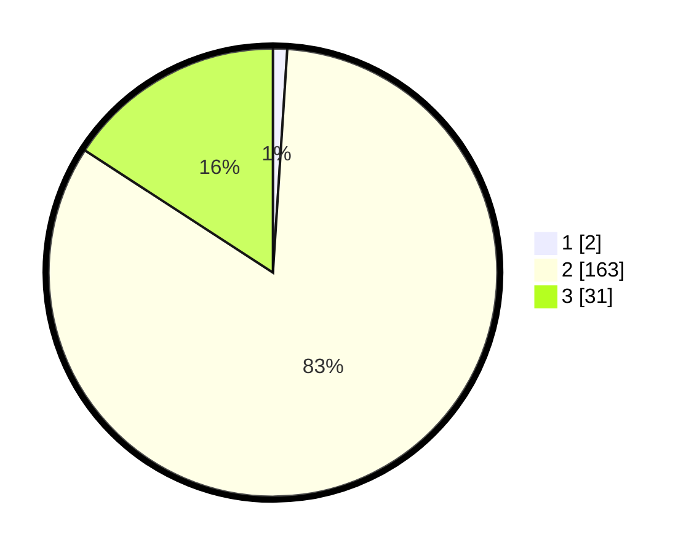

# Hasil

## Grafik

## Tabel

| No. | Nama Paslon    | Suara | Suara (raw) | Persentase |
|:--- |:-------------- | -----:| -----------:| ----------:|
| 1   | ANIES MUHAIMIN | 2     | [2][p-1]    | 1,02       |
| 2   | PRABOWO GIBRAN | 163   | [163][p-2]  | 83,16      |
| 3   | GANJAR MAHFUD  | 31    | [31][p-3]   | 15,82      |

[p-1]: https://github.com/gigit-pemilu/pemilu-2024-53-nusa-tenggara-timur/blob/main/pilpres/hitung-suara/sub/53-nusa-tenggara-timur/sub/01-kupang/sub/23-semau-selatan/sub/2002-uitiuh-ana/sub/001-tps/sub/paslon-1.txt
[p-2]: https://github.com/gigit-pemilu/pemilu-2024-53-nusa-tenggara-timur/blob/main/pilpres/hitung-suara/sub/53-nusa-tenggara-timur/sub/01-kupang/sub/23-semau-selatan/sub/2002-uitiuh-ana/sub/001-tps/sub/paslon-2.txt
[p-3]: https://github.com/gigit-pemilu/pemilu-2024-53-nusa-tenggara-timur/blob/main/pilpres/hitung-suara/sub/53-nusa-tenggara-timur/sub/01-kupang/sub/23-semau-selatan/sub/2002-uitiuh-ana/sub/001-tps/sub/paslon-3.txt

## Foto C Plano

https://sirekap-obj-formc.kpu.go.id/0195/pemilu/ppwp/53/01/23/20/02/5301232002001-20240215-004940--4a7e7857-efe8-482d-ac6a-a95bff92e5ee.jpg

https://sirekap-obj-formc.kpu.go.id/0195/pemilu/ppwp/53/01/23/20/02/5301232002001-20240215-161550--e16963d4-6ddb-4e3f-a635-5585e32815db.jpg

https://sirekap-obj-formc.kpu.go.id/0195/pemilu/ppwp/53/01/23/20/02/5301232002001-20240215-004934--d0f47d48-a7d1-4131-80d1-d48551dc496f.jpg

## Metadata

| Key        | Value               |
| ---------- | ------------------- |
| Time Stamp | 2024-02-21 22:00:00 |

