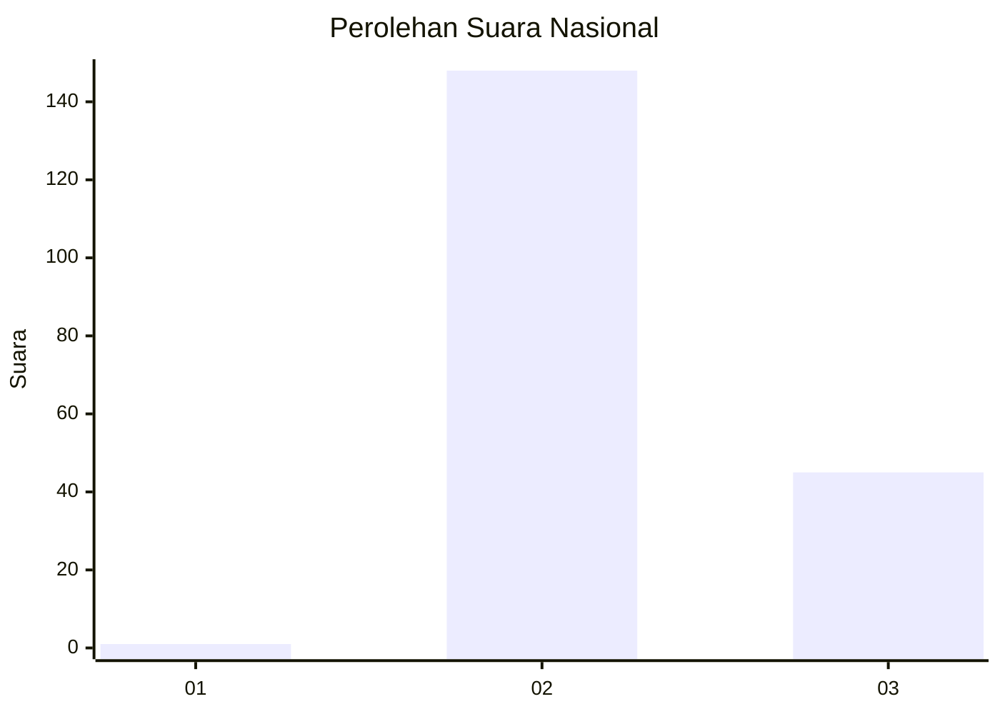
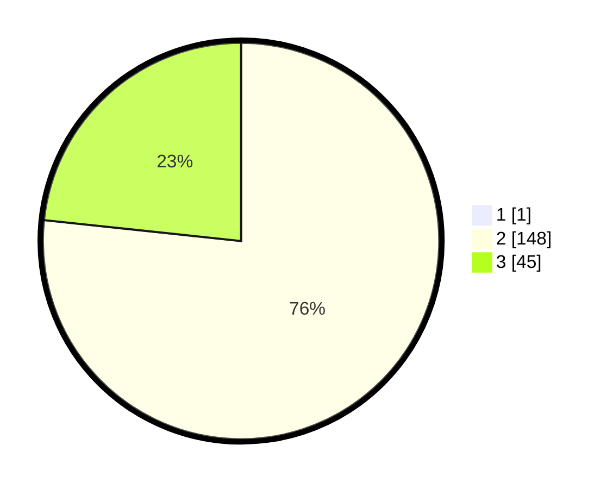

# Hasil

## Grafik

## Tabel

| No. | Nama Paslon    | Suara | Suara (raw) | Persentase |
|:--- |:-------------- | -----:| -----------:| ----------:|
| 1   | ANIES MUHAIMIN | 1     | [1][p-1]    | 0,52       |
| 2   | PRABOWO GIBRAN | 148   | [148][p-2]  | 76,29      |
| 3   | GANJAR MAHFUD  | 45    | [45][p-3]   | 23,20      |

[p-1]: https://github.com/gigit-pemilu/pemilu-2024/blob/main/pilpres/hitung-suara/sub/53-nusa-tenggara-timur/sub/01-kupang/sub/23-semau-selatan/sub/2002-uitiuh-ana/sub/002-tps/sub/paslon-1.txt
[p-2]: https://github.com/gigit-pemilu/pemilu-2024/blob/main/pilpres/hitung-suara/sub/53-nusa-tenggara-timur/sub/01-kupang/sub/23-semau-selatan/sub/2002-uitiuh-ana/sub/002-tps/sub/paslon-2.txt
[p-3]: https://github.com/gigit-pemilu/pemilu-2024/blob/main/pilpres/hitung-suara/sub/53-nusa-tenggara-timur/sub/01-kupang/sub/23-semau-selatan/sub/2002-uitiuh-ana/sub/002-tps/sub/paslon-3.txt

## Foto C Plano

https://sirekap-obj-formc.kpu.go.id/9897/pemilu/ppwp/53/01/23/20/02/5301232002002-20240215-104338--72262853-c80d-4f82-842c-f9a708deee03.jpg

https://sirekap-obj-formc.kpu.go.id/9897/pemilu/ppwp/53/01/23/20/02/5301232002002-20240215-090246--db064e92-d389-4cc8-a983-5d9852200b13.jpg

https://sirekap-obj-formc.kpu.go.id/9897/pemilu/ppwp/53/01/23/20/02/5301232002002-20240215-090922--bf2158c9-4d02-4e1c-827c-53abcac51d6c.jpg

## Metadata

| Key        | Value               |
| ---------- | ------------------- |
| Time Stamp | 2024-02-15 18:00:26 |

