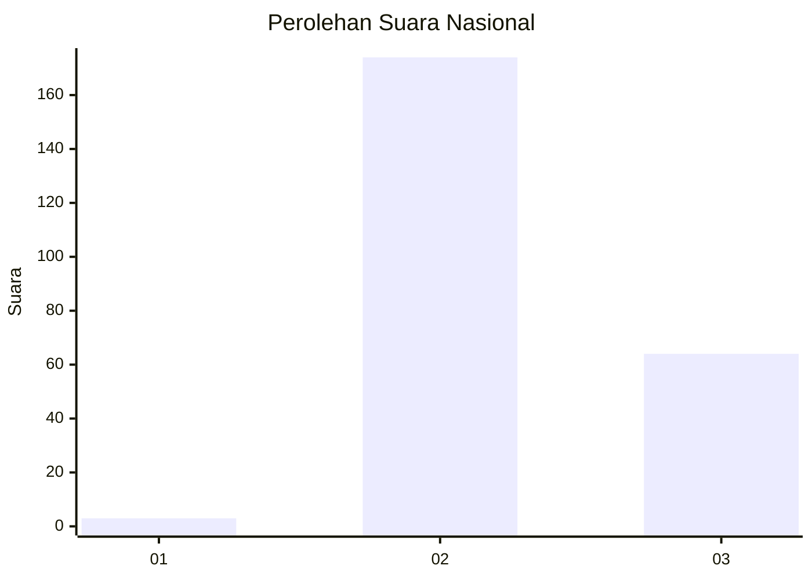
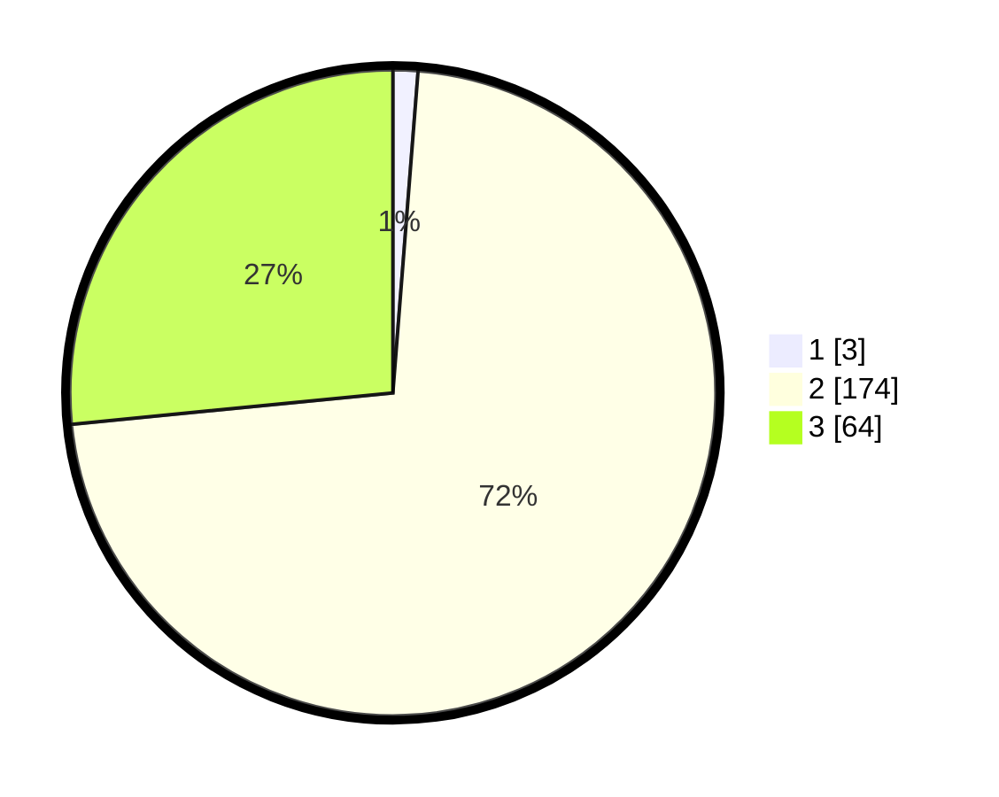

# Hasil

## Grafik

## Tabel

| No. | Nama Paslon    | Suara | Suara (raw) | Persentase |
|:--- |:-------------- | -----:| -----------:| ----------:|
| 1   | ANIES MUHAIMIN | 3     | [3][p-1]    | 1,24       |
| 2   | PRABOWO GIBRAN | 174   | [174][p-2]  | 72,20      |
| 3   | GANJAR MAHFUD  | 64    | [64][p-3]   | 26,56      |

[p-1]: https://github.com/gigit-pemilu/pemilu-2024/blob/main/pilpres/hitung-suara/sub/53-nusa-tenggara-timur/sub/01-kupang/sub/23-semau-selatan/sub/2002-uitiuh-ana/sub/003-tps/sub/paslon-1.txt
[p-2]: https://github.com/gigit-pemilu/pemilu-2024/blob/main/pilpres/hitung-suara/sub/53-nusa-tenggara-timur/sub/01-kupang/sub/23-semau-selatan/sub/2002-uitiuh-ana/sub/003-tps/sub/paslon-2.txt
[p-3]: https://github.com/gigit-pemilu/pemilu-2024/blob/main/pilpres/hitung-suara/sub/53-nusa-tenggara-timur/sub/01-kupang/sub/23-semau-selatan/sub/2002-uitiuh-ana/sub/003-tps/sub/paslon-3.txt

## Foto C Plano

https://sirekap-obj-formc.kpu.go.id/ccf4/pemilu/ppwp/53/01/23/20/02/5301232002003-20240215-092532--755a64c1-f2f8-4a27-b98e-d330c589b240.jpg

https://sirekap-obj-formc.kpu.go.id/ccf4/pemilu/ppwp/53/01/23/20/02/5301232002003-20240215-092827--98abf218-7a4d-4a3a-915c-67269e62bd18.jpg

https://sirekap-obj-formc.kpu.go.id/ccf4/pemilu/ppwp/53/01/23/20/02/5301232002003-20240215-093124--36da969e-ec5f-4896-8a36-407895030995.jpg

## Metadata

| Key        | Value               |
| ---------- | ------------------- |
| Time Stamp | 2024-02-15 18:00:26 |

