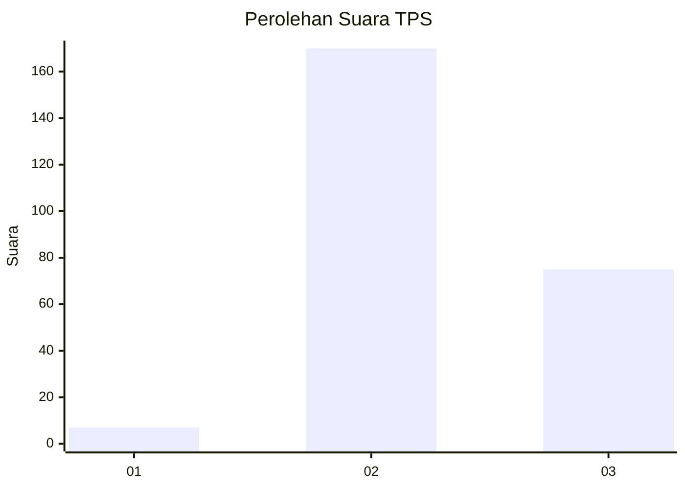

# Hasil

## Grafik

## Tabel

| No. | Nama Paslon    | Suara | Suara (raw) | Persentase |
|:--- |:-------------- | -----:| -----------:| ----------:|
| 1   | ANIES MUHAIMIN | 7     | [7][p-1]    | 2,78       |
| 2   | PRABOWO GIBRAN | 170   | [170][p-2]  | 67,46      |
| 3   | GANJAR MAHFUD  | 75    | [75][p-3]   | 29,76      |

[p-1]: https://github.com/gigit-pemilu/pemilu-2024-53-nusa-tenggara-timur/blob/main/pilpres/hitung-suara/sub/53-nusa-tenggara-timur/sub/01-kupang/sub/24-taebenu/sub/2001-oeltuah/sub/011-tps/sub/paslon-1.txt
[p-2]: https://github.com/gigit-pemilu/pemilu-2024-53-nusa-tenggara-timur/blob/main/pilpres/hitung-suara/sub/53-nusa-tenggara-timur/sub/01-kupang/sub/24-taebenu/sub/2001-oeltuah/sub/011-tps/sub/paslon-2.txt
[p-3]: https://github.com/gigit-pemilu/pemilu-2024-53-nusa-tenggara-timur/blob/main/pilpres/hitung-suara/sub/53-nusa-tenggara-timur/sub/01-kupang/sub/24-taebenu/sub/2001-oeltuah/sub/011-tps/sub/paslon-3.txt

## Foto C Plano

https://sirekap-obj-formc.kpu.go.id/12a9/pemilu/ppwp/53/01/24/20/01/5301242001011-20240215-102028--338d550d-f679-4d23-a635-67c88da87309.jpg

https://sirekap-obj-formc.kpu.go.id/12a9/pemilu/ppwp/53/01/24/20/01/5301242001011-20240215-101912--f13d08ba-5c8f-4223-96fd-1c133af77e76.jpg

https://sirekap-obj-formc.kpu.go.id/12a9/pemilu/ppwp/53/01/24/20/01/5301242001011-20240215-123917--85a2a808-dcfa-43e6-9ca9-87bb464474d8.jpg

## Metadata

| Key        | Value               |
| ---------- | ------------------- |
| Time Stamp | 2024-02-24 22:31:28 |

