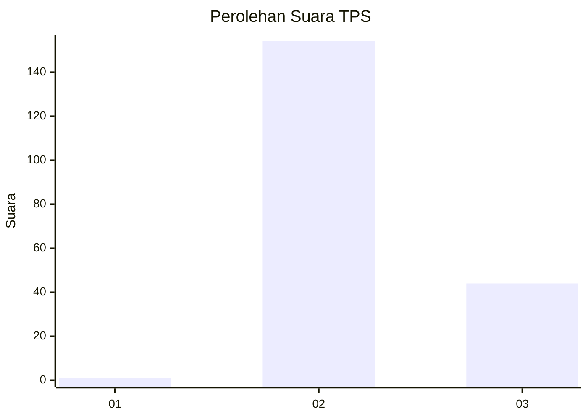
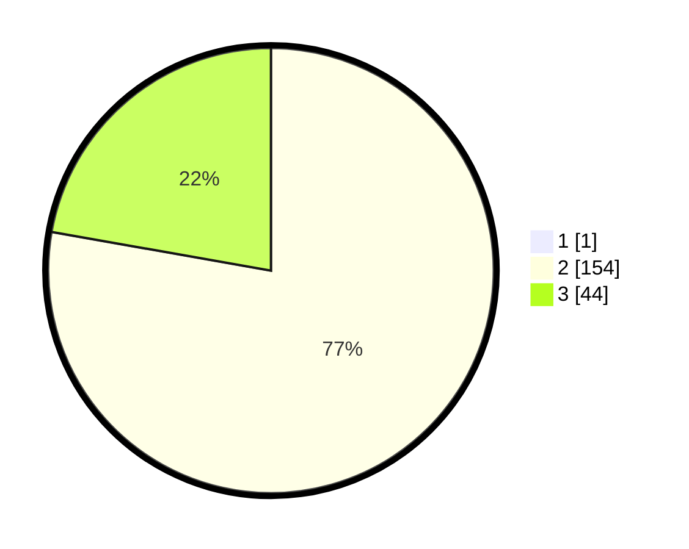

# Hasil

## Grafik

## Tabel

| No. | Nama Paslon    | Suara | Suara (raw) | Persentase |
|:--- |:-------------- | -----:| -----------:| ----------:|
| 1   | ANIES MUHAIMIN | 1     | [1][p-1]    | 0,50       |
| 2   | PRABOWO GIBRAN | 154   | [154][p-2]  | 77,39      |
| 3   | GANJAR MAHFUD  | 44    | [44][p-3]   | 22,11      |

[p-1]: https://github.com/gigit-pemilu/pemilu-2024-53-nusa-tenggara-timur/blob/main/pilpres/hitung-suara/sub/53-nusa-tenggara-timur/sub/01-kupang/sub/25-amabi-oefeto/sub/2001-fatukanutu/sub/002-tps/sub/paslon-1.txt
[p-2]: https://github.com/gigit-pemilu/pemilu-2024-53-nusa-tenggara-timur/blob/main/pilpres/hitung-suara/sub/53-nusa-tenggara-timur/sub/01-kupang/sub/25-amabi-oefeto/sub/2001-fatukanutu/sub/002-tps/sub/paslon-2.txt
[p-3]: https://github.com/gigit-pemilu/pemilu-2024-53-nusa-tenggara-timur/blob/main/pilpres/hitung-suara/sub/53-nusa-tenggara-timur/sub/01-kupang/sub/25-amabi-oefeto/sub/2001-fatukanutu/sub/002-tps/sub/paslon-3.txt

## Foto C Plano

https://sirekap-obj-formc.kpu.go.id/a27e/pemilu/ppwp/53/01/25/20/01/5301252001002-20240215-203346--abd2147e-4c5f-453c-a3c9-f0c11f760325.jpg

https://sirekap-obj-formc.kpu.go.id/a27e/pemilu/ppwp/53/01/25/20/01/5301252001002-20240215-204016--a04a7934-8a8b-4092-aee5-5d029990e069.jpg

https://sirekap-obj-formc.kpu.go.id/a27e/pemilu/ppwp/53/01/25/20/01/5301252001002-20240215-005522--7393e373-94d2-488b-a0d4-942663877b0a.jpg

## Metadata

| Key        | Value               |
| ---------- | ------------------- |
| Time Stamp | 2024-02-17 10:30:03 |

