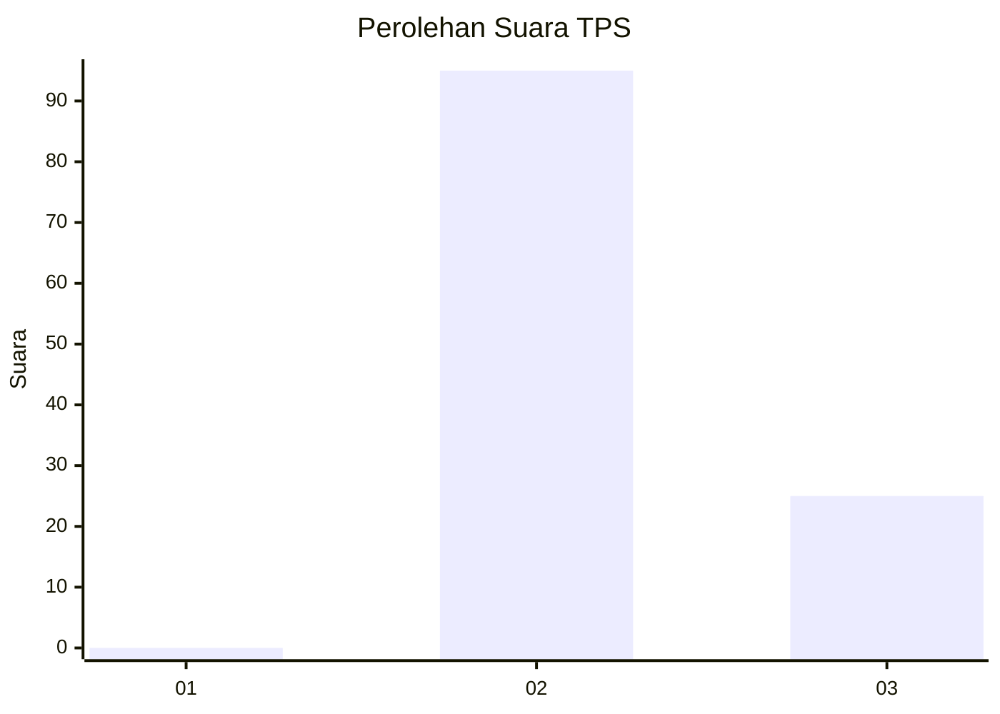
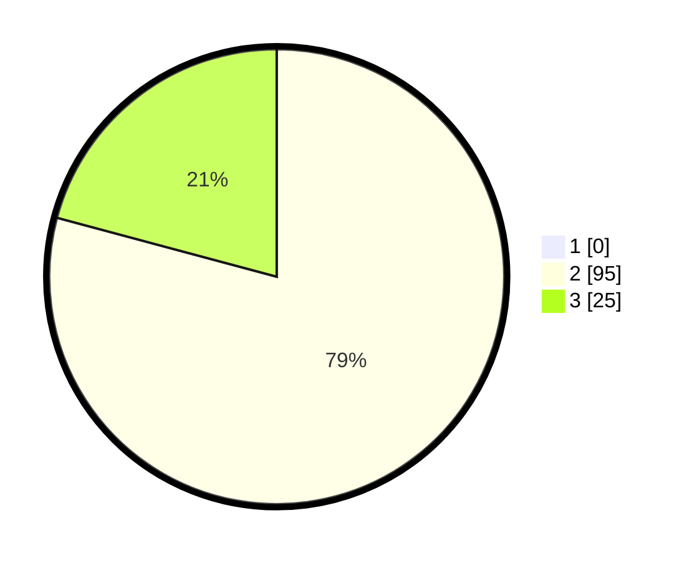

# Hasil

## Grafik

## Tabel

| No. | Nama Paslon    | Suara | Suara (raw) | Persentase |
|:--- |:-------------- | -----:| -----------:| ----------:|
| 1   | ANIES MUHAIMIN | 0     | [0][p-1]    | 0,00       |
| 2   | PRABOWO GIBRAN | 95    | [95][p-2]   | 79,17      |
| 3   | GANJAR MAHFUD  | 25    | [25][p-3]   | 20,83      |

[p-1]: https://github.com/gigit-pemilu/pemilu-2024-53-nusa-tenggara-timur/blob/main/pilpres/hitung-suara/sub/53-nusa-tenggara-timur/sub/01-kupang/sub/25-amabi-oefeto/sub/2001-fatukanutu/sub/004-tps/sub/paslon-1.txt
[p-2]: https://github.com/gigit-pemilu/pemilu-2024-53-nusa-tenggara-timur/blob/main/pilpres/hitung-suara/sub/53-nusa-tenggara-timur/sub/01-kupang/sub/25-amabi-oefeto/sub/2001-fatukanutu/sub/004-tps/sub/paslon-2.txt
[p-3]: https://github.com/gigit-pemilu/pemilu-2024-53-nusa-tenggara-timur/blob/main/pilpres/hitung-suara/sub/53-nusa-tenggara-timur/sub/01-kupang/sub/25-amabi-oefeto/sub/2001-fatukanutu/sub/004-tps/sub/paslon-3.txt

## Foto C Plano

https://sirekap-obj-formc.kpu.go.id/a3de/pemilu/ppwp/53/01/25/20/01/5301252001004-20240215-095035--074305ff-7962-49dd-9b78-798f8e3ef1aa.jpg

https://sirekap-obj-formc.kpu.go.id/a3de/pemilu/ppwp/53/01/25/20/01/5301252001004-20240215-095332--aeb924f4-0fb7-4b19-9b2f-c692428bd561.jpg

https://sirekap-obj-formc.kpu.go.id/a3de/pemilu/ppwp/53/01/25/20/01/5301252001004-20240215-095559--cfe3063e-e0e7-40fd-a2e4-da586679d057.jpg

## Metadata

| Key        | Value               |
| ---------- | ------------------- |
| Time Stamp | 2024-02-25 22:00:00 |

