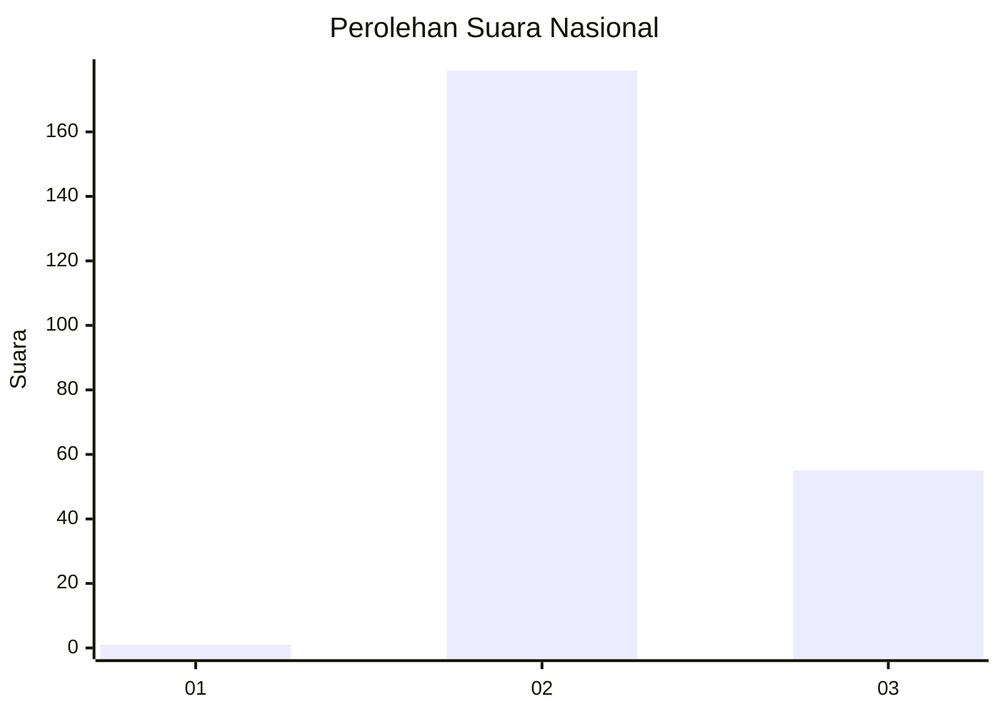
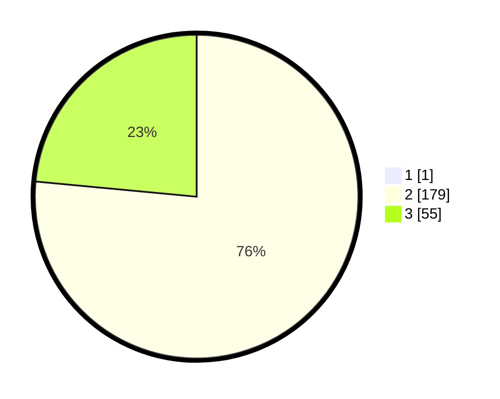

# Hasil

## Grafik

## Tabel

| No. | Nama Paslon    | Suara | Suara (raw) | Persentase |
|:--- |:-------------- | -----:| -----------:| ----------:|
| 1   | ANIES MUHAIMIN | 1     | [1][p-1]    | 0,43       |
| 2   | PRABOWO GIBRAN | 179   | [179][p-2]  | 76,17      |
| 3   | GANJAR MAHFUD  | 55    | [55][p-3]   | 23,40      |

[p-1]: https://github.com/gigit-pemilu/pemilu-2024/blob/main/pilpres/hitung-suara/sub/53-nusa-tenggara-timur/sub/01-kupang/sub/25-amabi-oefeto/sub/2001-fatukanutu/sub/006-tps/sub/paslon-1.txt
[p-2]: https://github.com/gigit-pemilu/pemilu-2024/blob/main/pilpres/hitung-suara/sub/53-nusa-tenggara-timur/sub/01-kupang/sub/25-amabi-oefeto/sub/2001-fatukanutu/sub/006-tps/sub/paslon-2.txt
[p-3]: https://github.com/gigit-pemilu/pemilu-2024/blob/main/pilpres/hitung-suara/sub/53-nusa-tenggara-timur/sub/01-kupang/sub/25-amabi-oefeto/sub/2001-fatukanutu/sub/006-tps/sub/paslon-3.txt

## Foto C Plano

https://sirekap-obj-formc.kpu.go.id/17d3/pemilu/ppwp/53/01/25/20/01/5301252001006-20240215-064524--97233114-4bb8-4e68-8b25-1c3372656874.jpg

https://sirekap-obj-formc.kpu.go.id/17d3/pemilu/ppwp/53/01/25/20/01/5301252001006-20240215-094032--379d1e4d-eb9b-4c93-89e5-b7b624062b53.jpg

https://sirekap-obj-formc.kpu.go.id/17d3/pemilu/ppwp/53/01/25/20/01/5301252001006-20240215-135249--0ffe6306-a7a0-451c-a66d-10394626b6cc.jpg

## Metadata

| Key        | Value               |
| ---------- | ------------------- |
| Time Stamp | 2024-02-15 18:30:25 |

