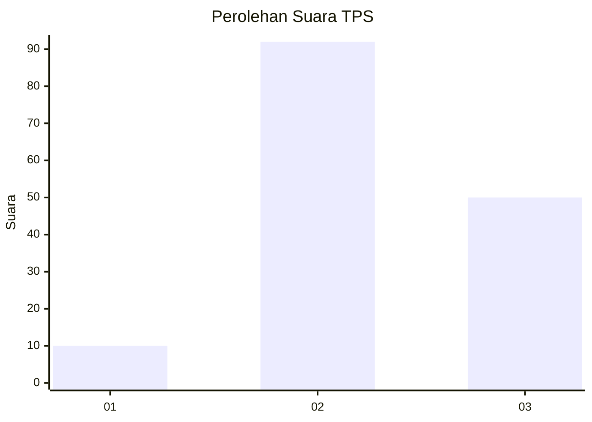
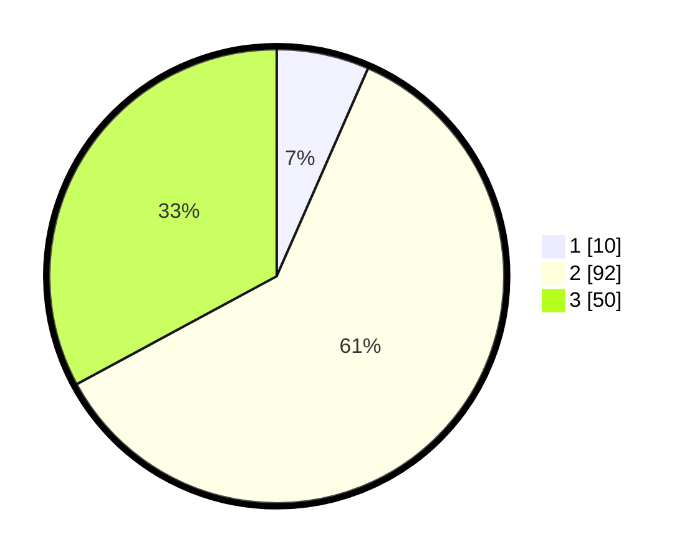

# Hasil

## Grafik

## Tabel

| No. | Nama Paslon    | Suara | Suara (raw) | Persentase |
|:--- |:-------------- | -----:| -----------:| ----------:|
| 1   | ANIES MUHAIMIN | 10    | [10][p-1]   | 6,58       |
| 2   | PRABOWO GIBRAN | 92    | [92][p-2]   | 60,53      |
| 3   | GANJAR MAHFUD  | 50    | [50][p-3]   | 32,89      |

[p-1]: https://github.com/gigit-pemilu/pemilu-2024-53-nusa-tenggara-timur/blob/main/pilpres/hitung-suara/sub/53-nusa-tenggara-timur/sub/01-kupang/sub/26-amfoang-timur/sub/2001-nunuanah/sub/002-tps/sub/paslon-1.txt
[p-2]: https://github.com/gigit-pemilu/pemilu-2024-53-nusa-tenggara-timur/blob/main/pilpres/hitung-suara/sub/53-nusa-tenggara-timur/sub/01-kupang/sub/26-amfoang-timur/sub/2001-nunuanah/sub/002-tps/sub/paslon-2.txt
[p-3]: https://github.com/gigit-pemilu/pemilu-2024-53-nusa-tenggara-timur/blob/main/pilpres/hitung-suara/sub/53-nusa-tenggara-timur/sub/01-kupang/sub/26-amfoang-timur/sub/2001-nunuanah/sub/002-tps/sub/paslon-3.txt

## Foto C Plano

https://sirekap-obj-formc.kpu.go.id/5b67/pemilu/ppwp/53/01/26/20/01/5301262001002-20240217-132816--f3685205-9eb8-4139-846b-811a56d50ef7.jpg

https://sirekap-obj-formc.kpu.go.id/5b67/pemilu/ppwp/53/01/26/20/01/5301262001002-20240217-132849--0967208e-a178-4eba-b49e-60018e613436.jpg

https://sirekap-obj-formc.kpu.go.id/5b67/pemilu/ppwp/53/01/26/20/01/5301262001002-20240217-132908--663f9f76-dd99-43ab-8a07-a61d1920ee07.jpg

## Metadata

| Key        | Value               |
| ---------- | ------------------- |
| Time Stamp | 2024-02-25 15:00:00 |

