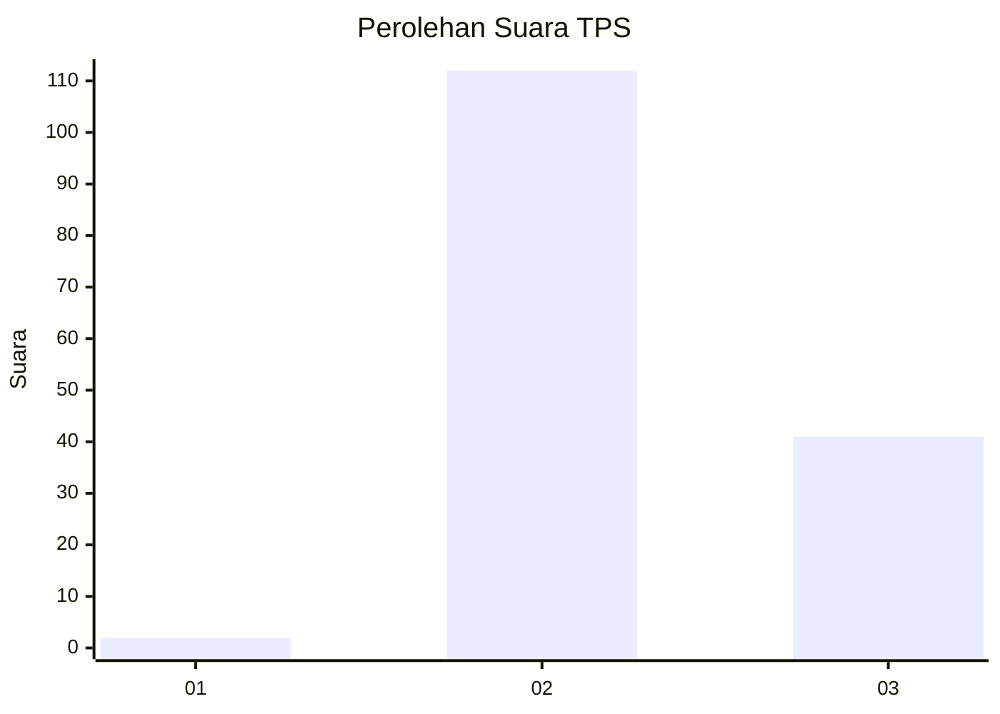
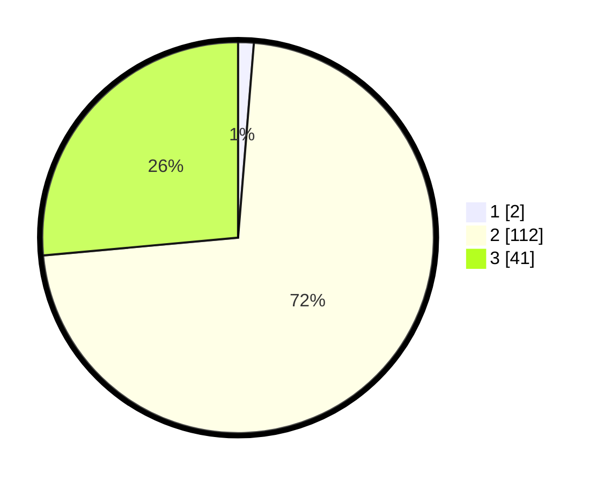

# Hasil

## Grafik

## Tabel

| No. | Nama Paslon    | Suara | Suara (raw) | Persentase |
|:--- |:-------------- | -----:| -----------:| ----------:|
| 1   | ANIES MUHAIMIN | 2     | [2][p-1]    | 1,29       |
| 2   | PRABOWO GIBRAN | 112   | [112][p-2]  | 72,26      |
| 3   | GANJAR MAHFUD  | 41    | [41][p-3]   | 26,45      |

[p-1]: https://github.com/gigit-pemilu/pemilu-2024-53-nusa-tenggara-timur/blob/main/pilpres/hitung-suara/sub/53-nusa-tenggara-timur/sub/01-kupang/sub/26-amfoang-timur/sub/2002-kifu/sub/003-tps/sub/paslon-1.txt
[p-2]: https://github.com/gigit-pemilu/pemilu-2024-53-nusa-tenggara-timur/blob/main/pilpres/hitung-suara/sub/53-nusa-tenggara-timur/sub/01-kupang/sub/26-amfoang-timur/sub/2002-kifu/sub/003-tps/sub/paslon-2.txt
[p-3]: https://github.com/gigit-pemilu/pemilu-2024-53-nusa-tenggara-timur/blob/main/pilpres/hitung-suara/sub/53-nusa-tenggara-timur/sub/01-kupang/sub/26-amfoang-timur/sub/2002-kifu/sub/003-tps/sub/paslon-3.txt

## Foto C Plano

https://sirekap-obj-formc.kpu.go.id/945e/pemilu/ppwp/53/01/26/20/02/5301262002003-20240215-132501--4b897916-69e9-4f98-a3e8-23b7a9827f4e.jpg

https://sirekap-obj-formc.kpu.go.id/945e/pemilu/ppwp/53/01/26/20/02/5301262002003-20240215-231205--ebeabf3f-50e0-445f-9318-6bbd86529793.jpg

https://sirekap-obj-formc.kpu.go.id/945e/pemilu/ppwp/53/01/26/20/02/5301262002003-20240215-150936--ff26199e-0518-40a9-a227-178f23333459.jpg

## Metadata

| Key        | Value               |
| ---------- | ------------------- |
| Time Stamp | 2024-02-21 18:00:00 |

