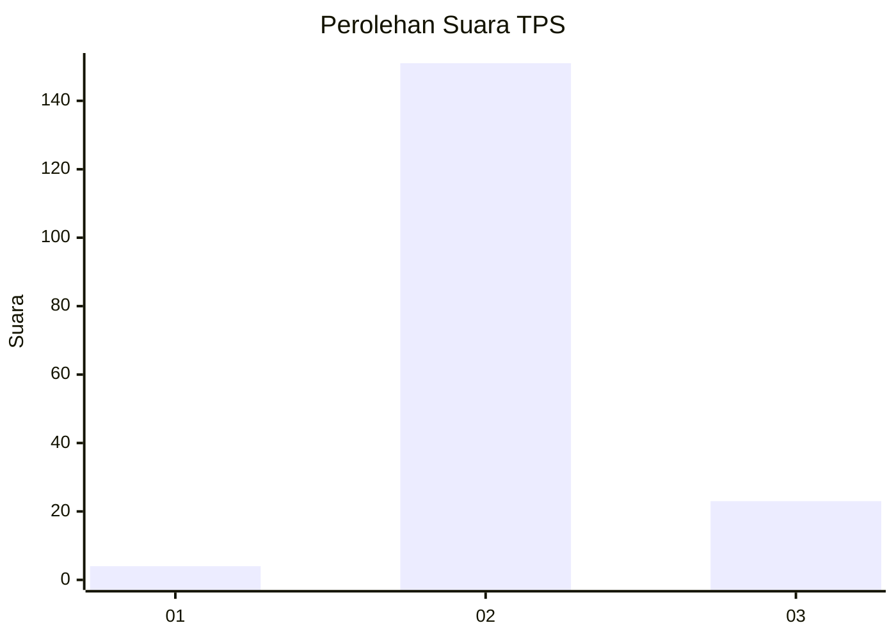
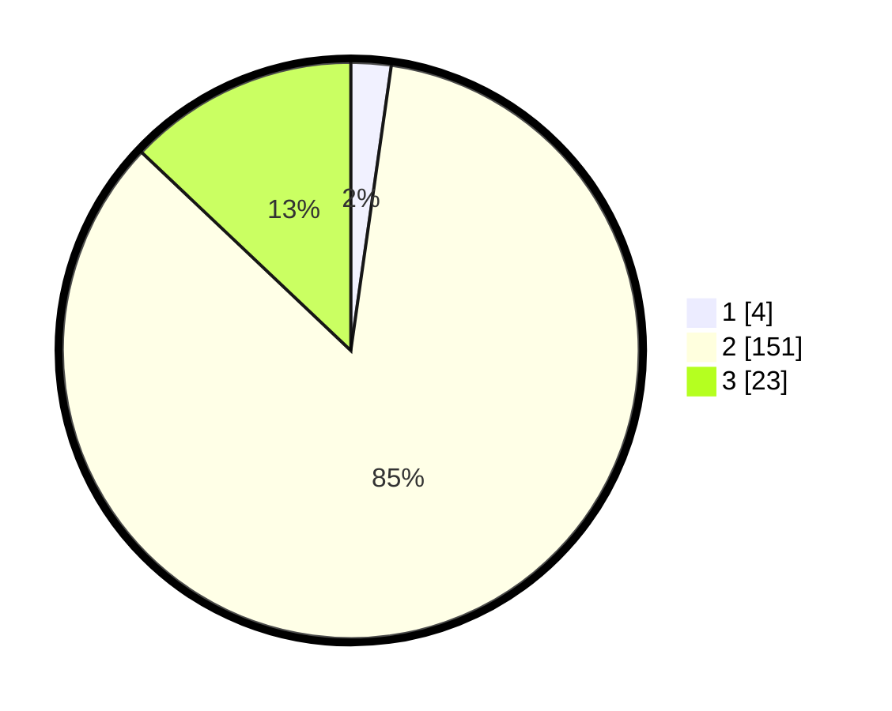

# Hasil

## Grafik

## Tabel

| No. | Nama Paslon    | Suara | Suara (raw) | Persentase |
|:--- |:-------------- | -----:| -----------:| ----------:|
| 1   | ANIES MUHAIMIN | 4     | [4][p-1]    | 2,25       |
| 2   | PRABOWO GIBRAN | 151   | [151][p-2]  | 84,83      |
| 3   | GANJAR MAHFUD  | 23    | [23][p-3]   | 12,92      |

[p-1]: https://github.com/gigit-pemilu/pemilu-2024-53-nusa-tenggara-timur/blob/main/pilpres/hitung-suara/sub/53-nusa-tenggara-timur/sub/01-kupang/sub/30-amfoang-tengah/sub/2001-fatumonas/sub/006-tps/sub/paslon-1.txt
[p-2]: https://github.com/gigit-pemilu/pemilu-2024-53-nusa-tenggara-timur/blob/main/pilpres/hitung-suara/sub/53-nusa-tenggara-timur/sub/01-kupang/sub/30-amfoang-tengah/sub/2001-fatumonas/sub/006-tps/sub/paslon-2.txt
[p-3]: https://github.com/gigit-pemilu/pemilu-2024-53-nusa-tenggara-timur/blob/main/pilpres/hitung-suara/sub/53-nusa-tenggara-timur/sub/01-kupang/sub/30-amfoang-tengah/sub/2001-fatumonas/sub/006-tps/sub/paslon-3.txt

## Foto C Plano

https://sirekap-obj-formc.kpu.go.id/b252/pemilu/ppwp/53/01/30/20/01/5301302001006-20240215-125840--4ea270d6-ff78-4d84-9c85-21d5b20a0cf4.jpg

https://sirekap-obj-formc.kpu.go.id/b252/pemilu/ppwp/53/01/30/20/01/5301302001006-20240215-125909--4c0935bf-ab63-4740-9e6a-527c46d2a5b7.jpg

https://sirekap-obj-formc.kpu.go.id/b252/pemilu/ppwp/53/01/30/20/01/5301302001006-20240215-130659--7cc4e504-713b-4eae-8260-052d9bfbb2cf.jpg

## Metadata

| Key        | Value               |
| ---------- | ------------------- |
| Time Stamp | 2024-02-25 12:00:00 |

