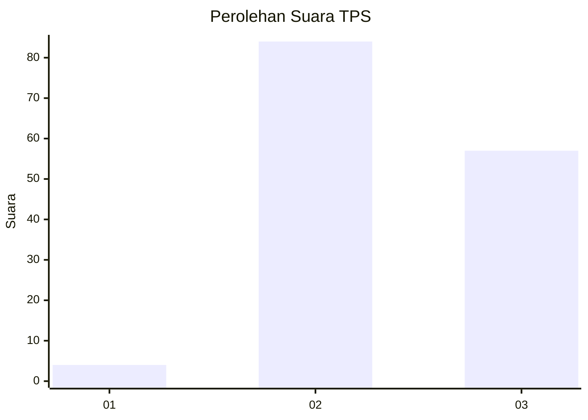
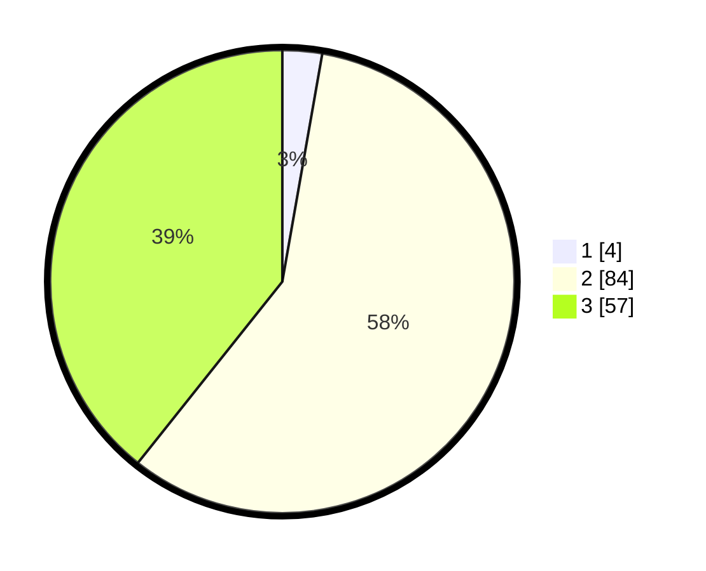

# Hasil

## Grafik

## Tabel

| No. | Nama Paslon    | Suara | Suara (raw) | Persentase |
|:--- |:-------------- | -----:| -----------:| ----------:|
| 1   | ANIES MUHAIMIN | 4     | [4][p-1]    | 2,76       |
| 2   | PRABOWO GIBRAN | 84    | [84][p-2]   | 57,93      |
| 3   | GANJAR MAHFUD  | 57    | [57][p-3]   | 39,31      |

[p-1]: https://github.com/gigit-pemilu/pemilu-2024-53-nusa-tenggara-timur/blob/main/pilpres/hitung-suara/sub/53-nusa-tenggara-timur/sub/02-kab-timor-tengah-selatan/sub/05-amanuban-tengah/sub/1010-niki-niki/sub/001-tps/sub/paslon-1.txt
[p-2]: https://github.com/gigit-pemilu/pemilu-2024-53-nusa-tenggara-timur/blob/main/pilpres/hitung-suara/sub/53-nusa-tenggara-timur/sub/02-kab-timor-tengah-selatan/sub/05-amanuban-tengah/sub/1010-niki-niki/sub/001-tps/sub/paslon-2.txt
[p-3]: https://github.com/gigit-pemilu/pemilu-2024-53-nusa-tenggara-timur/blob/main/pilpres/hitung-suara/sub/53-nusa-tenggara-timur/sub/02-kab-timor-tengah-selatan/sub/05-amanuban-tengah/sub/1010-niki-niki/sub/001-tps/sub/paslon-3.txt

## Foto C Plano

https://sirekap-obj-formc.kpu.go.id/be34/pemilu/ppwp/53/02/05/10/10/5302051010001-20240218-162952--1f69a259-c8b6-4b04-9b9f-f98d6a6428f3.jpg

https://sirekap-obj-formc.kpu.go.id/be34/pemilu/ppwp/53/02/05/10/10/5302051010001-20240218-162722--bec6242c-6e26-4d37-b537-bbcef9922f59.jpg

https://sirekap-obj-formc.kpu.go.id/be34/pemilu/ppwp/53/02/05/10/10/5302051010001-20240218-162835--65f78ddb-c08b-45fb-80ee-003278478074.jpg

## Metadata

| Key        | Value               |
| ---------- | ------------------- |
| Time Stamp | 2024-02-25 20:00:00 |

