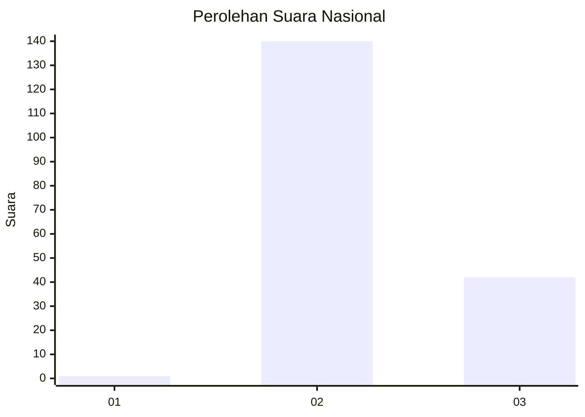
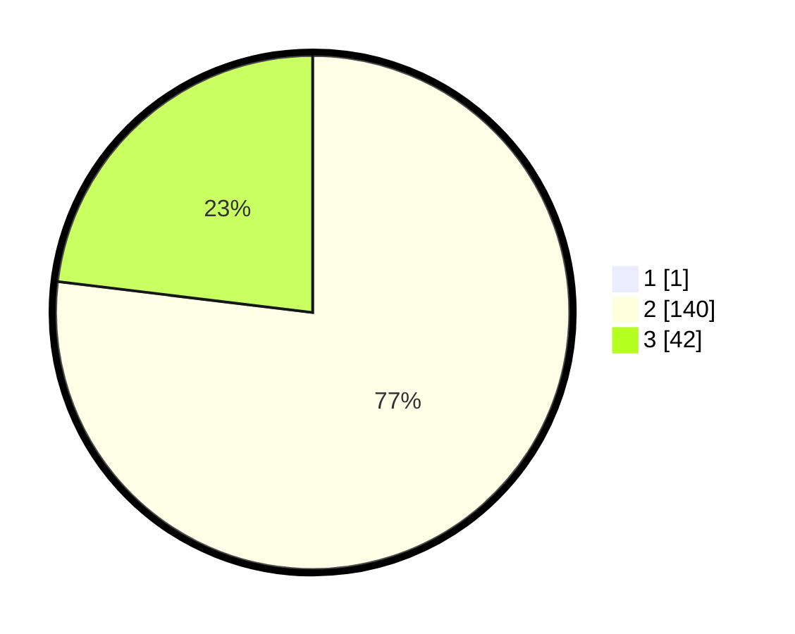

# Hasil

## Grafik

## Tabel

| No. | Nama Paslon    | Suara | Suara (raw) | Persentase |
|:--- |:-------------- | -----:| -----------:| ----------:|
| 1   | ANIES MUHAIMIN | 1     | [1][p-1]    | 0,55       |
| 2   | PRABOWO GIBRAN | 140   | [140][p-2]  | 76,50      |
| 3   | GANJAR MAHFUD  | 42    | [42][p-3]   | 22,95      |

[p-1]: https://github.com/gigit-pemilu/pemilu-2024/blob/main/pilpres/hitung-suara/sub/53-nusa-tenggara-timur/sub/02-kab-timor-tengah-selatan/sub/06-amanuban-selatan/sub/2001-pollo/sub/002-tps/sub/paslon-1.txt
[p-2]: https://github.com/gigit-pemilu/pemilu-2024/blob/main/pilpres/hitung-suara/sub/53-nusa-tenggara-timur/sub/02-kab-timor-tengah-selatan/sub/06-amanuban-selatan/sub/2001-pollo/sub/002-tps/sub/paslon-2.txt
[p-3]: https://github.com/gigit-pemilu/pemilu-2024/blob/main/pilpres/hitung-suara/sub/53-nusa-tenggara-timur/sub/02-kab-timor-tengah-selatan/sub/06-amanuban-selatan/sub/2001-pollo/sub/002-tps/sub/paslon-3.txt

## Foto C Plano

https://sirekap-obj-formc.kpu.go.id/67af/pemilu/ppwp/53/02/06/20/01/5302062001002-20240215-161516--5334d287-cbc7-40d9-8e2d-12acbdf7943d.jpg

https://sirekap-obj-formc.kpu.go.id/67af/pemilu/ppwp/53/02/06/20/01/5302062001002-20240215-161949--e33275c4-d2d9-42f0-ae22-8e192a5dad1d.jpg

https://sirekap-obj-formc.kpu.go.id/67af/pemilu/ppwp/53/02/06/20/01/5302062001002-20240215-161635--c83c981a-4f70-4469-849a-81e85b2b3204.jpg

## Metadata

| Key        | Value               |
| ---------- | ------------------- |
| Time Stamp | 2024-02-17 17:30:00 |

