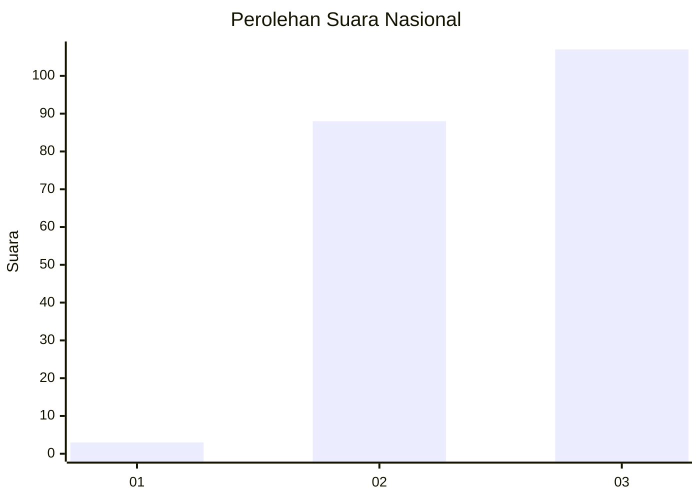
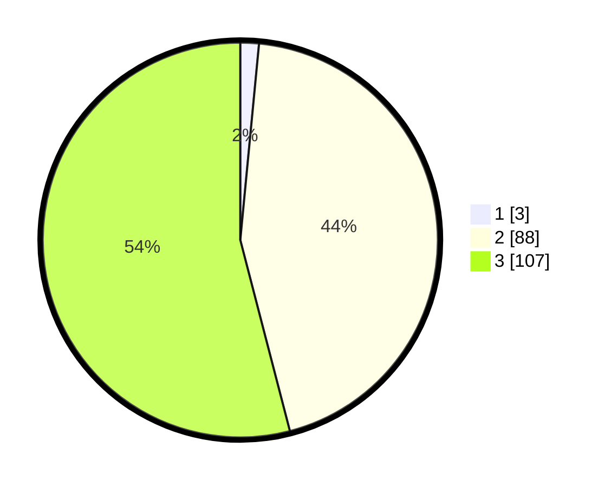

# Hasil

## Grafik

## Tabel

| No. | Nama Paslon    | Suara | Suara (raw) | Persentase |
|:--- |:-------------- | -----:| -----------:| ----------:|
| 1   | ANIES MUHAIMIN | 3     | [3][p-1]    | 1,52       |
| 2   | PRABOWO GIBRAN | 88    | [88][p-2]   | 44,44      |
| 3   | GANJAR MAHFUD  | 107   | [107][p-3]  | 54,04      |

[p-1]: https://github.com/gigit-pemilu/pemilu-2024/blob/main/pilpres/hitung-suara/sub/53-nusa-tenggara-timur/sub/02-kab-timor-tengah-selatan/sub/06-amanuban-selatan/sub/2001-pollo/sub/012-tps/sub/paslon-1.txt
[p-2]: https://github.com/gigit-pemilu/pemilu-2024/blob/main/pilpres/hitung-suara/sub/53-nusa-tenggara-timur/sub/02-kab-timor-tengah-selatan/sub/06-amanuban-selatan/sub/2001-pollo/sub/012-tps/sub/paslon-2.txt
[p-3]: https://github.com/gigit-pemilu/pemilu-2024/blob/main/pilpres/hitung-suara/sub/53-nusa-tenggara-timur/sub/02-kab-timor-tengah-selatan/sub/06-amanuban-selatan/sub/2001-pollo/sub/012-tps/sub/paslon-3.txt

## Foto C Plano

https://sirekap-obj-formc.kpu.go.id/c589/pemilu/ppwp/53/02/06/20/01/5302062001012-20240215-110234--0ad6fefa-ae96-4a41-9358-bd00ee2068c0.jpg

https://sirekap-obj-formc.kpu.go.id/c589/pemilu/ppwp/53/02/06/20/01/5302062001012-20240215-110342--181d2cbc-7691-4f3b-8c58-6f7570c0001f.jpg

https://sirekap-obj-formc.kpu.go.id/c589/pemilu/ppwp/53/02/06/20/01/5302062001012-20240215-110510--268133ec-6f1f-4099-8434-0e69770d4b69.jpg

## Metadata

| Key        | Value               |
| ---------- | ------------------- |
| Time Stamp | 2024-02-17 17:30:00 |

