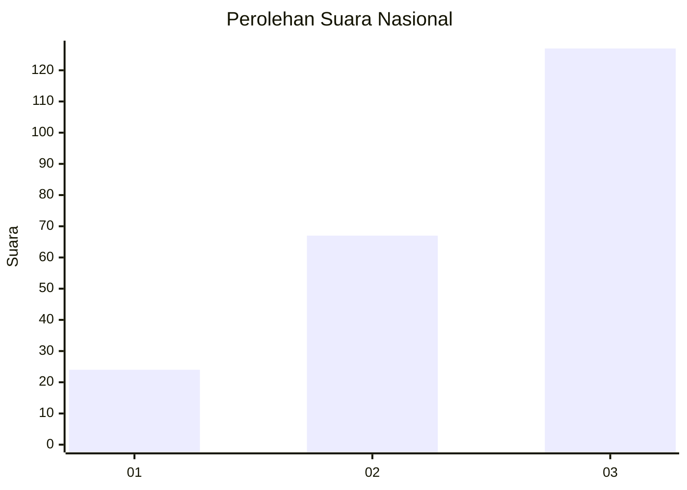
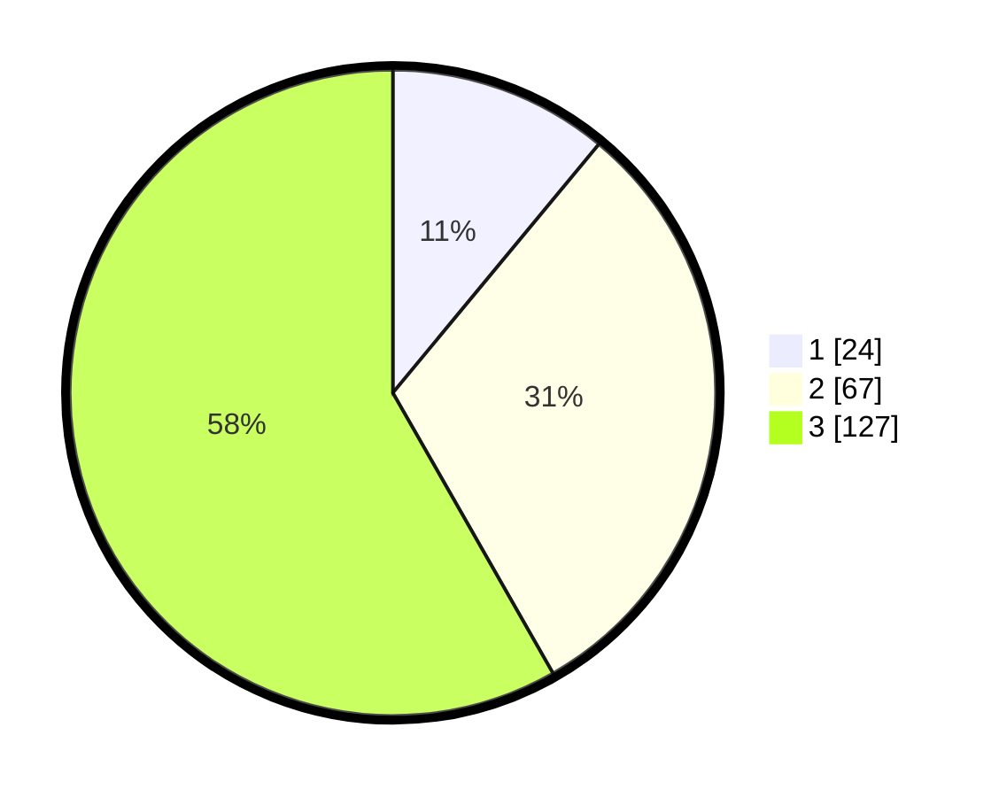

# Hasil

## Grafik

## Tabel

| No. | Nama Paslon    | Suara | Suara (raw) | Persentase |
|:--- |:-------------- | -----:| -----------:| ----------:|
| 1   | ANIES MUHAIMIN | 24    | [24][p-1]   | 11,01      |
| 2   | PRABOWO GIBRAN | 67    | [67][p-2]   | 30,73      |
| 3   | GANJAR MAHFUD  | 127   | [127][p-3]  | 58,26      |

[p-1]: https://github.com/gigit-pemilu/pemilu-2024/blob/main/pilpres/hitung-suara/sub/53-nusa-tenggara-timur/sub/02-kab-timor-tengah-selatan/sub/07-amanuban-barat/sub/2007-tublopo/sub/001-tps/sub/paslon-1.txt
[p-2]: https://github.com/gigit-pemilu/pemilu-2024/blob/main/pilpres/hitung-suara/sub/53-nusa-tenggara-timur/sub/02-kab-timor-tengah-selatan/sub/07-amanuban-barat/sub/2007-tublopo/sub/001-tps/sub/paslon-2.txt
[p-3]: https://github.com/gigit-pemilu/pemilu-2024/blob/main/pilpres/hitung-suara/sub/53-nusa-tenggara-timur/sub/02-kab-timor-tengah-selatan/sub/07-amanuban-barat/sub/2007-tublopo/sub/001-tps/sub/paslon-3.txt

## Foto C Plano

https://sirekap-obj-formc.kpu.go.id/c8e2/pemilu/ppwp/53/02/07/20/07/5302072007001-20240215-190920--0bbb514c-9cc0-45a7-b195-b7d7e265ab3c.jpg

https://sirekap-obj-formc.kpu.go.id/c8e2/pemilu/ppwp/53/02/07/20/07/5302072007001-20240215-191040--50dce4d2-6754-407f-8175-aa6cac28d0ba.jpg

https://sirekap-obj-formc.kpu.go.id/c8e2/pemilu/ppwp/53/02/07/20/07/5302072007001-20240215-082300--3280d274-f737-413e-9cdf-d7d18e6e77d4.jpg

## Metadata

| Key        | Value               |
| ---------- | ------------------- |
| Time Stamp | 2024-02-24 22:31:28 |

