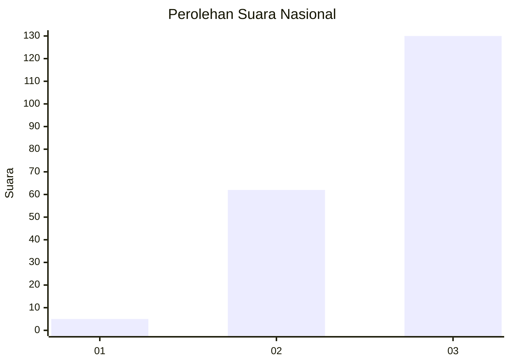
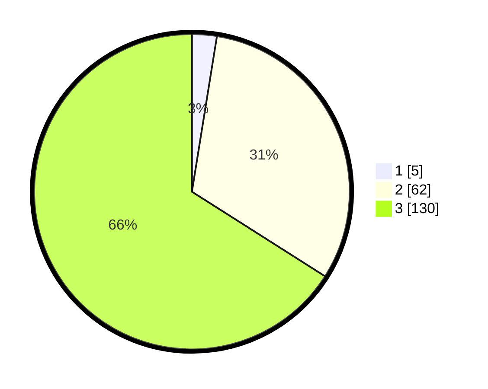

# Hasil

## Grafik

## Tabel

| No. | Nama Paslon    | Suara | Suara (raw) | Persentase |
|:--- |:-------------- | -----:| -----------:| ----------:|
| 1   | ANIES MUHAIMIN | 5     | [5][p-1]    | 2,54       |
| 2   | PRABOWO GIBRAN | 62    | [62][p-2]   | 31,47      |
| 3   | GANJAR MAHFUD  | 130   | [130][p-3]  | 65,99      |

[p-1]: https://github.com/gigit-pemilu/pemilu-2024/blob/main/pilpres/hitung-suara/sub/53-nusa-tenggara-timur/sub/02-kab-timor-tengah-selatan/sub/07-amanuban-barat/sub/2013-haumeni-baki/sub/004-tps/sub/paslon-1.txt
[p-2]: https://github.com/gigit-pemilu/pemilu-2024/blob/main/pilpres/hitung-suara/sub/53-nusa-tenggara-timur/sub/02-kab-timor-tengah-selatan/sub/07-amanuban-barat/sub/2013-haumeni-baki/sub/004-tps/sub/paslon-2.txt
[p-3]: https://github.com/gigit-pemilu/pemilu-2024/blob/main/pilpres/hitung-suara/sub/53-nusa-tenggara-timur/sub/02-kab-timor-tengah-selatan/sub/07-amanuban-barat/sub/2013-haumeni-baki/sub/004-tps/sub/paslon-3.txt

## Foto C Plano

https://sirekap-obj-formc.kpu.go.id/9132/pemilu/ppwp/53/02/07/20/13/5302072013004-20240214-200533--56f18ef2-5b85-4c03-93ad-e1f86069939d.jpg

https://sirekap-obj-formc.kpu.go.id/9132/pemilu/ppwp/53/02/07/20/13/5302072013004-20240214-200652--a7c5280d-8eed-4e0b-be33-69cd2c263440.jpg

https://sirekap-obj-formc.kpu.go.id/9132/pemilu/ppwp/53/02/07/20/13/5302072013004-20240214-200850--8330027a-c4d1-4c14-ba6d-c890f6437345.jpg

## Metadata

| Key        | Value               |
| ---------- | ------------------- |
| Time Stamp | 2024-02-25 14:00:00 |

