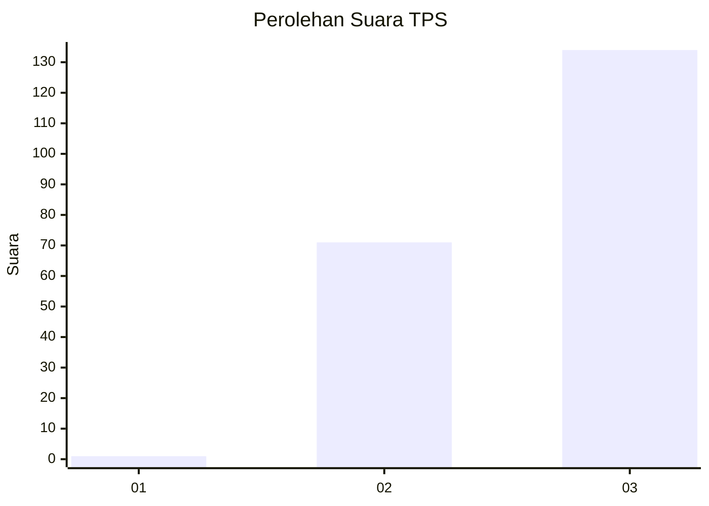
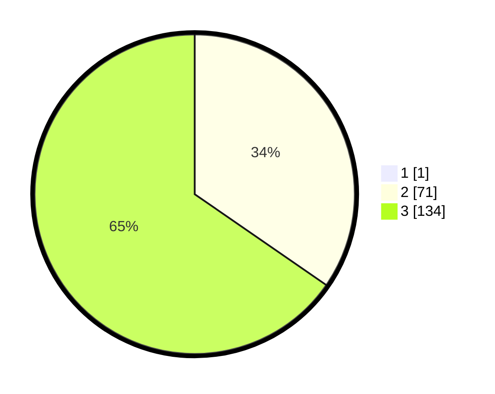

# Hasil

## Grafik

## Tabel

| No. | Nama Paslon    | Suara | Suara (raw) | Persentase |
|:--- |:-------------- | -----:| -----------:| ----------:|
| 1   | ANIES MUHAIMIN | 1     | [1][p-1]    | 0,49       |
| 2   | PRABOWO GIBRAN | 71    | [71][p-2]   | 34,47      |
| 3   | GANJAR MAHFUD  | 134   | [134][p-3]  | 65,05      |

[p-1]: https://github.com/gigit-pemilu/pemilu-2024-53-nusa-tenggara-timur/blob/main/pilpres/hitung-suara/sub/53-nusa-tenggara-timur/sub/02-kab-timor-tengah-selatan/sub/11-kuanfatu/sub/2003-kakan/sub/002-tps/sub/paslon-1.txt
[p-2]: https://github.com/gigit-pemilu/pemilu-2024-53-nusa-tenggara-timur/blob/main/pilpres/hitung-suara/sub/53-nusa-tenggara-timur/sub/02-kab-timor-tengah-selatan/sub/11-kuanfatu/sub/2003-kakan/sub/002-tps/sub/paslon-2.txt
[p-3]: https://github.com/gigit-pemilu/pemilu-2024-53-nusa-tenggara-timur/blob/main/pilpres/hitung-suara/sub/53-nusa-tenggara-timur/sub/02-kab-timor-tengah-selatan/sub/11-kuanfatu/sub/2003-kakan/sub/002-tps/sub/paslon-3.txt

## Foto C Plano

https://sirekap-obj-formc.kpu.go.id/ac93/pemilu/ppwp/53/02/11/20/03/5302112003002-20240215-133656--69a57b9d-8d5b-4e06-a690-acb41ce7ea6e.jpg

https://sirekap-obj-formc.kpu.go.id/ac93/pemilu/ppwp/53/02/11/20/03/5302112003002-20240224-173903--760e668e-3a64-4d16-8604-6d508694fd23.jpg

https://sirekap-obj-formc.kpu.go.id/ac93/pemilu/ppwp/53/02/11/20/03/5302112003002-20240215-134046--dd73666d-1dd8-45a1-8ef3-c48dd1a7966c.jpg

## Metadata

| Key        | Value               |
| ---------- | ------------------- |
| Time Stamp | 2024-02-24 22:31:28 |

