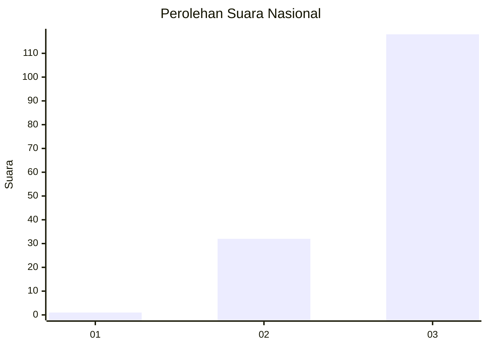
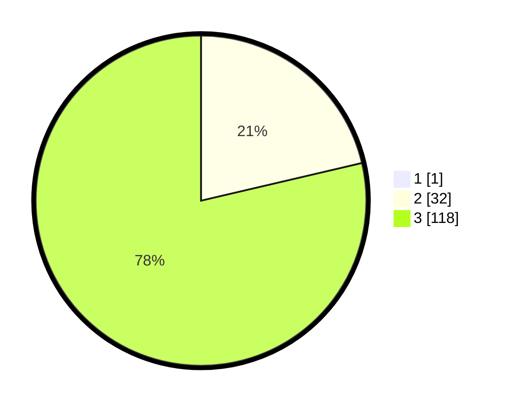

# Hasil

## Grafik

## Tabel

| No. | Nama Paslon    | Suara | Suara (raw) | Persentase |
|:--- |:-------------- | -----:| -----------:| ----------:|
| 1   | ANIES MUHAIMIN | 1     | [1][p-1]    | 0,66       |
| 2   | PRABOWO GIBRAN | 32    | [32][p-2]   | 21,19      |
| 3   | GANJAR MAHFUD  | 118   | [118][p-3]  | 78,15      |

[p-1]: https://github.com/gigit-pemilu/pemilu-2024/blob/main/pilpres/hitung-suara/sub/53-nusa-tenggara-timur/sub/02-kab-timor-tengah-selatan/sub/11-kuanfatu/sub/2003-kakan/sub/004-tps/sub/paslon-1.txt
[p-2]: https://github.com/gigit-pemilu/pemilu-2024/blob/main/pilpres/hitung-suara/sub/53-nusa-tenggara-timur/sub/02-kab-timor-tengah-selatan/sub/11-kuanfatu/sub/2003-kakan/sub/004-tps/sub/paslon-2.txt
[p-3]: https://github.com/gigit-pemilu/pemilu-2024/blob/main/pilpres/hitung-suara/sub/53-nusa-tenggara-timur/sub/02-kab-timor-tengah-selatan/sub/11-kuanfatu/sub/2003-kakan/sub/004-tps/sub/paslon-3.txt

## Foto C Plano

https://sirekap-obj-formc.kpu.go.id/2f1e/pemilu/ppwp/53/02/11/20/03/5302112003004-20240214-185914--55ee9a19-0e04-4134-9b17-f5794eef2f73.jpg

https://sirekap-obj-formc.kpu.go.id/2f1e/pemilu/ppwp/53/02/11/20/03/5302112003004-20240214-190645--563beaa5-2ff6-4fda-8bbc-2250d2a7c2ba.jpg

https://sirekap-obj-formc.kpu.go.id/2f1e/pemilu/ppwp/53/02/11/20/03/5302112003004-20240214-190426--be2530c1-3dc0-474b-8f02-460367bd5489.jpg

## Metadata

| Key        | Value               |
| ---------- | ------------------- |
| Time Stamp | 2024-02-24 22:31:28 |

