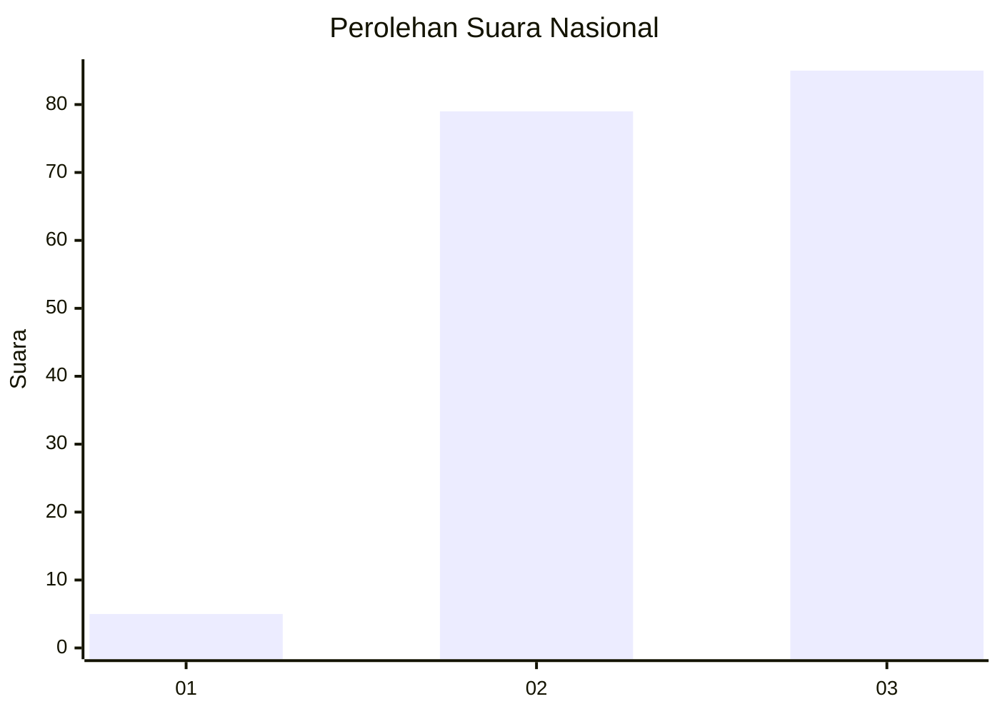
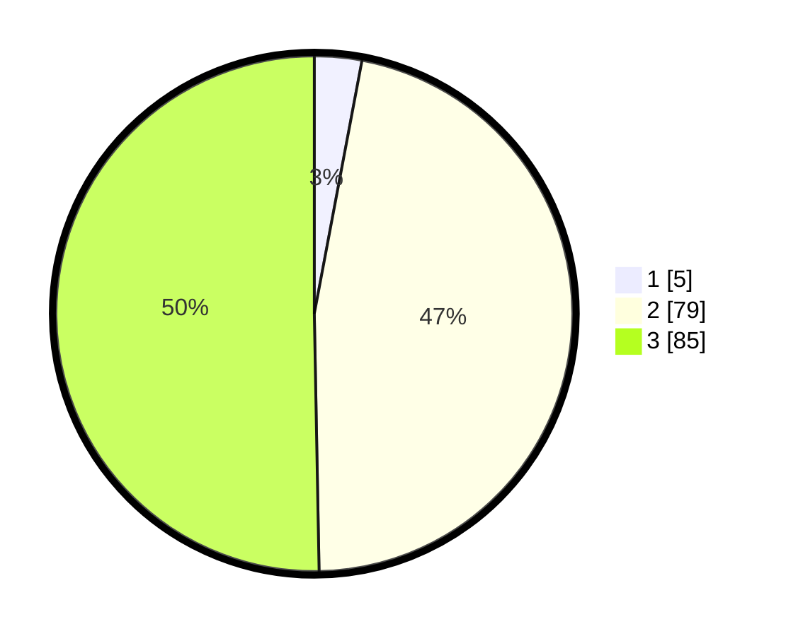

# Hasil

## Grafik

## Tabel

| No. | Nama Paslon    | Suara | Suara (raw) | Persentase |
|:--- |:-------------- | -----:| -----------:| ----------:|
| 1   | ANIES MUHAIMIN | 5     | [5][p-1]    | 2,96       |
| 2   | PRABOWO GIBRAN | 79    | [79][p-2]   | 46,75      |
| 3   | GANJAR MAHFUD  | 85    | [85][p-3]   | 50,30      |

[p-1]: https://github.com/gigit-pemilu/pemilu-2024/blob/main/pilpres/hitung-suara/sub/53-nusa-tenggara-timur/sub/02-kab-timor-tengah-selatan/sub/13-polen/sub/2001-konbaki/sub/002-tps/sub/paslon-1.txt
[p-2]: https://github.com/gigit-pemilu/pemilu-2024/blob/main/pilpres/hitung-suara/sub/53-nusa-tenggara-timur/sub/02-kab-timor-tengah-selatan/sub/13-polen/sub/2001-konbaki/sub/002-tps/sub/paslon-2.txt
[p-3]: https://github.com/gigit-pemilu/pemilu-2024/blob/main/pilpres/hitung-suara/sub/53-nusa-tenggara-timur/sub/02-kab-timor-tengah-selatan/sub/13-polen/sub/2001-konbaki/sub/002-tps/sub/paslon-3.txt

## Foto C Plano

https://sirekap-obj-formc.kpu.go.id/26df/pemilu/ppwp/53/02/13/20/01/5302132001002-20240216-181448--7c7f11a0-394f-4c7f-81a9-7a0df40d6fe4.jpg

https://sirekap-obj-formc.kpu.go.id/26df/pemilu/ppwp/53/02/13/20/01/5302132001002-20240216-181800--4e64c7b5-d6f6-4662-bff0-78d0c6f2f109.jpg

https://sirekap-obj-formc.kpu.go.id/26df/pemilu/ppwp/53/02/13/20/01/5302132001002-20240216-182330--1d5d985b-1590-45b8-ba5a-06497a743be7.jpg

## Metadata

| Key        | Value               |
| ---------- | ------------------- |
| Time Stamp | 2024-02-16 21:01:00 |

