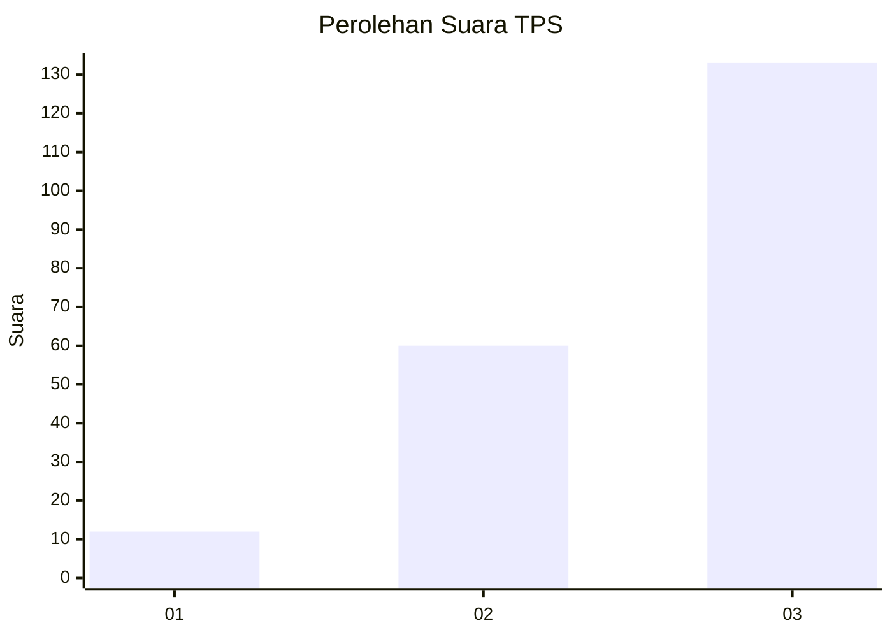
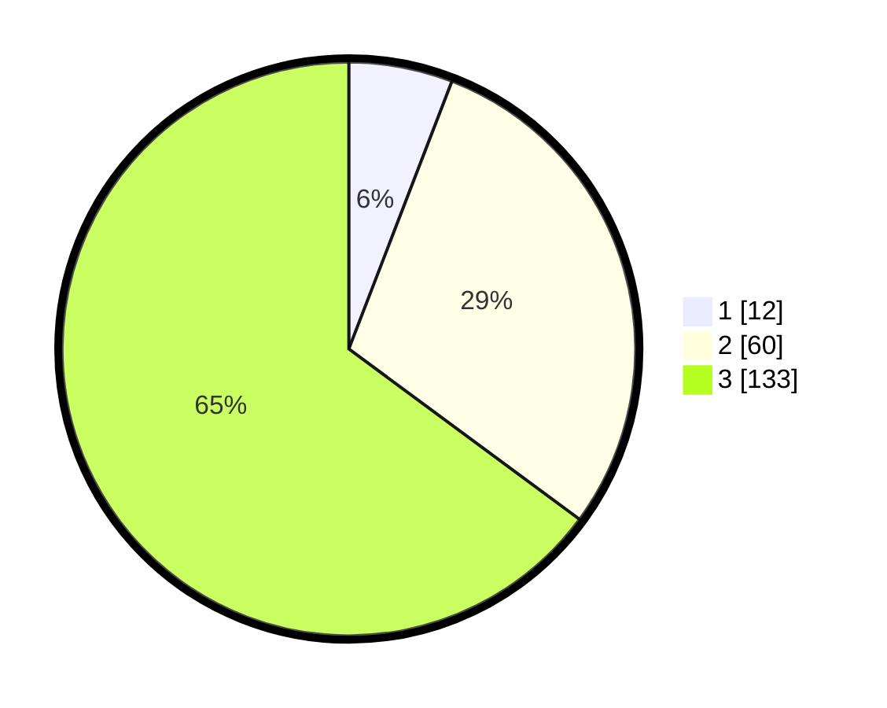

# Hasil

## Grafik

## Tabel

| No. | Nama Paslon    | Suara | Suara (raw) | Persentase |
|:--- |:-------------- | -----:| -----------:| ----------:|
| 1   | ANIES MUHAIMIN | 12    | [12][p-1]   | 5,85       |
| 2   | PRABOWO GIBRAN | 60    | [60][p-2]   | 29,27      |
| 3   | GANJAR MAHFUD  | 133   | [133][p-3]  | 64,88      |

[p-1]: https://github.com/gigit-pemilu/pemilu-2024-53-nusa-tenggara-timur/blob/main/pilpres/hitung-suara/sub/53-nusa-tenggara-timur/sub/02-kab-timor-tengah-selatan/sub/14-batu-putih/sub/2002-boentuka/sub/001-tps/sub/paslon-1.txt
[p-2]: https://github.com/gigit-pemilu/pemilu-2024-53-nusa-tenggara-timur/blob/main/pilpres/hitung-suara/sub/53-nusa-tenggara-timur/sub/02-kab-timor-tengah-selatan/sub/14-batu-putih/sub/2002-boentuka/sub/001-tps/sub/paslon-2.txt
[p-3]: https://github.com/gigit-pemilu/pemilu-2024-53-nusa-tenggara-timur/blob/main/pilpres/hitung-suara/sub/53-nusa-tenggara-timur/sub/02-kab-timor-tengah-selatan/sub/14-batu-putih/sub/2002-boentuka/sub/001-tps/sub/paslon-3.txt

## Foto C Plano

https://sirekap-obj-formc.kpu.go.id/c16b/pemilu/ppwp/53/02/14/20/02/5302142002001-20240215-212628--de0c3ba7-4ae1-41bc-b026-ae708c9bb74b.jpg

https://sirekap-obj-formc.kpu.go.id/c16b/pemilu/ppwp/53/02/14/20/02/5302142002001-20240215-212323--108d43fe-03d7-47b6-a360-2c1aef5e20d4.jpg

https://sirekap-obj-formc.kpu.go.id/c16b/pemilu/ppwp/53/02/14/20/02/5302142002001-20240215-154440--3f104670-25dc-472a-b3ac-2b1c24c0283b.jpg

## Metadata

| Key        | Value               |
| ---------- | ------------------- |
| Time Stamp | 2024-02-24 22:31:28 |

