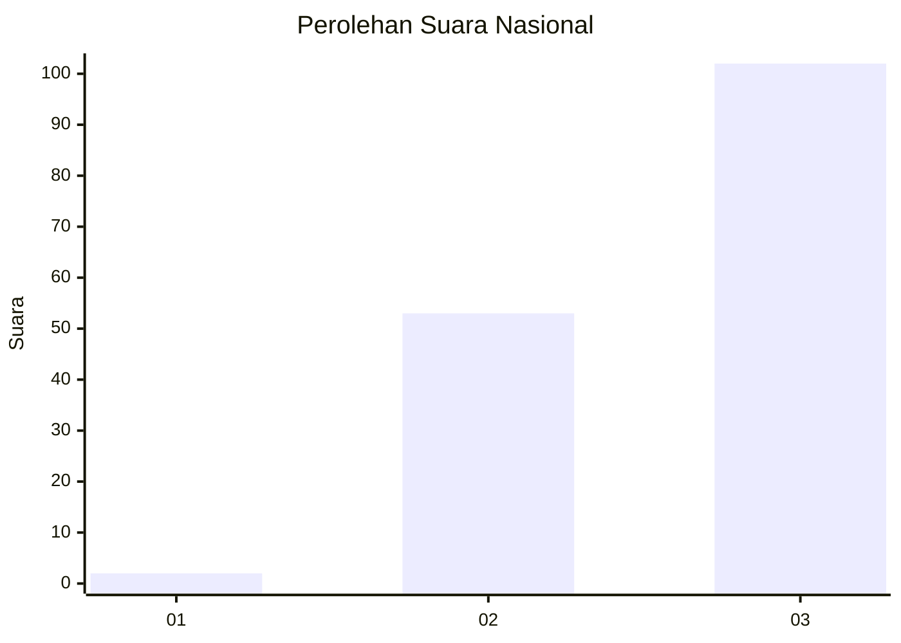
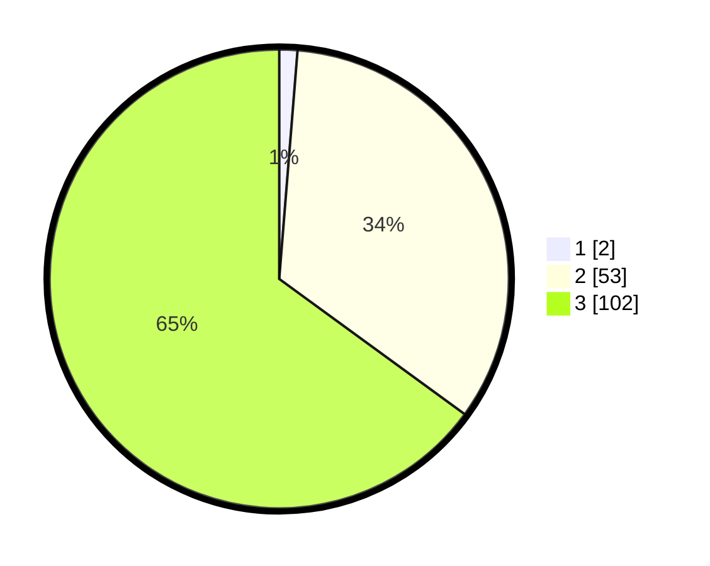

# Hasil

## Grafik

## Tabel

| No. | Nama Paslon    | Suara | Suara (raw) | Persentase |
|:--- |:-------------- | -----:| -----------:| ----------:|
| 1   | ANIES MUHAIMIN | 2     | [2][p-1]    | 1,27       |
| 2   | PRABOWO GIBRAN | 53    | [53][p-2]   | 33,76      |
| 3   | GANJAR MAHFUD  | 102   | [102][p-3]  | 64,97      |

[p-1]: https://github.com/gigit-pemilu/pemilu-2024/blob/main/pilpres/hitung-suara/sub/53-nusa-tenggara-timur/sub/02-kab-timor-tengah-selatan/sub/17-nunkolo/sub/2002-sahan/sub/002-tps/sub/paslon-1.txt
[p-2]: https://github.com/gigit-pemilu/pemilu-2024/blob/main/pilpres/hitung-suara/sub/53-nusa-tenggara-timur/sub/02-kab-timor-tengah-selatan/sub/17-nunkolo/sub/2002-sahan/sub/002-tps/sub/paslon-2.txt
[p-3]: https://github.com/gigit-pemilu/pemilu-2024/blob/main/pilpres/hitung-suara/sub/53-nusa-tenggara-timur/sub/02-kab-timor-tengah-selatan/sub/17-nunkolo/sub/2002-sahan/sub/002-tps/sub/paslon-3.txt

## Foto C Plano

https://sirekap-obj-formc.kpu.go.id/713d/pemilu/ppwp/53/02/17/20/02/5302172002002-20240215-011539--040d4af8-61ee-4d9c-afa3-4070bf4e61bf.jpg

https://sirekap-obj-formc.kpu.go.id/713d/pemilu/ppwp/53/02/17/20/02/5302172002002-20240215-011849--748fcb73-7d3b-4f3a-9d02-df3ce78ceed2.jpg

https://sirekap-obj-formc.kpu.go.id/713d/pemilu/ppwp/53/02/17/20/02/5302172002002-20240215-050752--d4f54cdc-7f05-4f3f-a7d6-21570ea33228.jpg

## Metadata

| Key        | Value               |
| ---------- | ------------------- |
| Time Stamp | 2024-02-26 15:00:00 |

