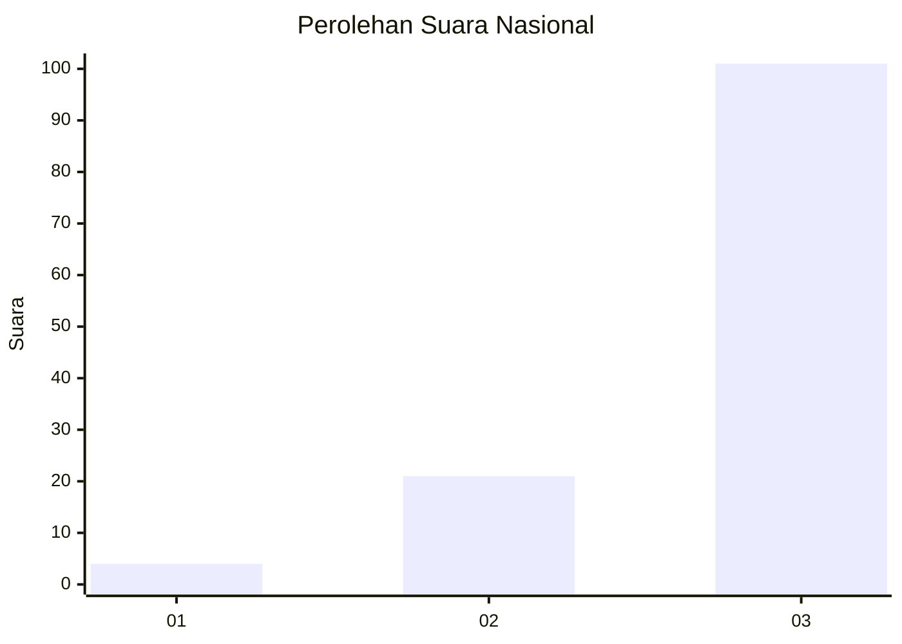
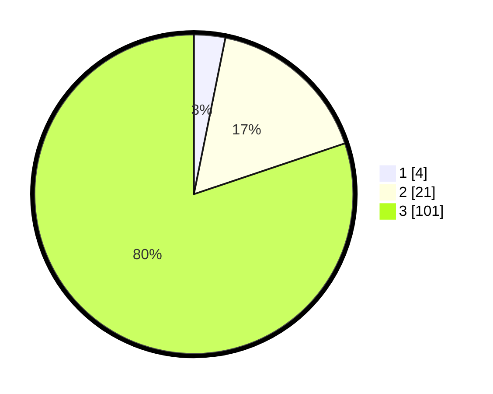

# Hasil

## Grafik

## Tabel

| No. | Nama Paslon    | Suara | Suara (raw) | Persentase |
|:--- |:-------------- | -----:| -----------:| ----------:|
| 1   | ANIES MUHAIMIN | 4     | [4][p-1]    | 3,17       |
| 2   | PRABOWO GIBRAN | 21    | [21][p-2]   | 16,67      |
| 3   | GANJAR MAHFUD  | 101   | [101][p-3]  | 80,16      |

[p-1]: https://github.com/gigit-pemilu/pemilu-2024/blob/main/pilpres/hitung-suara/sub/53-nusa-tenggara-timur/sub/02-kab-timor-tengah-selatan/sub/17-nunkolo/sub/2002-sahan/sub/005-tps/sub/paslon-1.txt
[p-2]: https://github.com/gigit-pemilu/pemilu-2024/blob/main/pilpres/hitung-suara/sub/53-nusa-tenggara-timur/sub/02-kab-timor-tengah-selatan/sub/17-nunkolo/sub/2002-sahan/sub/005-tps/sub/paslon-2.txt
[p-3]: https://github.com/gigit-pemilu/pemilu-2024/blob/main/pilpres/hitung-suara/sub/53-nusa-tenggara-timur/sub/02-kab-timor-tengah-selatan/sub/17-nunkolo/sub/2002-sahan/sub/005-tps/sub/paslon-3.txt

## Foto C Plano

https://sirekap-obj-formc.kpu.go.id/ce68/pemilu/ppwp/53/02/17/20/02/5302172002005-20240214-205509--ce02fec0-5428-4af0-8cd3-a53a72ed5ee1.jpg

https://sirekap-obj-formc.kpu.go.id/ce68/pemilu/ppwp/53/02/17/20/02/5302172002005-20240214-205612--21553fe3-a9cf-4019-ab19-68ecd0ad99e1.jpg

https://sirekap-obj-formc.kpu.go.id/ce68/pemilu/ppwp/53/02/17/20/02/5302172002005-20240214-205709--dce5e078-fd08-4788-8a9c-a80c06f142cb.jpg

## Metadata

| Key        | Value               |
| ---------- | ------------------- |
| Time Stamp | 2024-02-24 22:31:28 |

