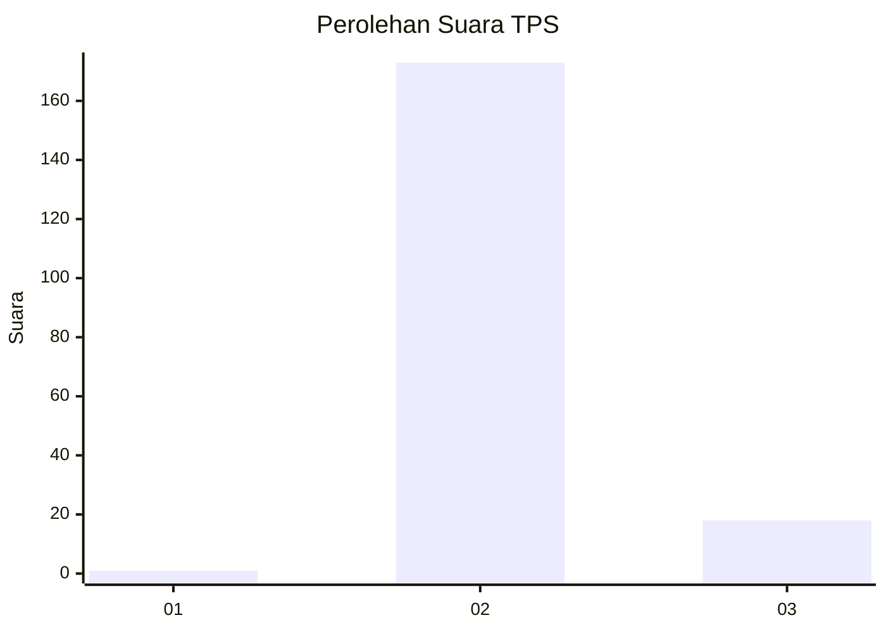
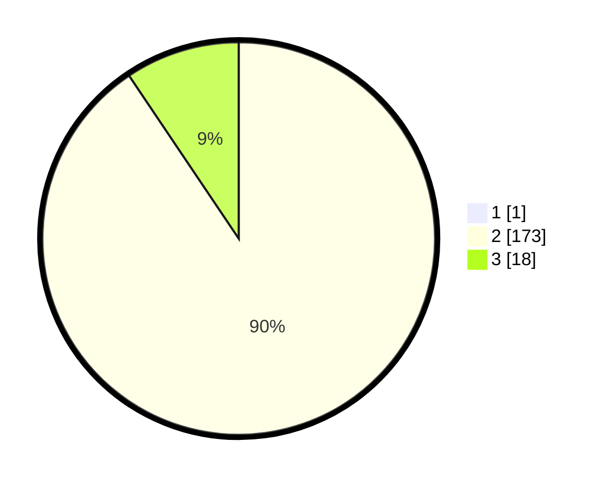

# Hasil

## Grafik

## Tabel

| No. | Nama Paslon    | Suara | Suara (raw) | Persentase |
|:--- |:-------------- | -----:| -----------:| ----------:|
| 1   | ANIES MUHAIMIN | 1     | [1][p-1]    | 0,52       |
| 2   | PRABOWO GIBRAN | 173   | [173][p-2]  | 90,10      |
| 3   | GANJAR MAHFUD  | 18    | [18][p-3]   | 9,38       |

[p-1]: https://github.com/gigit-pemilu/pemilu-2024-53-nusa-tenggara-timur/blob/main/pilpres/hitung-suara/sub/53-nusa-tenggara-timur/sub/02-kab-timor-tengah-selatan/sub/20-kot-olin/sub/2001-kot'olin/sub/001-tps/sub/paslon-1.txt
[p-2]: https://github.com/gigit-pemilu/pemilu-2024-53-nusa-tenggara-timur/blob/main/pilpres/hitung-suara/sub/53-nusa-tenggara-timur/sub/02-kab-timor-tengah-selatan/sub/20-kot-olin/sub/2001-kot'olin/sub/001-tps/sub/paslon-2.txt
[p-3]: https://github.com/gigit-pemilu/pemilu-2024-53-nusa-tenggara-timur/blob/main/pilpres/hitung-suara/sub/53-nusa-tenggara-timur/sub/02-kab-timor-tengah-selatan/sub/20-kot-olin/sub/2001-kot'olin/sub/001-tps/sub/paslon-3.txt

## Foto C Plano

https://sirekap-obj-formc.kpu.go.id/10b0/pemilu/ppwp/53/02/20/20/01/5302202001001-20240215-104323--20b78eb6-4c87-4ba0-9a8f-4f0e15c05f56.jpg

https://sirekap-obj-formc.kpu.go.id/10b0/pemilu/ppwp/53/02/20/20/01/5302202001001-20240215-104652--ff17bd44-85be-4f47-8dce-f5292900bccb.jpg

https://sirekap-obj-formc.kpu.go.id/10b0/pemilu/ppwp/53/02/20/20/01/5302202001001-20240215-105103--5f61f2de-0844-4f39-aacc-5d45beb55f51.jpg

## Metadata

| Key        | Value               |
| ---------- | ------------------- |
| Time Stamp | 2024-02-15 18:00:26 |

