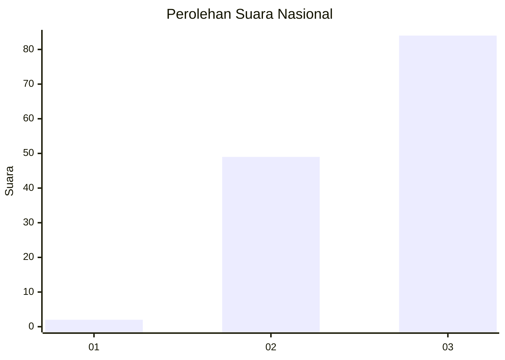
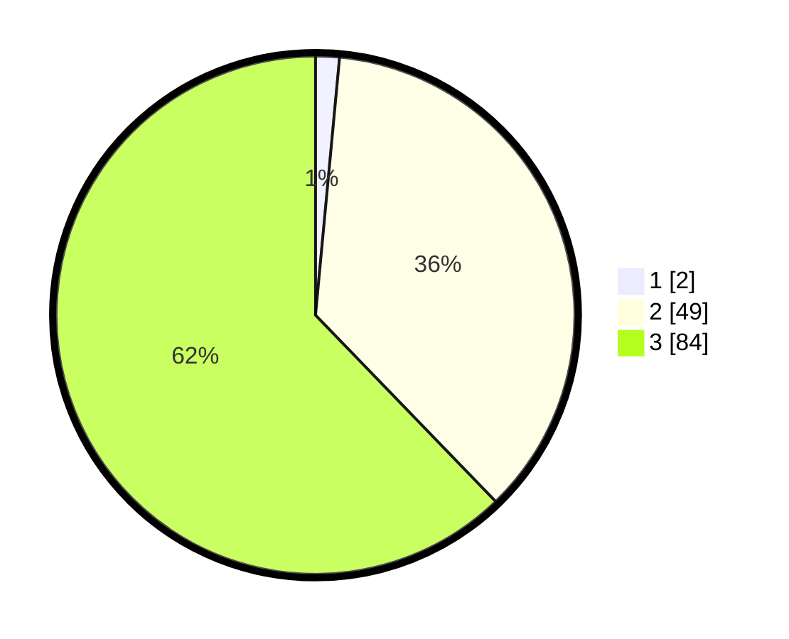

# Hasil

## Grafik

## Tabel

| No. | Nama Paslon    | Suara | Suara (raw) | Persentase |
|:--- |:-------------- | -----:| -----------:| ----------:|
| 1   | ANIES MUHAIMIN | 2     | [2][p-1]    | 1,48       |
| 2   | PRABOWO GIBRAN | 49    | [49][p-2]   | 36,30      |
| 3   | GANJAR MAHFUD  | 84    | [84][p-3]   | 62,22      |

[p-1]: https://github.com/gigit-pemilu/pemilu-2024/blob/main/pilpres/hitung-suara/sub/53-nusa-tenggara-timur/sub/02-kab-timor-tengah-selatan/sub/20-kot-olin/sub/2001-kot'olin/sub/008-tps/sub/paslon-1.txt
[p-2]: https://github.com/gigit-pemilu/pemilu-2024/blob/main/pilpres/hitung-suara/sub/53-nusa-tenggara-timur/sub/02-kab-timor-tengah-selatan/sub/20-kot-olin/sub/2001-kot'olin/sub/008-tps/sub/paslon-2.txt
[p-3]: https://github.com/gigit-pemilu/pemilu-2024/blob/main/pilpres/hitung-suara/sub/53-nusa-tenggara-timur/sub/02-kab-timor-tengah-selatan/sub/20-kot-olin/sub/2001-kot'olin/sub/008-tps/sub/paslon-3.txt

## Foto C Plano

https://sirekap-obj-formc.kpu.go.id/139d/pemilu/ppwp/53/02/20/20/01/5302202001008-20240215-085237--87f9eb96-eb29-4abd-8828-b11e5bdf45ad.jpg

https://sirekap-obj-formc.kpu.go.id/139d/pemilu/ppwp/53/02/20/20/01/5302202001008-20240215-083452--10103df3-c738-44da-bd3e-bd7d37ee7cdd.jpg

https://sirekap-obj-formc.kpu.go.id/139d/pemilu/ppwp/53/02/20/20/01/5302202001008-20240215-084851--4e424170-f370-40b5-ad1c-56748d954188.jpg

## Metadata

| Key        | Value               |
| ---------- | ------------------- |
| Time Stamp | 2024-02-17 16:00:02 |

