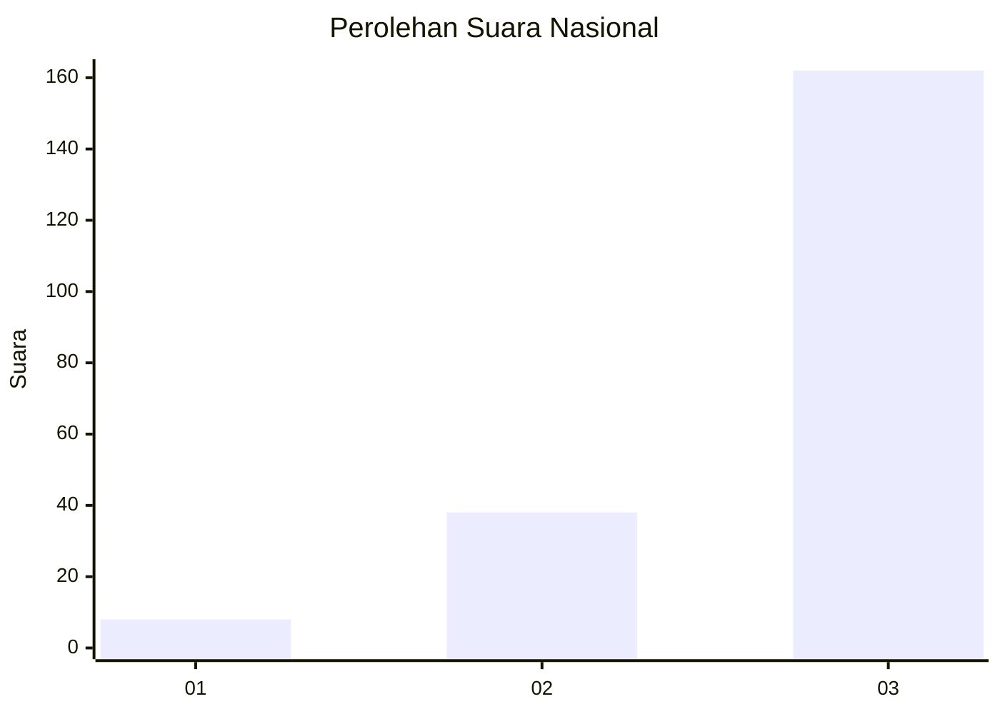
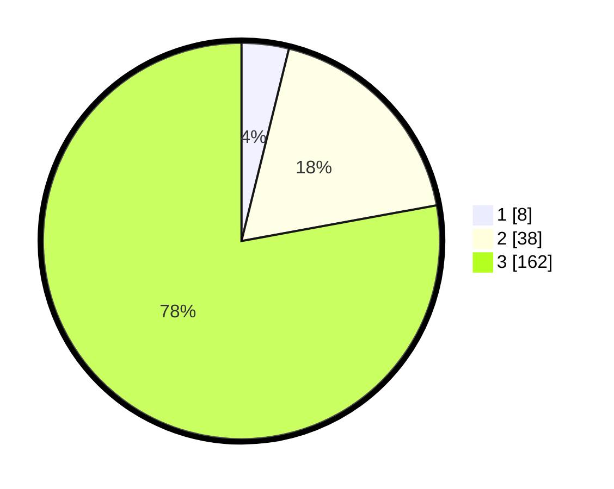

# Hasil

## Grafik

## Tabel

| No. | Nama Paslon    | Suara | Suara (raw) | Persentase |
|:--- |:-------------- | -----:| -----------:| ----------:|
| 1   | ANIES MUHAIMIN | 8     | [8][p-1]    | 3,85       |
| 2   | PRABOWO GIBRAN | 38    | [38][p-2]   | 18,27      |
| 3   | GANJAR MAHFUD  | 162   | [162][p-3]  | 77,88      |

[p-1]: https://github.com/gigit-pemilu/pemilu-2024/blob/main/pilpres/hitung-suara/sub/53-nusa-tenggara-timur/sub/02-kab-timor-tengah-selatan/sub/20-kot-olin/sub/2006-binenok/sub/001-tps/sub/paslon-1.txt
[p-2]: https://github.com/gigit-pemilu/pemilu-2024/blob/main/pilpres/hitung-suara/sub/53-nusa-tenggara-timur/sub/02-kab-timor-tengah-selatan/sub/20-kot-olin/sub/2006-binenok/sub/001-tps/sub/paslon-2.txt
[p-3]: https://github.com/gigit-pemilu/pemilu-2024/blob/main/pilpres/hitung-suara/sub/53-nusa-tenggara-timur/sub/02-kab-timor-tengah-selatan/sub/20-kot-olin/sub/2006-binenok/sub/001-tps/sub/paslon-3.txt

## Foto C Plano

https://sirekap-obj-formc.kpu.go.id/8021/pemilu/ppwp/53/02/20/20/06/5302202006001-20240215-101900--03f446d2-b3d5-4f17-937e-5008e14233da.jpg

https://sirekap-obj-formc.kpu.go.id/8021/pemilu/ppwp/53/02/20/20/06/5302202006001-20240215-100139--d428bf08-35c1-48a0-9fda-05824c6fe66e.jpg

https://sirekap-obj-formc.kpu.go.id/8021/pemilu/ppwp/53/02/20/20/06/5302202006001-20240215-103829--47ffd056-8174-462e-9813-706c301c25c5.jpg

## Metadata

| Key        | Value               |
| ---------- | ------------------- |
| Time Stamp | 2024-02-17 16:00:02 |

