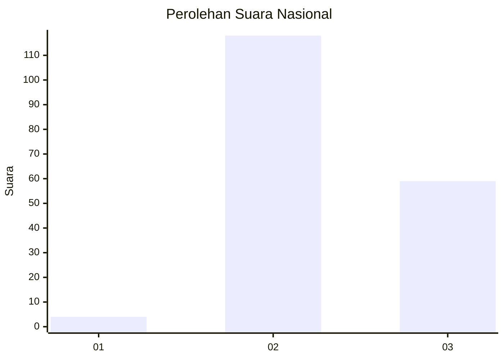
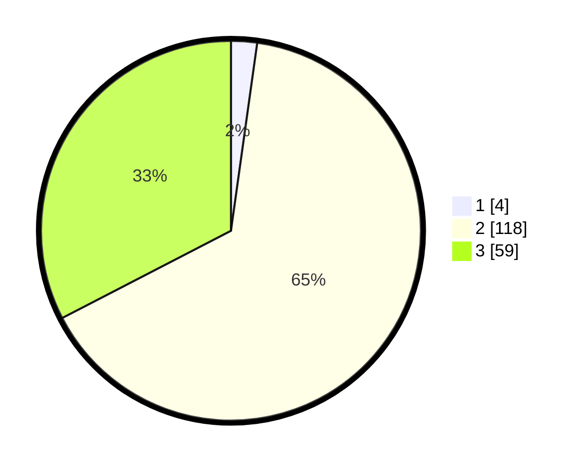

# Hasil

## Grafik

## Tabel

| No. | Nama Paslon    | Suara | Suara (raw) | Persentase |
|:--- |:-------------- | -----:| -----------:| ----------:|
| 1   | ANIES MUHAIMIN | 4     | [4][p-1]    | 2,21       |
| 2   | PRABOWO GIBRAN | 118   | [118][p-2]  | 65,19      |
| 3   | GANJAR MAHFUD  | 59    | [59][p-3]   | 32,60      |

[p-1]: https://github.com/gigit-pemilu/pemilu-2024/blob/main/pilpres/hitung-suara/sub/53-nusa-tenggara-timur/sub/02-kab-timor-tengah-selatan/sub/23-kok-baun/sub/2001-lotas/sub/001-tps/sub/paslon-1.txt
[p-2]: https://github.com/gigit-pemilu/pemilu-2024/blob/main/pilpres/hitung-suara/sub/53-nusa-tenggara-timur/sub/02-kab-timor-tengah-selatan/sub/23-kok-baun/sub/2001-lotas/sub/001-tps/sub/paslon-2.txt
[p-3]: https://github.com/gigit-pemilu/pemilu-2024/blob/main/pilpres/hitung-suara/sub/53-nusa-tenggara-timur/sub/02-kab-timor-tengah-selatan/sub/23-kok-baun/sub/2001-lotas/sub/001-tps/sub/paslon-3.txt

## Foto C Plano

https://sirekap-obj-formc.kpu.go.id/2fc8/pemilu/ppwp/53/02/23/20/01/5302232001001-20240216-032723--5a203400-95ae-4418-aa98-5580cd9e9729.jpg

https://sirekap-obj-formc.kpu.go.id/2fc8/pemilu/ppwp/53/02/23/20/01/5302232001001-20240215-120902--fd15e82c-5670-4d99-8aec-aa3f68ab8b59.jpg

https://sirekap-obj-formc.kpu.go.id/2fc8/pemilu/ppwp/53/02/23/20/01/5302232001001-20240215-121232--a417d465-d6e5-4d2d-a93e-0fe70409840c.jpg

## Metadata

| Key        | Value               |
| ---------- | ------------------- |
| Time Stamp | 2024-02-19 06:16:00 |

