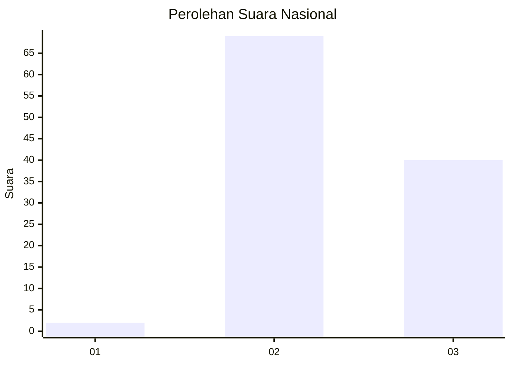
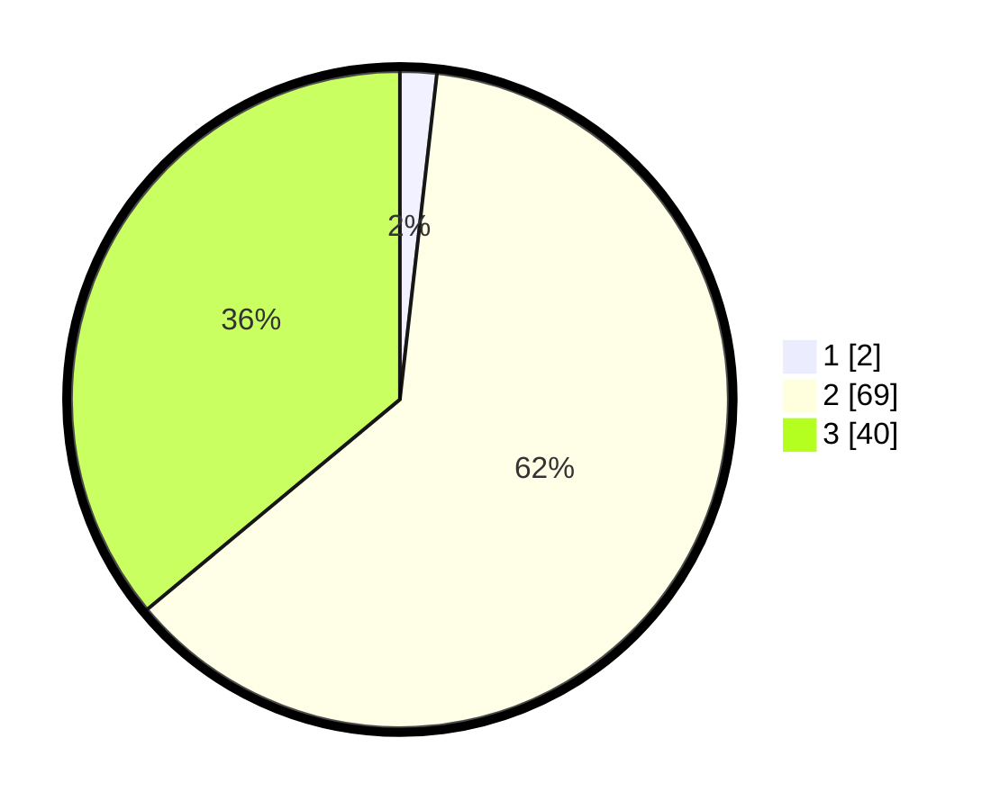

# Hasil

## Grafik

## Tabel

| No. | Nama Paslon    | Suara | Suara (raw) | Persentase |
|:--- |:-------------- | -----:| -----------:| ----------:|
| 1   | ANIES MUHAIMIN | 2     | [2][p-1]    | 1,80       |
| 2   | PRABOWO GIBRAN | 69    | [69][p-2]   | 62,16      |
| 3   | GANJAR MAHFUD  | 40    | [40][p-3]   | 36,04      |

[p-1]: https://github.com/gigit-pemilu/pemilu-2024/blob/main/pilpres/hitung-suara/sub/53-nusa-tenggara-timur/sub/02-kab-timor-tengah-selatan/sub/23-kok-baun/sub/2002-sabnala/sub/001-tps/sub/paslon-1.txt
[p-2]: https://github.com/gigit-pemilu/pemilu-2024/blob/main/pilpres/hitung-suara/sub/53-nusa-tenggara-timur/sub/02-kab-timor-tengah-selatan/sub/23-kok-baun/sub/2002-sabnala/sub/001-tps/sub/paslon-2.txt
[p-3]: https://github.com/gigit-pemilu/pemilu-2024/blob/main/pilpres/hitung-suara/sub/53-nusa-tenggara-timur/sub/02-kab-timor-tengah-selatan/sub/23-kok-baun/sub/2002-sabnala/sub/001-tps/sub/paslon-3.txt

## Foto C Plano

https://sirekap-obj-formc.kpu.go.id/b162/pemilu/ppwp/53/02/23/20/02/5302232002001-20240214-205259--d1082e99-248b-43fa-9d55-f8e70f7f1a5d.jpg

https://sirekap-obj-formc.kpu.go.id/b162/pemilu/ppwp/53/02/23/20/02/5302232002001-20240214-210208--05855692-4f06-444f-80f5-8e8c3b215f85.jpg

https://sirekap-obj-formc.kpu.go.id/b162/pemilu/ppwp/53/02/23/20/02/5302232002001-20240215-211140--94123000-b375-4a1e-a0dd-a986a8195fa7.jpg

## Metadata

| Key        | Value               |
| ---------- | ------------------- |
| Time Stamp | 2024-02-15 22:00:27 |

