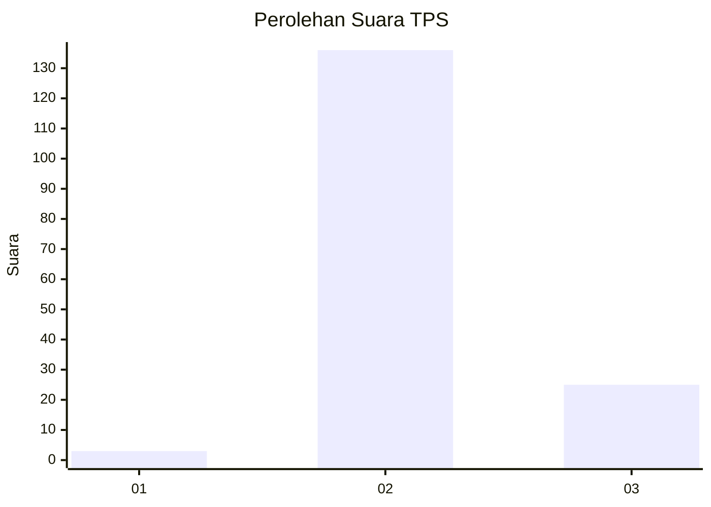
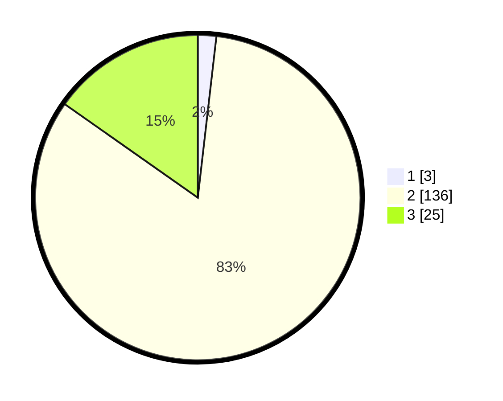

# Hasil

## Grafik

## Tabel

| No. | Nama Paslon    | Suara | Suara (raw) | Persentase |
|:--- |:-------------- | -----:| -----------:| ----------:|
| 1   | ANIES MUHAIMIN | 3     | [3][p-1]    | 1,83       |
| 2   | PRABOWO GIBRAN | 136   | [136][p-2]  | 82,93      |
| 3   | GANJAR MAHFUD  | 25    | [25][p-3]   | 15,24      |

[p-1]: https://github.com/gigit-pemilu/pemilu-2024-53-nusa-tenggara-timur/blob/main/pilpres/hitung-suara/sub/53-nusa-tenggara-timur/sub/02-kab-timor-tengah-selatan/sub/27-kuatnana/sub/2001-tetaf/sub/004-tps/sub/paslon-1.txt
[p-2]: https://github.com/gigit-pemilu/pemilu-2024-53-nusa-tenggara-timur/blob/main/pilpres/hitung-suara/sub/53-nusa-tenggara-timur/sub/02-kab-timor-tengah-selatan/sub/27-kuatnana/sub/2001-tetaf/sub/004-tps/sub/paslon-2.txt
[p-3]: https://github.com/gigit-pemilu/pemilu-2024-53-nusa-tenggara-timur/blob/main/pilpres/hitung-suara/sub/53-nusa-tenggara-timur/sub/02-kab-timor-tengah-selatan/sub/27-kuatnana/sub/2001-tetaf/sub/004-tps/sub/paslon-3.txt

## Foto C Plano

https://sirekap-obj-formc.kpu.go.id/ccfe/pemilu/ppwp/53/02/27/20/01/5302272001004-20240215-073308--d291274a-0de6-44e5-9955-eadcfbc7273a.jpg

https://sirekap-obj-formc.kpu.go.id/ccfe/pemilu/ppwp/53/02/27/20/01/5302272001004-20240215-081619--f4f53a6b-eafb-450a-a7f9-951c8fe5ff4e.jpg

https://sirekap-obj-formc.kpu.go.id/ccfe/pemilu/ppwp/53/02/27/20/01/5302272001004-20240215-082039--18479103-47c2-4dee-89ad-7dc5b3c198e8.jpg

## Metadata

| Key        | Value               |
| ---------- | ------------------- |
| Time Stamp | 2024-02-17 01:22:58 |

