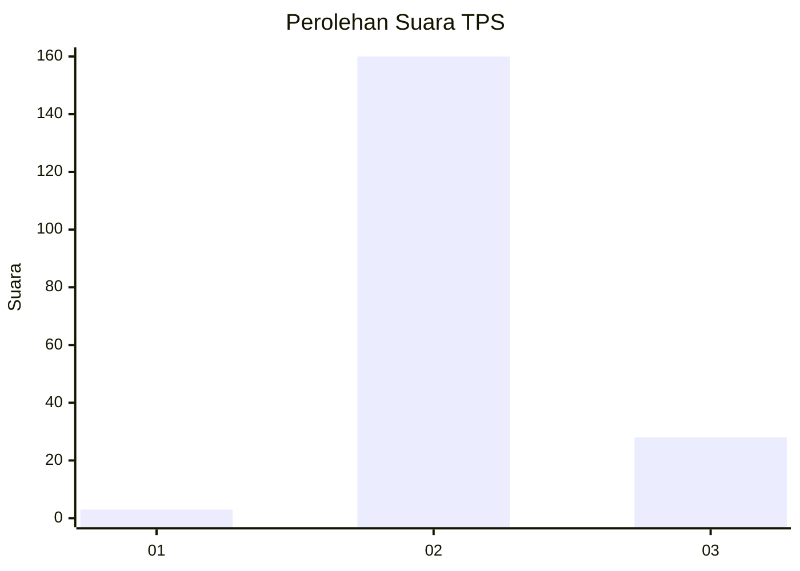
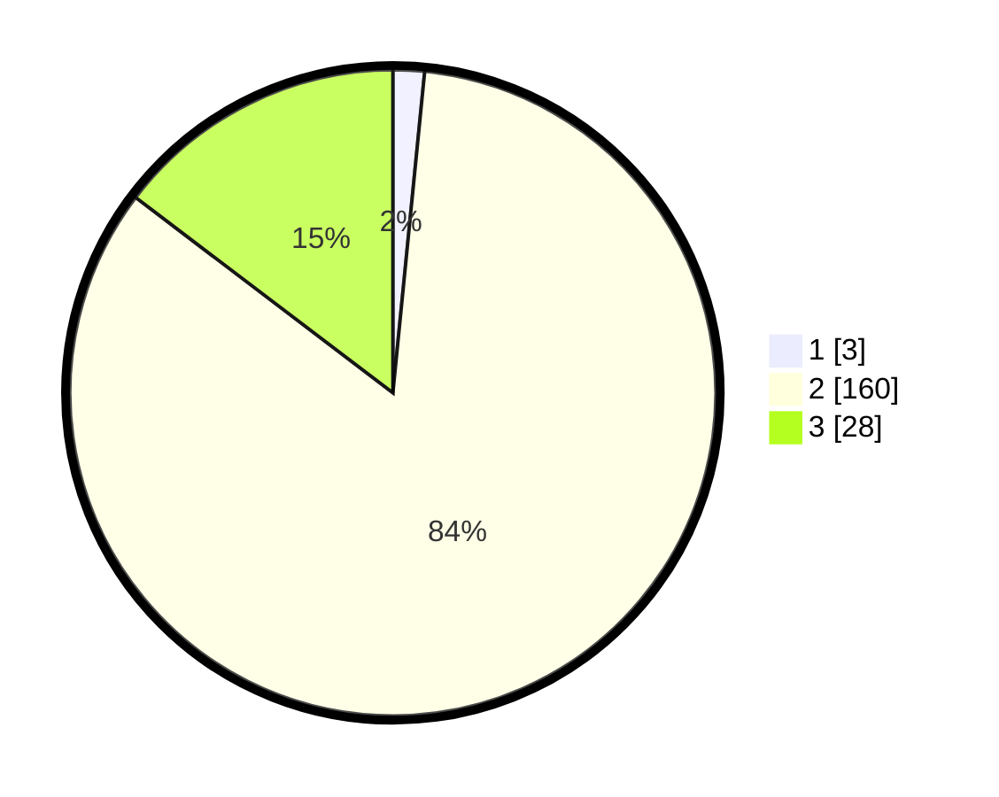

# Hasil

## Grafik

## Tabel

| No. | Nama Paslon    | Suara | Suara (raw) | Persentase |
|:--- |:-------------- | -----:| -----------:| ----------:|
| 1   | ANIES MUHAIMIN | 3     | [3][p-1]    | 1,57       |
| 2   | PRABOWO GIBRAN | 160   | [160][p-2]  | 83,77      |
| 3   | GANJAR MAHFUD  | 28    | [28][p-3]   | 14,66      |

[p-1]: https://github.com/gigit-pemilu/pemilu-2024-53-nusa-tenggara-timur/blob/main/pilpres/hitung-suara/sub/53-nusa-tenggara-timur/sub/02-kab-timor-tengah-selatan/sub/27-kuatnana/sub/2001-tetaf/sub/005-tps/sub/paslon-1.txt
[p-2]: https://github.com/gigit-pemilu/pemilu-2024-53-nusa-tenggara-timur/blob/main/pilpres/hitung-suara/sub/53-nusa-tenggara-timur/sub/02-kab-timor-tengah-selatan/sub/27-kuatnana/sub/2001-tetaf/sub/005-tps/sub/paslon-2.txt
[p-3]: https://github.com/gigit-pemilu/pemilu-2024-53-nusa-tenggara-timur/blob/main/pilpres/hitung-suara/sub/53-nusa-tenggara-timur/sub/02-kab-timor-tengah-selatan/sub/27-kuatnana/sub/2001-tetaf/sub/005-tps/sub/paslon-3.txt

## Foto C Plano

https://sirekap-obj-formc.kpu.go.id/190f/pemilu/ppwp/53/02/27/20/01/5302272001005-20240222-141216--82ef4a63-fd91-4856-bced-e81082f004ed.jpg

https://sirekap-obj-formc.kpu.go.id/190f/pemilu/ppwp/53/02/27/20/01/5302272001005-20240222-141302--daf2b5af-e1f1-4ac8-a16f-67dde2e33aa0.jpg

https://sirekap-obj-formc.kpu.go.id/190f/pemilu/ppwp/53/02/27/20/01/5302272001005-20240222-141330--a36b7f9d-5afb-4e7b-8dbf-d6301ffcc919.jpg

## Metadata

| Key        | Value               |
| ---------- | ------------------- |
| Time Stamp | 2024-02-25 12:00:00 |

