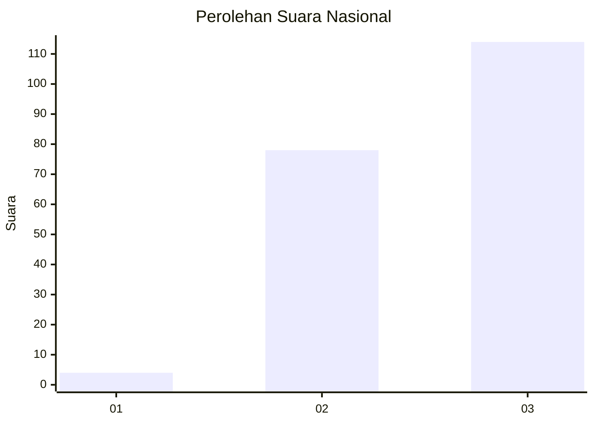
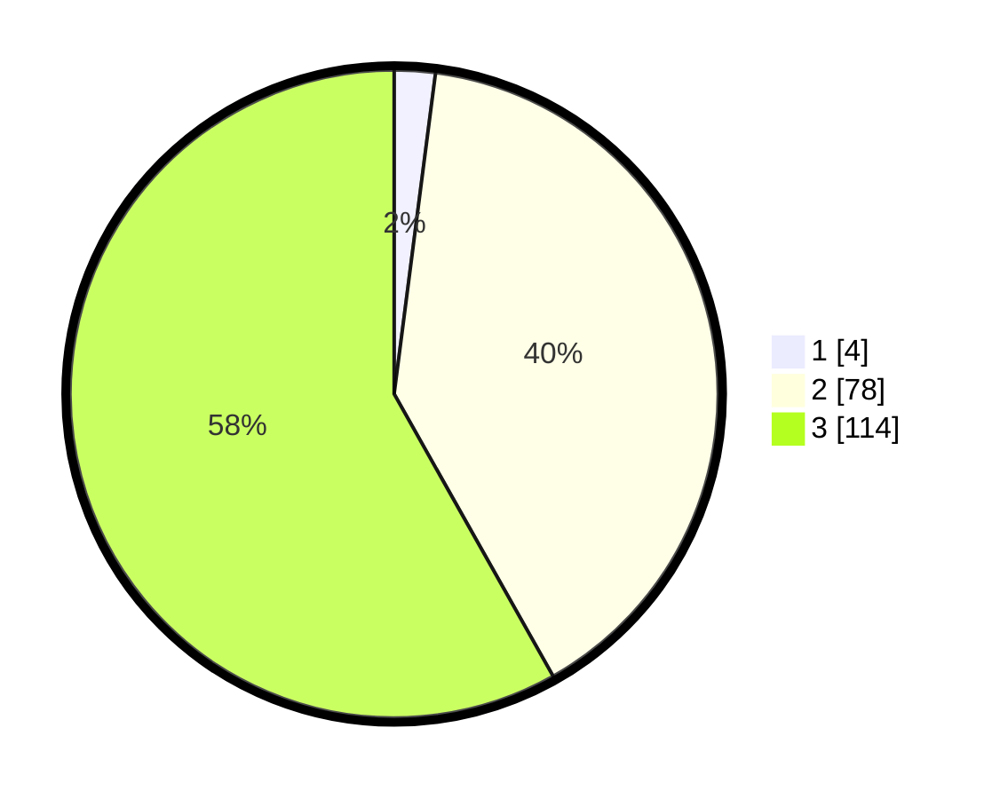

# Hasil

## Grafik

## Tabel

| No. | Nama Paslon    | Suara | Suara (raw) | Persentase |
|:--- |:-------------- | -----:| -----------:| ----------:|
| 1   | ANIES MUHAIMIN | 4     | [4][p-1]    | 2,04       |
| 2   | PRABOWO GIBRAN | 78    | [78][p-2]   | 39,80      |
| 3   | GANJAR MAHFUD  | 114   | [114][p-3]  | 58,16      |

[p-1]: https://github.com/gigit-pemilu/pemilu-2024/blob/main/pilpres/hitung-suara/sub/53-nusa-tenggara-timur/sub/02-kab-timor-tengah-selatan/sub/27-kuatnana/sub/2001-tetaf/sub/006-tps/sub/paslon-1.txt
[p-2]: https://github.com/gigit-pemilu/pemilu-2024/blob/main/pilpres/hitung-suara/sub/53-nusa-tenggara-timur/sub/02-kab-timor-tengah-selatan/sub/27-kuatnana/sub/2001-tetaf/sub/006-tps/sub/paslon-2.txt
[p-3]: https://github.com/gigit-pemilu/pemilu-2024/blob/main/pilpres/hitung-suara/sub/53-nusa-tenggara-timur/sub/02-kab-timor-tengah-selatan/sub/27-kuatnana/sub/2001-tetaf/sub/006-tps/sub/paslon-3.txt

## Foto C Plano

https://sirekap-obj-formc.kpu.go.id/d4a1/pemilu/ppwp/53/02/27/20/01/5302272001006-20240216-073704--67629ecc-9a95-4b0d-bfa5-25601bf04bce.jpg

https://sirekap-obj-formc.kpu.go.id/d4a1/pemilu/ppwp/53/02/27/20/01/5302272001006-20240215-151913--1df68256-1f4a-4993-8dc7-a61f4dc3dc93.jpg

https://sirekap-obj-formc.kpu.go.id/d4a1/pemilu/ppwp/53/02/27/20/01/5302272001006-20240215-152025--0743e8b9-c48d-486a-b431-dc971f97a180.jpg

## Metadata

| Key        | Value               |
| ---------- | ------------------- |
| Time Stamp | 2024-02-25 15:00:00 |

