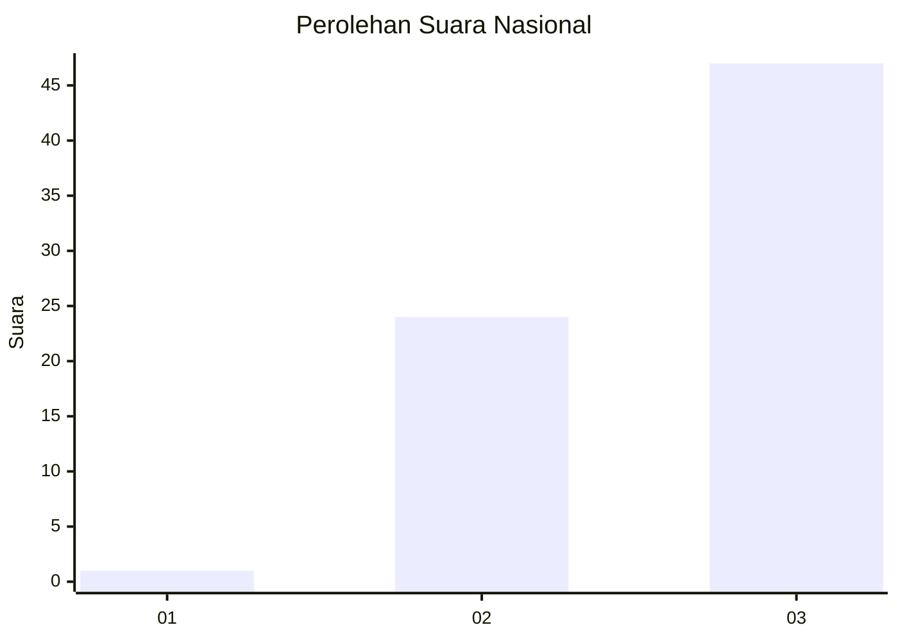
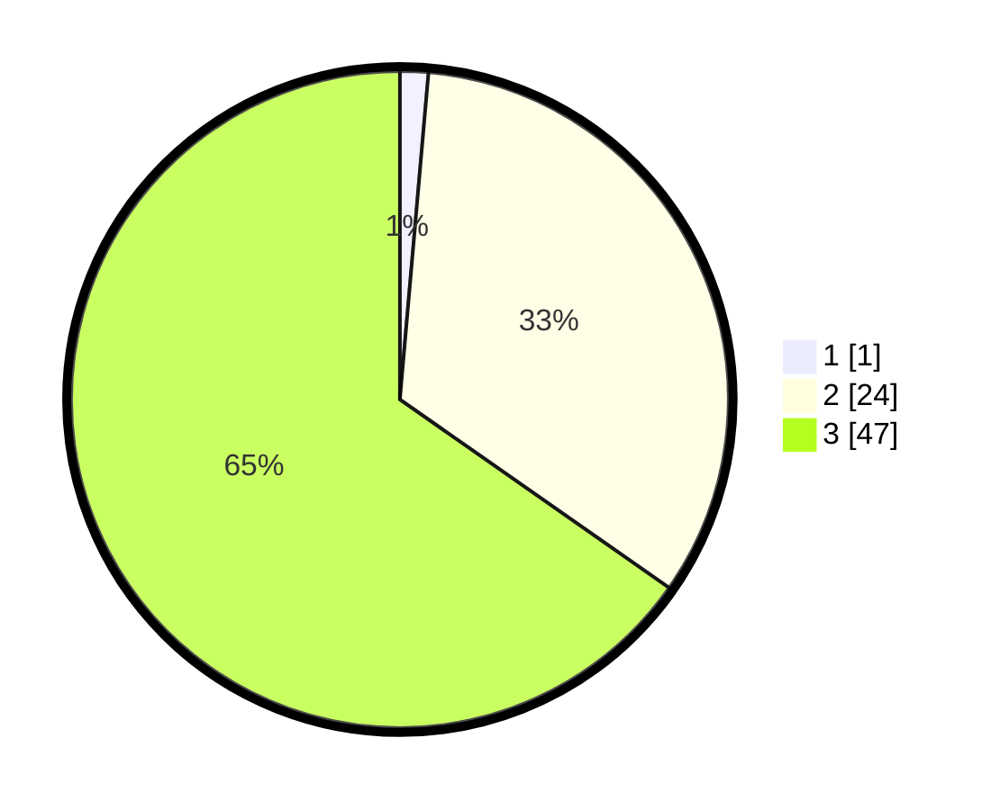

# Hasil

## Grafik

## Tabel

| No. | Nama Paslon    | Suara | Suara (raw) | Persentase |
|:--- |:-------------- | -----:| -----------:| ----------:|
| 1   | ANIES MUHAIMIN | 1     | [1][p-1]    | 1,39       |
| 2   | PRABOWO GIBRAN | 24    | [24][p-2]   | 33,33      |
| 3   | GANJAR MAHFUD  | 47    | [47][p-3]   | 65,28      |

[p-1]: https://github.com/gigit-pemilu/pemilu-2024/blob/main/pilpres/hitung-suara/sub/53-nusa-tenggara-timur/sub/02-kab-timor-tengah-selatan/sub/29-fatukopa/sub/2007-nifulinah/sub/002-tps/sub/paslon-1.txt
[p-2]: https://github.com/gigit-pemilu/pemilu-2024/blob/main/pilpres/hitung-suara/sub/53-nusa-tenggara-timur/sub/02-kab-timor-tengah-selatan/sub/29-fatukopa/sub/2007-nifulinah/sub/002-tps/sub/paslon-2.txt
[p-3]: https://github.com/gigit-pemilu/pemilu-2024/blob/main/pilpres/hitung-suara/sub/53-nusa-tenggara-timur/sub/02-kab-timor-tengah-selatan/sub/29-fatukopa/sub/2007-nifulinah/sub/002-tps/sub/paslon-3.txt

## Foto C Plano

https://sirekap-obj-formc.kpu.go.id/4f04/pemilu/ppwp/53/02/29/20/07/5302292007002-20240215-085332--b0ed8bb1-c021-4739-933c-7f5760e28df8.jpg

https://sirekap-obj-formc.kpu.go.id/4f04/pemilu/ppwp/53/02/29/20/07/5302292007002-20240214-155210--ff4fffdb-1780-40f3-b5c4-be13a71d4c57.jpg

https://sirekap-obj-formc.kpu.go.id/4f04/pemilu/ppwp/53/02/29/20/07/5302292007002-20240214-155838--0858116f-d7a0-4e80-8fce-d00905a618db.jpg

## Metadata

| Key        | Value               |
| ---------- | ------------------- |
| Time Stamp | 2024-02-15 15:00:29 |

